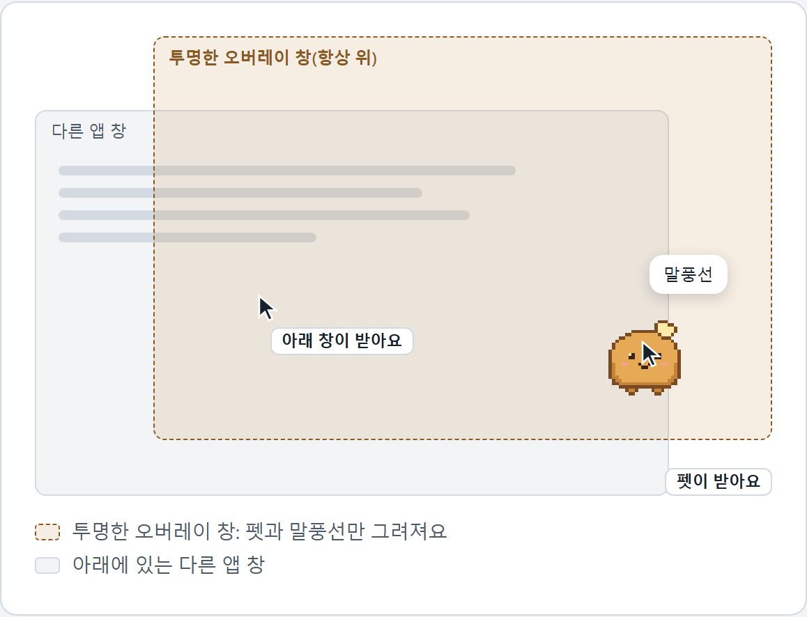
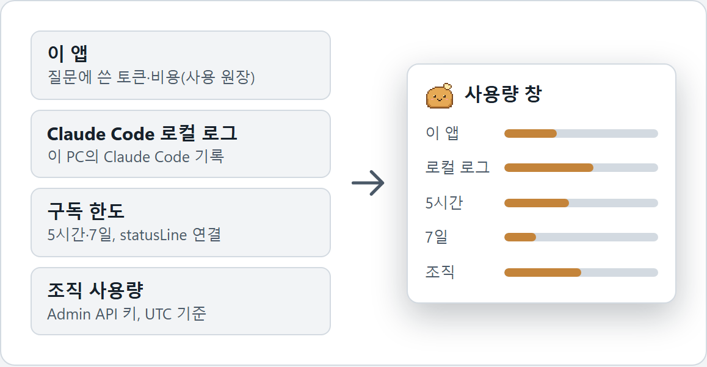
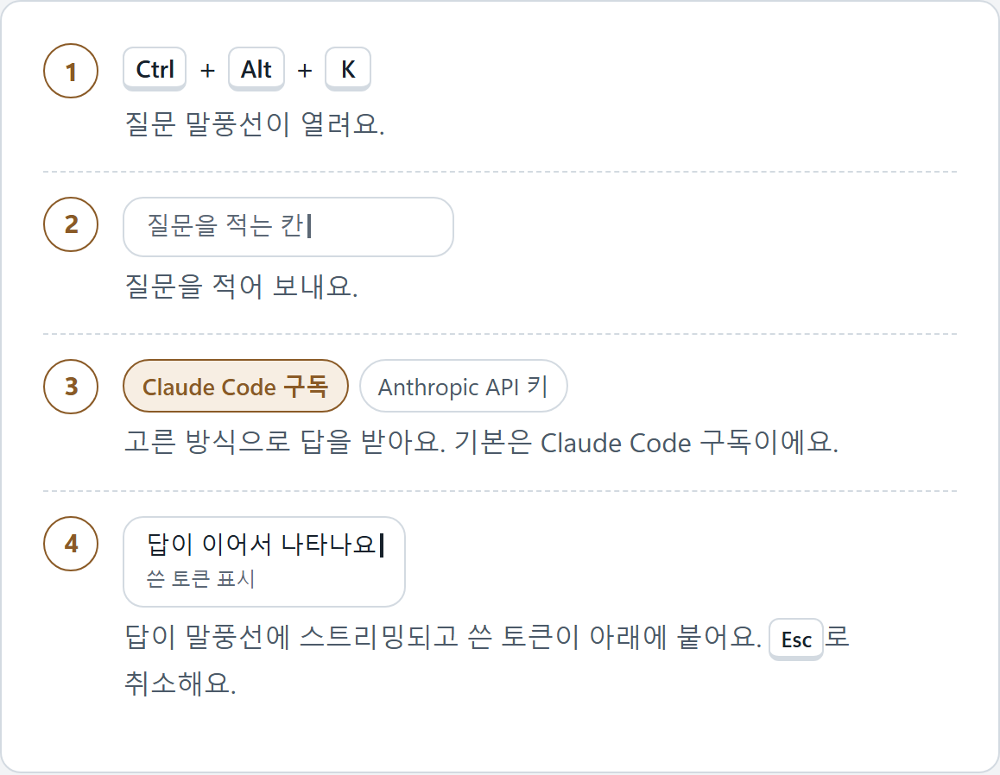
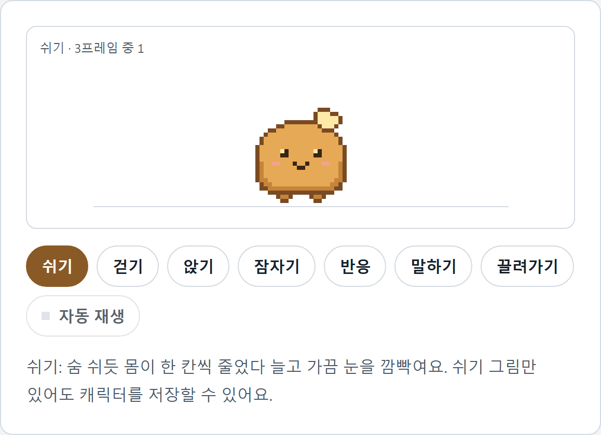
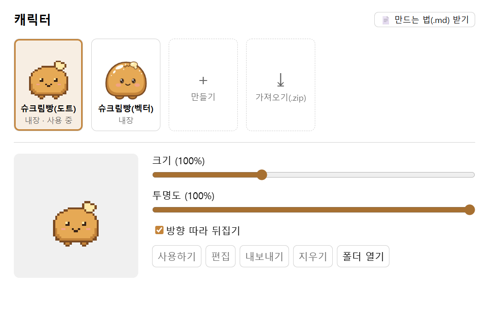
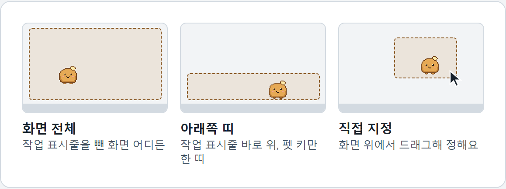
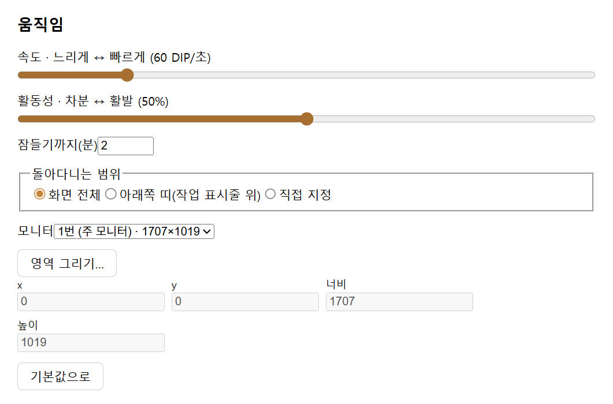
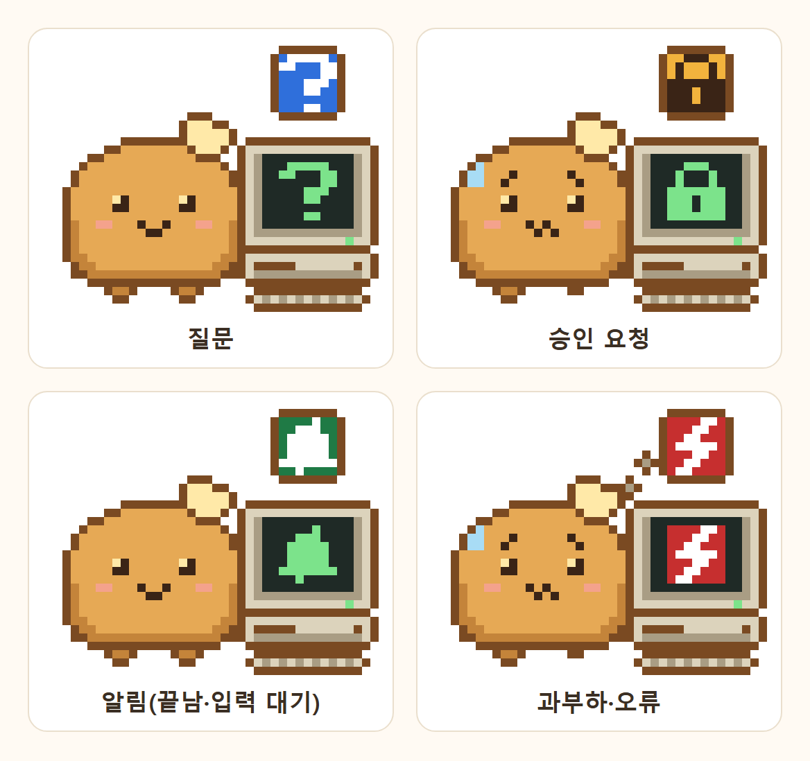
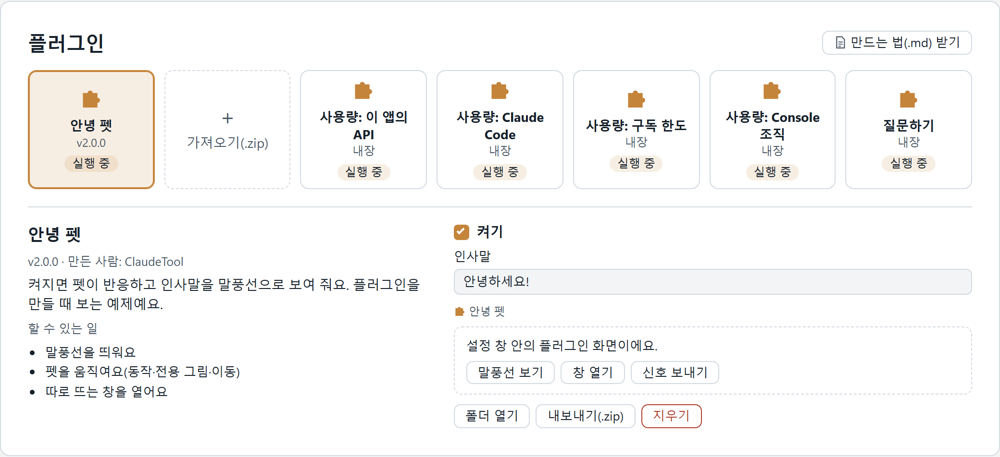
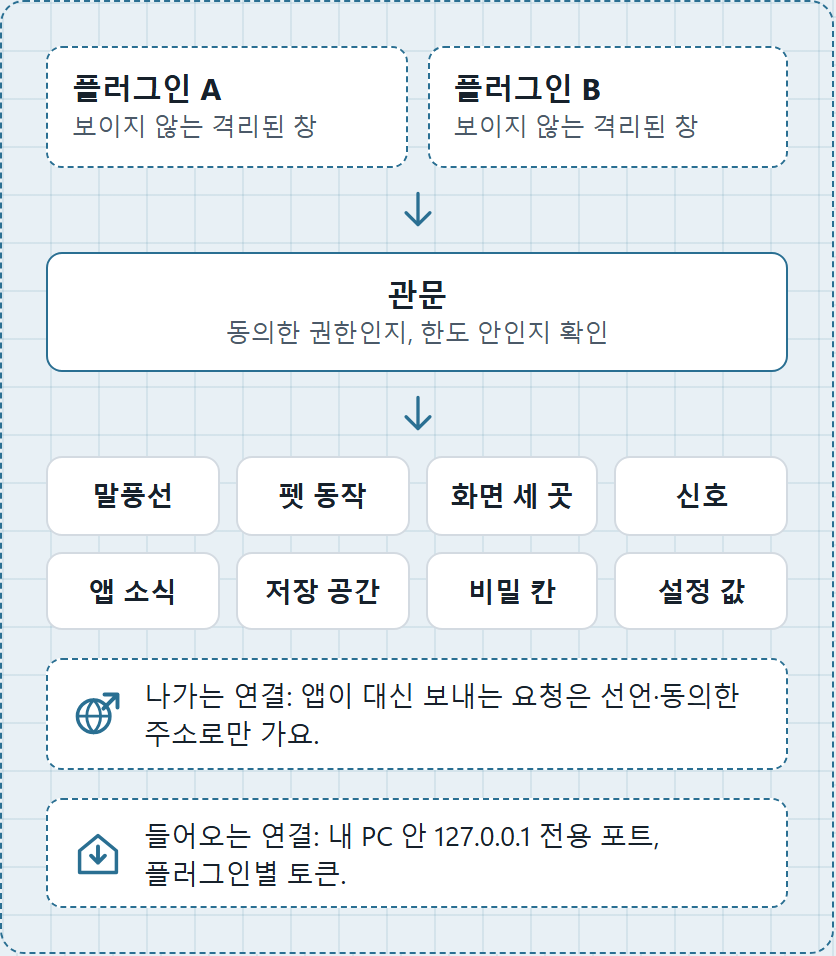

# ClaudeTool

화면 위를 돌아다니는 Windows용 데스크톱 펫이에요. 펫을 누르면 Claude를 얼마나 썼는지 보여 주고 단축키로 질문하면 말풍선으로 답해요. 0.4.0부터는 **플러그인**으로 기능을 더할 수 있고 0.4.1에서는 Claude Code가 질문하거나 승인을 기다릴 때 펫이 알려 주는 **Claude Code 알림**이 생겼어요. 0.4.2부터는 앱이 **새 판을 알려 주고** Windows를 켤 때 **자동으로 시작**하게 할 수 있으며 알림은 설정 창의 **연결 버튼 하나**로 켜요. 0.4.3부터는 질문에 답하는 곳으로 Ollama·LM Studio 같은 **로컬 AI**(OpenAI 호환 서버)를 고를 수 있고 플러그인이 AI에게 일을 시켜 승인을 받고 이 PC에서 행동하는 **에이전트 플러그인**을 만들 수 있어요. 0.4.4부터는 말풍선 질문에서 AI가 앱 기능과 켜 둔 플러그인의 **도구를 불러** 쓸 수 있어요(API 키나 OpenAI 호환 서버 방식).

<p align="center">
  
</p>

**[설치 파일 내려받기(0.4.3)](https://github.com/BlackBuddle/claude-tool-page/releases/latest)** · [소개 페이지](https://blackbuddle.github.io/claude-tool-page/) · [릴리스](https://github.com/BlackBuddle/claude-tool-page/releases)

ClaudeTool은 개인 프로젝트이며 Anthropic과 관계없는 **비공식** 프로그램이에요.

## 한눈에 보기

- **하는 일:** 사용량 보기 · 질문하기 · 캐릭터 꾸미기와 만들기 · 움직임 정하기 · 플러그인으로 기능 더하기 · Claude Code 알림 받기 · 새 판 알림 · Windows 시작 시 실행 · 로컬 AI 연결 · 에이전트 플러그인 · 대화로 플러그인 부르기
- **필요한 것:** Windows 10·11(64비트). 질문하기는 이 PC에 로그인된 Claude Code가 있어야 해요(Anthropic API 키나 Ollama·LM Studio 같은 OpenAI 호환 서버로 바꿔 쓸 수도 있어요). 펫·캐릭터·플러그인은 Claude Code가 없어도 돼요. Node.js는 설치 파일에 들어 있어서 따로 깔지 않아도 돼요.
- **설치:** 이 저장소의 [릴리스](https://github.com/BlackBuddle/claude-tool-page/releases/latest)에서 설치 파일(약 125MB)을 받아 실행해요. 사용자별 설치라 관리자 권한은 필요 없어요.
- **가격:** 개인 사용은 무료예요. 업무·영리 목적의 사용과 재배포는 저작권자의 허락이 필요해요([라이선스](#라이선스)).
- **내 데이터:** 설치 폴더 바로 옆의 `<설치 폴더 이름>-data`에만 쌓여요. 가입·로그인·사용 통계 전송이 없어요. 새 판 확인만 GitHub에 접속하고 끌 수 있어요([개인정보와 데이터](#개인정보와-데이터)). 질문은 내가 고른 방식(Claude Code·Anthropic API·내가 적은 OpenAI 호환 서버)의 곳으로 가요.
- **소스 코드:** 공개하지 않아요. 이 저장소에는 사용 설명서·소개 페이지·법적 문서가 있고 설치 파일은 릴리스에 있어요.

바로 가기: [내려받기와 설치](#내려받기와-설치) · [이런 걸 해요](#이런-걸-해요) · [AI 연결(로컬 AI)](#ai-연결로컬-ai) · [에이전트 플러그인](#에이전트-플러그인) · [대화로 플러그인 부르기](#대화로-플러그인-부르기) · [플러그인 쓰기](#플러그인-쓰기) · [Claude Code 알림 쓰기](#claude-code-알림-쓰기) · [AI로 만들 때 쓰는 규칙](#ai로-만들-때-쓰는-규칙) · [자주 묻는 질문과 문제 해결](#자주-묻는-질문과-문제-해결) · [개인정보와 데이터](#개인정보와-데이터) · [라이선스와 면책](#라이선스와-면책) · [문서](#문서)

## 내려받기와 설치

설치 파일은 이 저장소의 [릴리스](https://github.com/BlackBuddle/claude-tool-page/releases/latest)에서 받아요. 최신 판은 **0.4.3**이고 파일 이름은 `ClaudeTool-Setup-0.4.3.exe`예요(약 125MB).

0.4.2를 쓰고 있다면 앱이 새 판을 알려 줘요. **받기**와 **다시 시작해서 설치**만 누르면 돼요([업데이트](#업데이트)). 0.4.1 이하는 업데이트 기능이 없어서 **이번 한 번만 직접** 받아 같은 위치에 덮어 설치하세요. 데이터 폴더는 그대로 남아요.

### 내려받는 곳과 확인

- **이 저장소의 릴리스에서만** 받으세요. 같은 이름으로 다른 곳에서 받은 파일은 위조일 수 있으니 실행하지 마세요.
- 받은 파일이 맞는지 SHA-256 값으로 확인할 수 있어요. 0.4.3의 값은 `6016fe612d1b607bbf6c261256de84d3654d667d9a2b9d55928273b7f38921f4`이고 PowerShell에서 `Get-FileHash .\ClaudeTool-Setup-0.4.3.exe -Algorithm SHA256`로 구해 비교해요.
- 설치 파일에는 코드 서명이 없어서 처음 실행할 때 Windows SmartScreen 경고가 뜰 수 있어요. 위 확인을 마쳤다면 **추가 정보 → 실행**을 누르세요.

### 설치 순서

1. 받은 `ClaudeTool-Setup-0.4.3.exe`를 실행해요.
2. 라이선스 화면에서 내용을 읽고 동의해요.
3. 설치 위치를 정해요. 기본은 `D:\Programs\ClaudeTool`이에요(D 드라이브가 없으면 Windows의 기본 위치예요). 사용자별 설치라 관리자 권한은 필요 없어요.
4. 설치가 끝나면 시작 메뉴의 **ClaudeTool**을 실행해요. 바탕화면 바로가기는 만들지 않아요.

### 필요한 것

- Windows 10 또는 11(64비트).
- **질문하기**를 쓰려면 이 PC에 **Claude Code**(네이티브 설치, `claude.exe`)가 설치되어 있고 로그인되어 있어야 해요. 별도 API 키는 필요 없어요. (원하면 Claude Code 대신 Anthropic API 키나 [OpenAI 호환 서버](#ai-연결로컬-ai)로 쓰는 방식도 고를 수 있어요.)
- 구독 한도 표시와 Claude Code 알림에 쓰는 **Node.js**는 설치 파일에 들어 있어요(`<설치 폴더>\resources\node`). 따로 설치하지 않아도 돼요.

펫·캐릭터·플러그인은 Claude Code가 없어도 쓸 수 있어요.

### 처음 실행하면

설치한 뒤 처음 실행하면 이래요.

- 화면에 펫(기본은 도트 슈크림빵)이 나타나 걷기 시작해요. 처음에는 화면 전체가 돌아다니는 범위예요.
- 작업 표시줄 알림 영역(트레이)에 아이콘이 생겨요. 안 보이면 알림 영역의 ^ 단추 안을 보세요.
- 데이터 폴더가 만들어지고 기본 설정 파일이 처음 적혀요. 가입이나 로그인은 없어요.
- 펫을 눌러 사용량 창을 열어 보고 `Ctrl+Alt+K`로 질문해 보세요.
- 켠 지 1분쯤 지나면 새 판 확인을 안내하는 말풍선이 한 번 떠요. **좋아요**를 누르면 앱을 켠 1분 뒤와 켜 두는 동안 24시간마다 확인하고 **확인 끄기**를 누르면 확인하지 않아요([업데이트](#업데이트)).
- ClaudeTool은 한 번에 하나만 실행돼요. Windows를 켤 때 자동으로 시작하게 하려면 설정 창 › ⚙ 일반의 **시작 시 실행**을 켜세요([Windows 시작 시 실행](#windows-시작-시-실행)). 기본은 꺼져 있어서 그렇지 않으면 시작 메뉴에서 켜야 해요.

### 데이터는 어디에 쌓이나요

설정·캐릭터·플러그인·키는 설치 폴더 **바로 옆**의 `<설치 폴더 이름>-data` 폴더에 쌓여요(예: 설치 폴더가 `…\ClaudeTool`이면 `…\ClaudeTool-data`). 설정 창 › ⚙ 일반의 **데이터 폴더 열기**로 바로 열 수 있고 안에 무엇이 있는지는 [개인정보와 데이터](#개인정보와-데이터)에 있어요. 업데이트하거나 제거해도 이 폴더는 남아요.

### 업데이트

0.4.2부터 앱이 **새 판이 나왔는지 알려 줘요.** 설치 프로그램으로 설치한 앱에서만 동작해요.

- **확인:** 앱을 켠 지 1분쯤 지나면 처음 한 번 안내 말풍선이 떠요. **좋아요**를 누르면 그때부터 앱을 켠 1분 뒤와 켜 두는 동안 24시간마다 `github.com`에서 이 저장소의 최신 릴리스 정보를 확인해요(마지막 확인 시각은 저장하지 않아서 앱을 자주 켜면 켤 때마다 접속해요). **확인 끄기**를 누르면 확인하지 않아요. 확인할 때 GitHub에는 PC의 IP 주소 같은 접속 정보가 전해져요([개인정보와 데이터](#개인정보와-데이터)). 질문·설정·키·사용 기록은 보내지 않아요.
- **새 판이 있으면:** 말풍선과 설정 창 › ⚙ 일반과 트레이 메뉴로 알려 줘요. **받기**를 눌러야 설치 파일을 내려받고 **다시 시작해서 설치**를 눌러야 설치해요(저장하지 않은 설정 편집이 있으면 먼저 물어요). 말풍선의 **바뀐 점 보기**는 릴리스 안내 페이지를 브라우저로 열어요.
- **설치하는 동안:** 앱이 종료되고 설치가 끝날 때까지 1분쯤 보이지 않아요. 끝나면 새 판이 자동으로 다시 켜져요. 설치가 실패하면 영어 오류 상자가 뜰 수 있어요(`Failed to uninstall old application files` 같은 글). **확인**을 누르고 시작 메뉴에서 앱을 다시 켜세요. 옛 판은 그대로 남아요. 계속 안 되면 이 저장소의 [릴리스](https://github.com/BlackBuddle/claude-tool-page/releases/latest)에서 설치 파일을 받아 덮어 설치하세요. 데이터 폴더는 지워지지 않아요.
- **바로 확인하기:** 설정 창 › ⚙ 일반의 **새 판 확인**을 누르면 바로 확인해요. 자동 확인은 같은 곳의 체크로 끄고 켜요. 끈 동안은 **새 판 확인**을 누를 때만 접속해요.
- **믿을 수 있나요:** 앱은 이 저장소 릴리스의 설치 파일을 받아 `latest.yml`에 적힌 해시(sha512)와 맞을 때만 설치해요. 설치 파일에는 코드 서명이 없어서 만든 곳을 확인하지는 못해요. 해시는 전송 중 손상·변조를 막을 뿐 저장소 자체가 침해된 경우까지는 막지 못해요([면책](#면책)). 받은 설치 파일은 Windows 기본 캐시 위치(`%LOCALAPPDATA%\claude-tool-updater\pending`)에 남아요. 0.4.3부터는 옛 판과 견줘 바뀐 부분만 받을 수 있어요(견줄 수 없거나 0.4.2에서 올라오는 첫 업데이트는 전체를 받아요).

업데이트를 쓰지 않으려면 자동 확인을 끄고 새 설치 파일을 이 저장소의 [릴리스](https://github.com/BlackBuddle/claude-tool-page/releases/latest)에서 직접 받아 덮어 설치하세요. 켜져 있는 ClaudeTool은 먼저 종료하세요(트레이 아이콘 우클릭 › 종료). 설정·캐릭터·플러그인은 데이터 폴더에 있어서 그대로 남아요.

### 제거

Windows 설정의 앱 목록(Windows 10은 앱 및 기능, 11은 설치된 앱)에서 ClaudeTool을 제거하세요. 설치 폴더의 `Uninstall ClaudeTool.exe`를 실행해도 돼요. 제거해도 **데이터 폴더는 남아요.** 흔적까지 모두 지우려면 제거한 뒤 `…-data` 폴더를 직접 지우세요. 설정·캐릭터·플러그인·키가 모두 사라지니 필요하면 먼저 백업하세요.

사용량 창에서 **Claude Code 연결**을 해 두었다면, 제거하기 전에 같은 자리의 **연결 해제**를 눌러 주세요. 그렇지 않으면 Claude Code 설정에 이 앱의 상태 줄 명령이 남아요. [Claude Code 알림](#claude-code-알림-쓰기)의 훅을 연결했다면 제거하기 전에 플러그인 상세 칸의 **끊기**를 누르거나 플러그인을 지워서 훅도 빼 주세요. **시작 시 실행**을 켰다면 그것도 먼저 끄세요(제거 프로그램이 그 항목을 지우는지는 확인하지 못했어요).

## 이런 걸 해요

그림 가운데 설정 창 화면 두 장(캐릭터 탭·움직임 탭)은 실제 화면이고 나머지는 [소개 페이지](https://blackbuddle.github.io/claude-tool-page/)에서 옮긴 설명용 그림이에요.

### 화면 위의 펫

기본 캐릭터인 도트 슈크림빵이 정한 범위 안을 걷고 쉬고 앉고 오래 쉬면 잠들어요(기본은 2분 뒤). 끌어서 옮길 수 있어요. 늘 다른 창 위에 떠 있지만 펫과 말풍선이 아닌 곳을 누르면 클릭이 아래 창으로 그대로 지나가서 하던 일을 방해하지 않아요.

<p align="center">
  
</p>

### 사용량 보기

펫을 누르면 **사용량 창**이 열려요(한 번 더 누르면 닫혀요). 트레이의 **사용량 소스**에서 항목별로 켜고 꺼요.

<p align="center">
  
</p>

| 항목 | 보여 주는 것 |
|---|---|
| 이 앱의 API | 이 앱에서 한 질문에 쓴 토큰(API 키 방식이면 비용도) |
| Claude Code | 이 PC의 Claude Code 사용 기록에서 읽은 토큰 사용량 |
| 구독 한도 | 5시간 세션·7일 한도(사용량 창에서 **Claude Code 연결**을 해야 해요) |
| Console 조직 | 조직의 Admin API 키가 있을 때 조직 사용량(기본은 꺼져 있어요) |

보여 주는 사용량·한도·비용은 참고용 추정치라서 실제 청구나 한도와 다를 수 있어요.

### 질문하기

`Ctrl+Alt+K`를 누르고 질문을 쓴 뒤 `Enter`를 누르면 답이 말풍선에 이어서 나타나요. 펫을 더블클릭하거나 우클릭 › **질문하기**로도 열 수 있고 답이 나오는 중에는 `Esc`로 취소해요. 이어서 묻기 위해 앱이 켜져 있는 동안 최근 대화(6번까지)를 기억하고 쓴 토큰 수는 답 아래에 보여요.

<p align="center">
  
</p>

- 기본은 이 PC에 **로그인된 Claude Code**가 구독으로 답해요. 별도 API 키는 필요 없어요. 이때 Claude Code는 **답만 하도록** 실행돼요(도구·MCP를 끄고 설정·메모리를 읽지 않게 해요. [개인정보와 데이터](#개인정보와-데이터) 참고).
- 원하면 트레이의 **질문 방식**에서 **API 키**로 바꿔 Anthropic API 키로 쓸 수도 있어요(선택 사항이에요).
- 0.4.3부터는 **OpenAI 호환 서버**(Ollama·LM Studio 같은 로컬 AI)로도 답을 받을 수 있어요. 자세한 건 [AI 연결(로컬 AI)](#ai-연결로컬-ai)에 있어요.
- 0.4.4부터는 API 키나 OpenAI 호환 서버 방식이면 AI가 앱 기능과 플러그인의 도구를 불러 쓸 수 있어요. 자세한 건 [대화로 플러그인 부르기](#대화로-플러그인-부르기)에 있어요.
- 질문은 고른 방식의 곳(기본은 Anthropic)으로 전송되니 비밀번호·키·개인정보·회사 기밀은 쓰지 마세요. AI의 답은 틀릴 수 있어요.

### AI 연결(로컬 AI)

0.4.3부터는 질문에 답하는 곳을 세 가지 중에서 고를 수 있어요. 기본은 이 PC에 로그인된 **Claude Code**이고 **Anthropic API 키**와 **OpenAI 호환 서버**가 더 있어요. OpenAI 호환 서버는 Ollama나 LM Studio처럼 내 PC에서 돌리는 AI 프로그램(로컬 AI)이나 같은 방식으로 답하는 서비스예요. 이름의 OpenAI는 요청과 답의 형식을 가리키는 말이고 ClaudeTool은 OpenAI와도 관계없어요.

- **고르는 곳:** 설정 창 › ⚙ 일반의 맨 아래 **AI 연결**이나 트레이 아이콘 우클릭 › **질문 방식**이에요.
- **쓰는 순서:**
  1. 서버 프로그램을 켜 두고 모델을 받아 둬요.
  2. **AI 연결**에서 방식을 **OpenAI 호환 서버**로 바꿔요.
  3. 서버 주소를 적어요. 기본값은 Ollama의 기본 주소인 `http://127.0.0.1:11434/v1`이고 LM Studio는 보통 `http://127.0.0.1:1234/v1`이에요.
  4. **연결 확인**을 눌러요. 서버가 가진 모델 목록이 뜨면 하나를 고르고 목록이 없으면 모델 이름을 직접 적어요.
  5. 서버가 키를 요구하면 키 칸에 넣어요. 저장하면 **저장됨**만 보이고 값은 다시 보이지 않아요.
  6. 이제 `Ctrl+Alt+K`로 질문하면 그 서버가 답해요.
- **내 PC 안에서 돌릴 때:** 주소가 `127.0.0.1`이나 `localhost`이면 질문이 내 PC 밖으로 나가지 않아요.
- **생각하는 모델:** qwen3처럼 답하기 전에 생각부터 하는 모델은 생각하다 답 길이 한도를 다 써서 빈 답으로 끝날 수 있어요. 주소가 이 PC 안이면 ClaudeTool이 생각을 끄고 질문을 보내요. 생각이 필요하면 **AI 연결**의 **생각하는 모델의 생각 켜기**를 켜세요(답이 느려져요). 이 PC 밖 서버에는 생각을 끄는 값을 보내지 않아요. 그 값을 모르는 서버에는 값을 빼고 한 번 더 보내요. 그래도 모델이 생각만 하다 끝나면 질문 말풍선에 이유가 보여요.
- **첫 응답을 기다리는 시간:** 모델을 처음 올리는 동안은 답이 늦을 수 있어서 이 PC 안 서버는 첫 응답을 120초까지 기다리고 이 PC 밖 서버는 30초까지 기다려요.
- **이 PC 밖 서버를 쓸 때:** 인터넷의 서비스 주소도 적을 수 있어요. 이때 질문과 답이 그 서비스로 가고 `http`로 시작하는 주소는 암호화되지 않아요. 설정 창은 주소가 이 PC나 집·회사 내부망이 아니면 **이 PC 밖 주소예요. 질문 내용이 그 서버로 가요** 줄을 늘 보여 줘요. 그 서비스가 내용을 어떻게 다루는지는 ClaudeTool이 알 수 없어요.
- **사용량:** 사용량 창에 이 방식으로 쓴 토큰이 **OpenAI 호환 사용** 줄로 보여요. 서버가 토큰 수를 알려 주지 않으면 글자 수로 어림하고 비용은 계산하지 않아요.
- **알아 둘 것:** Ollama와 LM Studio는 공식 문서에서 이 방식을 지원한다고 밝혀요. 모든 서버와 모델 조합에서 되는지는 보증하지 않아요. 로컬 모델은 모델마다 답의 품질과 도구 호출 솜씨가 크게 달라요. AI의 답은 틀릴 수 있어요. 질문 내용은 [개인정보와 데이터](#개인정보와-데이터)에 적은 대로 고른 곳으로 가니 비밀번호·키·개인정보·회사 기밀은 쓰지 마세요.

### 캐릭터 꾸미기

설정 창 › 🐾 캐릭터에서 캐릭터를 고르고 크기(50~200%)·투명도·방향 따라 뒤집기를 정해요. 내장 캐릭터는 슈크림빵(도트)·슈크림빵(벡터) 두 가지이고 직접 만들 수도 있어요.

<p align="center">
  
</p>

- **만들기:** 쉬기·걷기·앉기·잠자기·반응·말하기·끌려가기 7가지 모습에 그림(GIF·APNG·WebP·PNG·SVG)을 넣어요. 쉬기 그림만 있어도 저장돼요.
- **새 동작:** 춤추기·점프 같은 동작을 더해요. 처음에는 12개까지이고 편집기의 **동작 한도** 칸에서 60개까지 늘릴 수 있어요. 동작마다 얼마나 자주(드물게·가끔·자주), 얼마나 오래, 제자리에서 할지 걸으며 할지, 그리고 **언제** 할지(쉬는 중 무작위·클릭했을 때·오래 쉬면·플러그인 신호)를 정해요.
- **플러그인 신호 동작:** **＋ 플러그인 신호 동작…**에서 플러그인을 고르면 그 플러그인의 신호마다 동작이 한 번에 더해져요. 동작마다 그림을 넣어 마무리해요.
- **주고받기:** 만든 캐릭터는 .zip으로 내보내고 가져와요. 플러그인 신호를 연결한 캐릭터는 0.3.0 이하 앱에서는 열 수 없어요.
- **AI에게 부탁하기:** 캐릭터 탭 제목 줄의 **📄 만드는 법(.md) 받기**로 받은 문서를 AI에게 건네면 캐릭터를 만들어 줘요. 설치한 플러그인이 있으면 그 신호 목록이 문서 끝에 붙어요. 규칙만 모은 [AI로 만들 때 쓰는 규칙](#ai로-만들-때-쓰는-규칙)을 건네도 돼요.

<p align="center">
  <br>
  <sub>설정 창 › 캐릭터 탭(실제 화면)</sub>
</p>

### 움직임 정하기

설정 창 › ↔ 움직임에서 속도·활동성·잠들기까지의 시간·돌아다니는 범위(화면 전체·아래쪽 띠·직접 지정)·모니터를 정해요.

<p align="center">
  
</p>

<p align="center">
  <br>
  <sub>설정 창 › 움직임 탭(실제 화면)</sub>
</p>

### 플러그인(0.4.0 새 기능)

받은 .zip을 가져와서 펫에 기능을 더해요. 가져올 때 동의 창이 플러그인이 할 수 있는 일과 접속할 주소를 보여 줘요. 자세한 건 [플러그인 쓰기](#플러그인-쓰기)에 있어요.

### 에이전트 플러그인

0.4.3부터 플러그인이 **AI에게 일을 시키고 승인을 받아 이 PC에서 행동**할 수 있어요. 예를 들어 "테스트를 돌리고 실패한 것만 한 줄로 알려 줘" 같은 일을 AI가 명령을 골라 해 볼 수 있어요. AI는 틀리거나 엉뚱한 명령을 낼 수 있어서 명령은 승인 카드로 확인해요. 이런 플러그인이 쓰는 권한이 새로 네 가지 생겼어요.

| 권한 | 하는 일 | 앱이 하는 일 |
|---|---|---|
| `ai` | 위 [AI 연결](#ai-연결로컬-ai)에서 고른 AI에게 글을 보내고 답을 받아요. | 플러그인마다 월 토큰 예산을 정할 수 있어요(Anthropic API 키 방식과 이 PC 밖 OpenAI 호환 주소에서만 지켜요). 보낸 글은 저장하지 않아요. |
| `run` | 허락한 프로그램(`git`·`npm` 같은 것)이나 PowerShell·cmd 명령을 **내 계정 권한으로** 실행해요. | 실행하기 전에 **승인 카드**가 명령줄을 보여 줘요. |
| `files` | 내가 **고른 폴더 안**의 파일을 읽고 써요. | 폴더는 설정 창 플러그인 카드에서 내가 골라요. 쓰기만 승인 카드가 떠요. |
| `open-app` | 파일이나 앱을 Windows의 기본 프로그램으로 열어요. | 열기 전에 승인 카드가 경로를 보여 줘요. 실행 파일과 스크립트는 열지 않아요. |

- **승인 카드:** 앱이 직접 띄우는 말풍선이에요. 플러그인은 카드를 만들거나 대신 누를 수 없어요. **허용**·**거부**·**이 플러그인은 늘 허용** 가운데 고르고 60초 안에 고르지 않으면 거부돼요.
- **늘 허용:** 카드에서 **이 플러그인은 늘 허용**을 누른 종류만 카드 없이 실행돼요. 설정 창 플러그인 상세 칸에 빨간 줄로 보이고 **끄기**로 꺼요. 플러그인을 업데이트하거나 새 권한을 허락하면 그 플러그인의 늘 허용은 꺼지고 카드가 다시 떠요. 정말 믿을 수 있는 플러그인의 되풀이 작업에만 쓰세요.
- **동의 창:** 이 네 권한은 **주의가 필요한 권한**으로 따로 묶여 보여요. `files`는 설치한 뒤 설정 창에서 폴더를 골라야 동작해요.
- **한계:** 승인 카드는 확인 수단이지 안전 장치가 아니에요. 허락한 프로그램이 하는 일은 앱이 막지 못하고 되돌릴 수도 없어요. 카드에는 명령줄의 앞부분이 보이니 끝까지 읽고 모르는 건 거부하세요. `files` 읽기에는 카드가 없어요. 자세한 한계는 [면책](#면책)과 [개인정보와 데이터](#개인정보와-데이터)에 있어요.
- **만들기:** 새 권한의 API는 설정 창 › 🧩 플러그인 탭의 **📄 만드는 법(.md) 받기**로 받는 안내 문서에 적혀 있어요([플러그인 만들기](#플러그인-만들기)).
- **예제 받기:** 이 저장소의 [릴리스](https://github.com/BlackBuddle/claude-tool-page/releases/latest)에 예제 플러그인 zip 두 개가 올라와 있어요. 설정 창 › 🧩 플러그인 › **＋ 가져오기(.zip)**에서 가져와 써 볼 수 있어요. 예제 에이전트 `local-agent-plugin.zip`(약 8KB)은 `ai`·`run`·`files` 권한과 승인 카드가 어떻게 보이는지 보여 주고 예제 대화 도구 `memo-tools-plugin.zip`(약 4KB)은 `tools` 권한으로 말풍선 대화에서 AI가 메모를 적고 읽게 해 줘요. 둘 다 도구 호출을 지원하는 AI 연결이 필요해요. 받은 파일이 맞는지는 릴리스 노트의 SHA-256 값과 비교하세요.

### 대화로 플러그인 부르기

0.4.4부터 말풍선 질문에서 AI가 **도구를 불러** 앱 기능과 켜 둔 플러그인의 기능을 쓸 수 있어요. 예를 들어 "이번 주 사용량 알려 줘"라고 물으면 AI가 사용량 도구를 불러 답하고 "춤춰 봐"라고 하면 펫이 춤을 춰요. 플러그인이 도구를 내놓았다면 "오늘 일정 뭐 있어?"처럼 물어 그 플러그인의 도구로 답하게 할 수도 있어요.

- **쓸 수 있는 방식:** 질문 방식이 **API 키**나 **OpenAI 호환 서버**일 때예요([AI 연결](#ai-연결로컬-ai)). Claude Code 방식은 도구 없이 지금처럼 대화만 하고 말풍선에 "도구를 쓰려면 설정 창 › 일반 › AI 연결에서 API 키나 OpenAI 호환 방식을 골라 주세요" 안내가 한 번 보여요. 도구 호출을 지원하는 모델이어야 해요. 모델이 도구를 모르면 같은 질문을 도구 없이 다시 보내고 그 이유를 알려 줘요.
- **앱 기능 도구 4개:**

| 도구 | 하는 일 | 승인 |
|---|---|---|
| `app_usage` | 사용량 창의 내용(5시간·주간 사용 비율과 초기화 시각 같은 것)을 글로 요약해요. | 바로 실행 |
| `app_pet_action` | 지금 캐릭터가 가진 동작 하나를 재생해요. | 바로 실행 |
| `app_open_settings` | 설정 창의 탭이나 플러그인 상세 칸을 열어요. | 바로 실행 |
| `app_change_setting` | 캐릭터 고르기·Windows 시작 시 실행·설치한 플러그인 켜기와 끄기·AI 연결 방식과 모델을 바꿔요. | **매번** 승인 카드 |

- **바꿀 수 없는 것:** API 키와 비밀 값·권한 동의·늘 허용 목록·업데이트 설치·데이터 지우기·플러그인 설치와 삭제는 AI가 바꾸지 못해요. 시키면 "설정 창에서 직접 해 주세요"라고 알려 줘요. 아직 동의하지 않은 권한이 있는 플러그인은 켜지 않고 설정 창의 그 플러그인 칸을 열어요.
- **플러그인의 도구:** 도구를 내놓은 플러그인(`tools` 권한)은 켜 두면 AI가 그 도구를 볼 수 있어요. 동의 창에는 "🧰 대화 도구 이름: 설명" 줄로 도구마다 보여요. 플러그인마다 설정 창 상세 칸의 **대화에서 쓰기**로 끌 수 있어요. 처음 부를 때 승인 카드가 도구 이름·설명·입력 요약을 보여 줘요. **허용**·**거부**·**이 도구는 늘 허용** 가운데 고르고 늘 허용을 누른 도구만 다음부터 카드 없이 실행돼요. 플러그인을 업데이트해서 도구 선언(도구 목록과 이름·설명·입력 형식)이 바뀌거나 새 동의를 쓰면 그 플러그인의 늘 허용은 모두 꺼져요.
- **승인 카드는 질문 말풍선 안에 떠요.** 대화 중의 카드는 열려 있는 말풍선 안에 같은 버튼으로 나타나요. 앱이 직접 그리는 버튼이라 플러그인이나 AI의 답은 누를 수 있는 승인 버튼을 만들 수 없어요. 60초 안에 고르지 않으면 거부돼요. 도구가 실행되는 동안 그 플러그인이 `run`·`files` 쓰기·`open-app` 권한으로 하는 일도 같은 말풍선에서 물어요.
- **횟수와 멈춤:** 한 질문에서 도구를 부르는 횟수는 기본 8번이고 1~50번으로 정할 수 있어요(설정 창 › 🧩 플러그인 › 내장 **질문하기** 카드의 "한 질문의 도구 호출 횟수"). 말풍선의 **멈춤**을 누르면 중간에 끝내요. 한도만큼 부른 뒤에도 AI가 더 부르려 하면 그 호출은 하지 않고 도구 없이 한 번 더 물어 지금까지의 결과로 답해요. 한 번에 AI에 보내는 도구는 32개까지이고 정의 글자 수에도 한도가 있어요(API 키 방식 32,000자·OpenAI 호환 방식 6,000자). 넘치면 플러그인 도구가 일부 빠지고 말풍선에 알려 줘요.
- **어디로 가나요:** 질문과 함께 도구 목록이 가고 도구를 쓴 결과도 이어서 같은 AI 서버로 가요. 사용량 수치나 플러그인이 돌려준 내용(예: 오늘 일정)이 들어 있을 수 있어요. 주소가 이 PC 밖이면 그 서버로 가요. AI가 고른 입력은 그 플러그인에도 전해져요. 접속할 주소를 동의받은 플러그인은 그 입력을 그 주소로 보낼 수 있어요. 앱은 입력과 결과를 저장하지 않고 로그에는 도구 이름과 허락 결과만 남겨요([개인정보와 데이터](#개인정보와-데이터)).
- **한계:** AI는 틀릴 수 있어요. 엉뚱한 도구를 고르거나 값을 지어내거나 도구를 부르지 않고 답을 지어내기도 하고 작은 로컬 모델은 이런 일이 더 잦을 수 있어요. 도구 결과 속의 글에 속아 의도하지 않은 도구를 부를 수도 있어서 설정 바꾸기는 매번 묻고 플러그인 도구는 첫 호출에 물어요. 승인 카드는 확인 수단이지 안전 장치가 아니에요. 도구를 쓰면 질문 하나에 AI를 여러 번 불러서 API 키 방식에서는 토큰과 요금이 늘 수 있어요. 자세한 한계는 [면책](#면책)에 있어요.
- **만들기:** 플러그인에 도구를 내놓는 법은 설정 창 › 🧩 플러그인 탭의 **📄 만드는 법(.md) 받기**로 받는 안내 문서의 "대화 도구 만들기" 장에 있어요([플러그인 만들기](#플러그인-만들기)). 동작하는 예제 `memo-tools-plugin.zip`은 이 저장소의 [릴리스](https://github.com/BlackBuddle/claude-tool-page/releases/latest)에서 받을 수 있어요.

### Claude Code 알림

Claude Code가 질문하거나 승인을 기다리거나 일을 끝내거나 과부하로 멈추면 펫이 몸짓과 말풍선으로 알려 줘요. 알림 목록의 버튼을 누르면 그 세션이 열려요. Claude 앱에서 만든 세션은 앱의 그 화면으로 가고 터미널 세션은 새 창에서 `claude --resume`으로 이어져요.

알림 플러그인 `claude-notify`와 알림 캐릭터 `choux-notify`(고전 컴퓨터 화면을 든 슈크림빵)로 이뤄져 있어요. 둘 다 릴리스에 `.zip`으로 올라와 있고 캐릭터는 없어도 알림은 와요. 0.4.2부터는 플러그인을 가져온 뒤 설정 창의 **연결** 버튼 하나로 Claude Code에 훅이 연결돼요. 쓰는 순서는 [Claude Code 알림 쓰기](#claude-code-알림-쓰기)에 있어요.

<p align="center">
  <br>
  <sub>알림 캐릭터의 기본 상태와 알림 동작 4가지(질문·승인·알림·과부하)</sub>
</p>

### 플러그인 묶음(2026-10)

캘린더·날씨·유튜브·GitHub·Steam·VS Code·메일·SNS 소식을 펫이 말풍선과 Windows 알림으로 알려 주는 예제 플러그인 8개와 소식마다 다른 몸짓을 보여 주는 캐릭터 `choux-desk`예요. 플러그인은 서로 독립이라 필요한 것만 가져오면 되고 캐릭터는 없어도 알림은 와요. 필요한 판은 **ClaudeTool 0.4.2 이상**이에요. `sns-notify`가 연결 실패 때 로그에 남는 토픽을 가려 주는 보호는 0.4.3부터예요. 서비스마다 키·토큰·주소는 직접 발급해서 설정 창 칸에 넣어요.

- `cal-notify`: 구글·아웃룩 캘린더의 일정이 곧 시작할 때·시작할 때·아침마다 알려요. 캘린더의 iCal 비공개 주소가 필요해요.
- `weather-notify`: 비·초미세먼지·더위·추위와 아침 날씨 요약을 알려요. 도시 이름만 있으면 되고 계정이나 키는 없어요.
- `yt-search`: 펫에게 유튜브 검색을 시키고 구독 채널의 새 영상을 알려요. 검색에는 YouTube Data API 키가 필요해요.
- `github-notify`: 리뷰 요청·멘션·CI 실패·병합을 알려요. GitHub 토큰(classic)이 필요해요.
- `steam-notify`: 친구 접속·게임 시작과 위시리스트 할인을 알려요. Steam Web API 키와 SteamID64가 필요해요.
- `ide-buddy`: VS Code에서 저장·오류·테스트·오래 쉼에 펫이 한 줄 참견해요. VS Code 1.90 이상과 확장(`.vsix`)이 필요하고 인터넷으로는 아무것도 나가지 않아요.
- `mail-notify`: 새 메일·중요 메일·하루 요약을 알려요. Gmail이나 Outlook 연결을 직접 준비해야 해요.
- `sns-notify`: Instagram·Threads의 좋아요·댓글·팔로워·DM·언급을 알려요. 안드로이드 폰과 MacroDroid로 알림 글을 ntfy에 보내거나(iPhone은 안 돼요), Meta 개발자 앱에서 직접 발급한 토큰이 필요해요.

캐릭터 `choux-desk`는 슈크림빵 책상판이고 이 플러그인들의 알림마다 다른 몸짓 36개가 들어 있어요. VS Code 확장 `ide-buddy-vscode-1.0.0.vsix`는 `ide-buddy`와 함께 써요.

받는 곳은 [플러그인 묶음 릴리스](https://github.com/BlackBuddle/claude-tool-page/releases/tag/plugins-2026-10)예요. 플러그인 zip 8개와 캐릭터 zip, VS Code 확장이 올라와 있어요. 받은 파일은 릴리스 노트의 SHA-256 값과 비교하고 설정 창 › 🧩 플러그인 › **＋ 가져오기(.zip)**로 가져올 때 동의 창의 권한과 주소가 안내서의 목록과 같은지 확인하세요([동의 창 읽는 법](#동의-창-읽는-법)). 서비스별 준비물과 설정, 문제 해결은 [플러그인 묶음 안내서](plugins/README.md)에 있어요.

### Windows 시작 시 실행

Windows에 로그인할 때 ClaudeTool이 자동으로 켜지게 할 수 있어요. 기본은 **꺼져 있어요.**

- **켜고 끄는 법:** 설정 창 › ⚙ 일반의 **시작 시 실행** 체크나 트레이 아이콘 우클릭 › **Windows 시작 시 실행**으로 해요. 설치 프로그램으로 설치한 앱에서만 쓸 수 있어요.
- **무엇이 바뀌나요:** 켜기를 고른 경우에만 현재 사용자의 레지스트리 `Run` 항목 하나(`HKCU\Software\Microsoft\Windows\CurrentVersion\Run`)를 써요. 관리자 권한은 필요 없어요. 끄면 항목이 지워져요. Windows 설정의 **시작 앱**에서 끄면 Windows가 그 항목을 꺼 두고 앱은 다음에 켤 때 설정도 끈 것으로 맞춰요.
- **제거할 때:** 제거 프로그램이 이 항목을 지우는지는 확인하지 못했어요. 앱을 제거하기 전에 먼저 끄세요.

### 메뉴

| 어디서 | 항목 |
|---|---|
| 펫 우클릭 | 질문하기 · 사용량 · 일시정지 · 캐릭터 바꾸기 ▸ · 설정… · 종료 |
| 트레이 아이콘 우클릭 | 펫 보이기 · 일시정지 · 사용량 소스 ▸ · 말풍선 자동 닫힘 ▸ · 질문 방식 ▸ · 질문 모델 ▸ · API 키 설정… · Windows 시작 시 실행 · (새 판이 있을 때만) 새 판 받기·다시 시작해서 설치 · 설정… · 종료 |

## 플러그인 쓰기

플러그인은 펫에 기능을 더하는 작은 프로그램이에요. 예를 들어 타이머가 끝나면 펫이 반응하며 말풍선으로 알려 주거나, 빌드가 끝났다는 신호를 받아 말풍선을 띄울 수 있어요.

- ClaudeTool에는 플러그인을 내려받는 기능이나 마켓이 없어요. 플러그인은 [직접 만들거나](#플러그인-만들기) 믿을 수 있는 사람에게 `.zip` 파일로 받아요. 사람들이 올린 플러그인을 구경하고 올릴 수 있는 [공유 공간](#플러그인-공유-공간)이 있지만 검토된 곳은 아니에요.
- 받은 플러그인은 **제3자가 만든 코드**예요. ClaudeTool은 플러그인을 보이지 않는 별도 창에서 돌리고 동의한 범위 안에서만 쓰게 막아 두지만 플러그인의 내용을 검토하거나 보증하지는 않아요. 완벽한 보호를 약속하는 것도 아니에요([알아 둘 한계](#알아-둘-한계)).

> **한 줄 요약:** 출처를 아는 플러그인만 설치하고 동의 창을 꼼꼼히 읽고 비밀 칸에는 그 플러그인 전용 키만 넣으세요.

<p align="center">
  <br>
  <sub>설정 창 › 플러그인 탭(화면을 본떠 그린 그림). 예제 플러그인 “안녕 펫”을 가져온 모습이에요. 안녕 펫은 설치 파일에 들어 있지 않아요.</sub>
</p>

### 플러그인이 할 수 있는 일과 없는 일

<p align="center">
  
</p>

- **할 수 있는 일:** 말풍선 띄우기, 펫 움직이기, 캐릭터에 신호 보내기, 자기 화면 그리기(말풍선 안·설정 창 안·따로 뜨는 창), 설정 칸에 넣은 값 읽기(비밀 칸 포함)와 자기 저장 공간 쓰기, 동의한 주소로 인터넷 요청 보내기, 이 PC의 다른 프로그램이 보내는 신호 받기, 화면의 버튼을 눌렀을 때 Claude Code 세션 열기(`session` 권한). 0.4.2부터는 허락을 받으면 받은 로그인 정보(토큰·키)를 암호화해 보관하기(`secrets`), Windows 알림 띄우기(`notify`), 사용자가 누른 링크 열기(`open-link`), 클립보드에 글 복사하기(`clipboard-write`), Claude Code 설정에 알림 훅 넣기(`hooks`, 앱이 대신 넣어요)도 할 수 있어요. 0.4.3부터는 허락을 받으면 앱에 연결한 AI 쓰기(`ai`), 프로그램 실행(`run`), 고른 폴더 읽고 쓰기(`files`), 파일·앱 열기(`open-app`)도 할 수 있어요([에이전트 플러그인](#에이전트-플러그인)). 0.4.4부터는 허락을 받으면 말풍선 질문의 AI가 부를 도구 내놓기(`tools`)도 할 수 있어요([대화로 플러그인 부르기](#대화로-플러그인-부르기)).
- **막아 둔 것(보증은 아니에요):** 자기 폴더 밖의 파일 읽고 쓰기(예외는 `files` 권한으로 내가 고른 폴더 안이에요), 프로그램 실행(예외는 `session` 권한과 `run` 권한이에요. `session`은 앱이 정한 Claude 앱 주소를 열거나 `claude --resume`을 실행하고 플러그인은 세션 번호만 넘겨요. `run`은 허락한 프로그램만 승인 카드를 거쳐 실행해요), 다른 플러그인이나 앱 화면 내용 보기, 카메라·마이크·화면 캡처, 클립보드 **읽기**, 전역 단축키, 동의하지 않은 주소로 접속하기, Claude Code 설정 파일에 직접 닿기. 다만 플러그인 화면이 클립보드를 **바꾸는** 것과 DNS 이름 조회로 정보를 내보내는 것은 막지 못했어요([알아 둘 한계](#알아-둘-한계)).

### 가져오기

1. 설정 창을 열어요. 펫 우클릭 › **설정…**(또는 트레이 아이콘 우클릭 › **설정…**).
2. 왼쪽의 **🧩 플러그인** 탭에서 **＋ 가져오기(.zip)** 카드를 눌러 받은 `.zip` 파일을 골라요.
3. **동의 창**이 떠요. 아래 [동의 창 읽는 법](#동의-창-읽는-법)대로 읽고 괜찮으면 **설치**를 눌러요(⚠ 주의가 필요한 권한이 있으면 버튼 글이 **주의를 읽고 설치**예요). 마음에 걸리면 **취소**를 눌러요. 취소하면 아무것도 바뀌지 않아요.
4. 설치하면 바로 켜져서 카드가 **실행 중**으로 바뀌어요. 앱을 다시 켜지 않아도 돼요. 훅 권한이 있는 플러그인이면 이어서 [Claude Code에 연결할지](#훅-연결주의-권한) 한 번 물어요.

같은 플러그인을 다시 가져오면 **업데이트**예요. 동의하면 업데이트한 뒤에도 켜진 상태로 돌아요. 새 버전에서 권한이나 주소가 늘었으면 동의 창이 늘어난 줄 앞에 ［새로］ 표시를 붙여 다시 물어요. 가져오기가 실패하면 이유 목록만 보이고 아무것도 바뀌지 않아요.

### 동의 창 읽는 법

동의 창은 이 플러그인이 **무엇을 할 수 있게 되는지**를 보여 줘요. 모양은 이래요(실제 문구는 플러그인마다 달라요).

```text
"타이머" 1.0.0을 설치할까요?

만든 사람(플러그인이 적은 값): 홍길동
이 플러그인이 할 수 있는 일:
 · 말풍선을 띄워요
 · 펫을 움직여요(동작·전용 그림·이동)
접속할 주소:
 · <접속할 주소>
그 밖에 설정 값 읽기·자기 저장 공간·캐릭터 신호 내기는 늘 할 수 있어요.
```

0.4.2부터는 다른 프로그램의 설정을 고치는 권한이 따로 묶여 보이고 0.4.3부터는 AI·프로그램 실행·파일·앱 열기 권한도 같은 묶음에 들어가요.

```text
⚠ 주의가 필요한 권한:
 · Claude Code 설정(settings.json)에 알림 훅을 넣어요(먼저 백업하고, 끄면 빼요): claude
   허용하면 이 플러그인이 Claude Code가 하는 일(명령·파일 경로·질문·답변 앞부분 같은 짧은 글과 작업 폴더)의 소식을 받을 수 있어요
[주의를 읽고 설치]  [취소]
```

| 창에 보이는 말 | 뜻 |
|---|---|
| 만든 사람(플러그인이 적은 값) | 플러그인 파일이 **스스로 적은** 이름이에요. 누가 만들었는지 확인된 것이 아니니 믿을 근거로 삼지 마세요. |
| 말풍선을 띄워요 | 펫 옆에 글·버튼이 있는 말풍선을 보여 줄 수 있어요. |
| 펫을 움직여요(동작·전용 그림·이동) | 펫이 동작하게 하거나, 펫 자리에 자기 그림을 보이거나, 걸어가게 할 수 있어요. |
| 따로 뜨는 창을 열어요 | 플러그인이 만든 작은 창을 띄울 수 있어요. 창 제목은 "플러그인: 이름"으로 고정돼요. |
| 펫 클릭·질문 답변 같은 앱 소식을 받아요 | 펫을 눌렀다는 것, 질문에 답이 왔다는 것을 알 수 있어요(답 내용은 받지 못해요). |
| 이 PC의 다른 프로그램이 보내는 신호를 받아요 | 아래 [들어오는 연결](#들어오는-연결)을 열어요. 이 PC 안의 프로그램이 플러그인에 이벤트를 보낼 수 있게 돼요. |
| Claude Code 세션을 열어요(Claude 앱 화면을 바꾸거나 새 창에서 claude 명령을 실행해요) | 플러그인 화면의 버튼을 눌렀을 때 들어오는 연결로 받은 Claude Code 세션을 열어요. 여는 주소와 명령은 앱이 정하고 플러그인은 바꾸지 못해요. 들어오는 연결 권한과 함께만 쓰여요. |
| 로그인 정보(토큰·키)를 이 PC에 암호화해 보관해요 | 플러그인이 받은 토큰·키를 이 PC에 암호화해 맡길 수 있어요(플러그인마다 20개까지). 같은 Windows 계정의 다른 프로그램은 알아낼 수 있고 값은 그 플러그인 코드에 풀려서 전달돼요. 상세 칸에서 개수를 보고 모두 지울 수 있어요. |
| Windows 알림을 띄워요 | 플러그인이 정한 제목과 본문으로 Windows 알림을 띄워요(제목 앞에 플러그인 이름이 붙어요). 알림이 보이는지는 Windows 알림 설정에 달려 있어요. |
| 사용자가 누른 링크를 브라우저로 열어요 | 말풍선 카드의 링크 버튼을 **눌렀을 때만** 그 https 주소를 기본 브라우저로 열어요. 버튼 옆에 열릴 호스트가 보여요. |
| 글을 클립보드에 복사해요 | 플러그인이 클립보드에 글을 쓸 수 있어요. 읽지는 못해요. 클릭 없이도 바꿀 수 있으니 붙여 넣기 전에 내용을 확인하세요. |
| 🧰 대화 도구 이름: 설명 | 말풍선 질문의 AI가 부를 수 있는 도구를 내놓아요. 도구마다 한 줄씩 보여요. AI가 고른 입력이 그 플러그인에 전해지고 접속할 주소를 동의받았다면 플러그인이 그 입력을 그 주소로 보낼 수 있어요. 처음 부를 때 승인 카드가 떠요. [대화로 플러그인 부르기](#대화로-플러그인-부르기)를 보세요. |
| ⚠ 주의가 필요한 권한: Claude Code 설정(settings.json)에 알림 훅을 넣어요(먼저 백업하고, 끄면 빼요): claude | 앱이 Claude Code의 설정 파일에 이 플러그인의 훅을 넣어요(**연결**을 눌렀을 때만). 다른 프로그램의 설정을 고치는 일이라 따로 묶여 보이고 설치 버튼 글이 **주의를 읽고 설치**로 바뀌어요. 줄 아래의 설명대로 플러그인은 Claude Code가 하는 일(명령·파일 경로·질문·답변 앞부분 같은 짧은 글과 작업 폴더)의 소식을 받아요. 아래 [훅 연결](#훅-연결주의-권한)을 보세요. |
| ⚠ 주의가 필요한 권한: Codex CLI 설정(config.toml)에 알림 명령을 넣어요(먼저 백업하고, 끄면 빼요): codex | 위와 같은 일을 Codex CLI에 해요. 앱은 설정 창에서 내가 그 플러그인의 **연결**을 눌렀을 때만 Codex 설정 맨 위에 알림 명령 한 줄을 넣어요. 플러그인은 Codex가 작업을 마칠 때 마지막 답의 앞부분을 받아요. |
| ⚠ 주의가 필요한 권한: 앱에 연결한 AI 모델을 써요(사용량·예산은 설정 창에서 봐요) | 플러그인이 보내는 글이 설정 창 **AI 연결**에서 고른 곳(Claude Code·Anthropic·내가 적은 OpenAI 호환 서버)으로 가요. 무엇을 보낼지는 플러그인이 정해요. |
| ⚠ 주의가 필요한 권한: 이 PC에서 프로그램을 실행해요: git, npm … (또는 이 PC에서 명령(PowerShell·cmd)을 실행해요) | 글 끝에 적힌 프로그램(`shell`이면 아무 명령)을 **내 계정 권한으로** 실행해요. 실행하기 전에 승인 카드가 떠요. 허락한 뒤 프로그램이 하는 일은 앱이 막지 못해요. |
| ⚠ 주의가 필요한 권한: 사용자가 고른 폴더를 읽어요(쓰기 키가 있으면 읽고 써요)와 그 아래 📁 줄 | 폴더마다 플러그인이 적은 이유가 📁 줄로 보여요. 설치한 뒤 설정 창 플러그인 카드에서 폴더를 고르면 그 폴더 안만 읽고 써요. 쓰기는 승인 카드를 거쳐요. |
| ⚠ 주의가 필요한 권한: 파일·앱을 기본 프로그램으로 열어요 | 열기 전에 승인 카드가 경로를 보여 줘요. 실행 파일과 스크립트는 열지 않아요. |
| 이 앱 판에서는 아직 못 쓰는 권한: … | 이 앱보다 새 판에서 생긴 권한이에요. 설치는 되지만 그 권한이 필요한 기능만 동작하지 않아요. 아래 [앱이 모르는 권한](#앱이-모르는-권한)을 보세요. |
| 접속할 주소 | 플러그인이 그 주소로 인터넷 요청을 보낼 수 있어요. 앱이 대신 보내는 요청은 목록에 없는 주소로 나가지 않아요(다만 [알아 둘 한계](#알아-둘-한계)의 DNS 이름 조회는 예외예요). |
| 주소 뒤의 **(이 PC 안)** | 이 PC에서 돌고 있는 프로그램에 접속해요. |
| 주소 뒤의 **(내부망)** | 집이나 회사 네트워크 안의 기기(공유기·NAS 등)에 접속해요. |
| **인터넷의 모든 주소**와 ⚠ 경고("인터넷의 모든 주소에 HTTP로 접속할 수 있어요") | 플러그인이 웹 주소(HTTP)로 인터넷의 어느 공용 주소에든 요청을 보낼 수 있다는 뜻이에요. 플러그인이 가진 정보를 아무 곳으로나 보낼 수 있으니 **가장 믿을 수 있는 경우에만** 허락하세요. (이 PC나 내부망은 주소를 따로 적어야 열려요.) |

### 켜기·끄기·설정

플러그인 카드를 누르면 아래에 상세가 나와요.

- 위쪽에는 이름·버전·만든 사람·설명(모두 플러그인이 적은 글), **할 수 있는 일**, 문제가 있었다면 **마지막 오류**가 보여요. 카드에는 **실행 중**·**꺼짐**·**오류**·**동의 필요** 중 하나가 표시돼요.
- **켜기** 칸으로 켜고 꺼요. 바로 반영돼요. 앱을 다시 켤 필요가 없어요.
- 플러그인이 정한 **설정 칸**(글·숫자·켜기/끄기·비밀 칸)이 자동으로 폼으로 나타나요. 바꾸면 바로 반영돼요. 비밀 칸은 **바꾸기**를 눌러 가려진 입력칸에 넣고 **저장**해요. 저장한 값은 화면에 다시 보이지 않고 ●●●●만 보여요.
- **폴더 열기**는 그 플러그인의 폴더를 열고 **내보내기(.zip)** 버튼은 플러그인을 .zip으로 묶어 저장해요(비밀 칸 값은 들어가지 않아요). **지우기**는 플러그인 폴더와 그 플러그인이 저장한 데이터·비밀 값·토큰을 함께 지워요(확인 창이 먼저 떠요).
- `secrets` 권한이 있는 플러그인은 상세 칸에 **코드가 보관한 비밀 N개**와 **모두 지우기**가 보여요(값은 보이지 않아요). 플러그인을 지우면 함께 지워져요.
- 0.4.3의 새 권한이 있으면 상세 칸에 **AI**(방식·모델·이번 달 토큰과 예산), **프로그램 실행**(찾은 경로·최근 실행), **폴더**(고른 폴더와 **폴더 고르기**·**바꾸기**·**해제**), **자동 허용**(빨간 줄과 **끄기**)과 최근 승인 기록이 보여요.
- `tools` 권한이 있는 플러그인은 상세 칸에 **대화에서 쓰기** 스위치(끄면 AI가 그 플러그인의 도구를 보지 못해요)와 **늘 허용**한 도구 표시와 **끄기**가 보여요.
- 앱에 들어 있는 기능(사용량 4개·질문하기)도 **내장** 카드로 보여서 여기서 켜고 끌 수 있어요. 예를 들어 질문하기 카드에서 **질문 단축키**를 바꿔요.

### 앱이 모르는 권한

플러그인이 지금 앱보다 새 판에서 생긴 권한을 적었어도 설치는 돼요. 동의 창에 "이 앱 판에서는 아직 못 쓰는 권한" 줄로 보이고 그 권한이 필요한 기능만 동작하지 않아요. 이 권한은 동의 기록에도 남지 않아요.

앱을 그 권한을 아는 새 판으로 올리면 플러그인은 꺼지지 않고 계속 돌아요. 상세 칸에 ［새로］ 줄과 **새 권한 허락하기** 버튼이 나오니 읽어 보고 괜찮을 때 누르세요. 그 권한만 한 번 물어요.

플러그인에 필요한 권한이 앱에 아직 없다면 제작자에게 요청해 주세요. 새로 만들어야 하는 권한은 차후 업데이트로 반영할 예정이에요.

### 폴더에 바로 넣기

설정 창 › ⚙ 일반 › **데이터 폴더 열기**로 데이터 폴더를 열고 그 안의 `plugins` 폴더에 플러그인 폴더(안에 `plugin.json`과 `main.js`)를 넣거나 고치면 바로 다시 읽어요. 처음 켤 때는 동의를 물어요. 카드가 **동의 필요**이면 **동의하고 켜기**를 눌러 같은 모양의 동의 창에서 **켜기**를 누르면 돼요. 파일을 고쳐서 권한이나 주소가 늘면 플러그인이 멈추고 다시 물어요. 읽지 못하는 폴더는 회색 카드로 이유가 보여요.

### 계속 멈추는 플러그인

플러그인이 10초 넘게 응답하지 않거나 오류로 멈추면 앱이 그 플러그인만 끝내고 다시 시작해요(알림이 떠요). **10분 안에 세 번째로 멈추면 꺼 두고** 알려 줘요. **켜기**를 다시 누르면 켜지지만 원인이 그대로면 또 멈춰요. 이 자동 꺼짐은 멈춘 플러그인을 정리하는 편의 기능이에요. 위험한 플러그인을 막아 주는 보안 장치가 아니에요.

### 들어오는 연결

**이 PC의 다른 프로그램이 보내는 신호를 받아요** 권한이 있는 플러그인을 켜 두면, 빌드 스크립트 같은 프로그램이 이 PC 안에서 플러그인에 이벤트를 보낼 수 있어요.

- 통로는 이 PC 안의 주소(`127.0.0.1`)의 47823번 포트(기본값)로 열려요. 그런 플러그인이 하나라도 켜져 있는 동안에만 열려요. 다른 기기에서는 닿지 않고 웹 페이지(브라우저)가 보내는 요청도 거절해요. 같은 PC의 다른 프로그램은 접속을 시도할 수 있지만 그 플러그인의 **토큰**을 알아야 받아 줘요.
- 플러그인마다 토큰이 달라요. 플러그인 상세 칸의 **토큰 복사**로 클립보드에 받아서 보내는 프로그램에 설정하세요. 유출이 걱정되면 **토큰 재발급**을 눌러요. 예전 토큰은 곧바로 쓸 수 없게 돼요. 상세 칸에는 PowerShell로 보내는 예시도 있어요.
- 토큰은 비밀번호처럼 다루세요. 남에게 주지 말고 클립보드(Windows 클립보드 기록 포함)나 명령 기록에 남을 수 있으니 쓴 뒤 필요하면 재발급하세요. 플러그인을 꺼 두면 통로가 닫혀서 다른 프로그램이 그 포트를 쓸 수 있어요. 토큰이 엉뚱한 프로그램에 넘어갔다고 의심되면 재발급하세요.
- 포트가 이미 쓰이고 있으면 상세 칸에 이유가 보여요. [자주 묻는 질문](#자주-묻는-질문과-문제-해결)을 보세요.

### 훅 연결(주의 권한)

**Claude Code 설정(settings.json)에 알림 훅을 넣어요** 권한이 있는 플러그인은 Claude Code가 질문하거나 승인을 기다리거나 일을 끝내는 소식을 받을 수 있어요. 앱이 Claude Code 설정 파일에 그 플러그인의 훅을 대신 넣고 빼요. 다른 프로그램의 설정을 고치는 일이라 **주의가 필요한 권한**으로 따로 묶여 보여요.

- **언제 연결하나요:** 플러그인을 설치하거나 켠 직후에 "Claude Code에 연결할까요?"를 한 번 물어요. **연결**을 누르거나 나중에 상세 칸의 **Claude Code 연결(훅)**에서 **연결**을 눌러요. **나중에**를 누르면 아무것도 바뀌지 않아요. Claude Code를 한 번도 실행하지 않아 설정 폴더가 없으면 묻지 않아요.
- **앱이 하는 일:** 먼저 Claude Code의 `settings.json`을 데이터 폴더의 `hooks\<플러그인 id>\backup`에 백업하고 그 플러그인의 훅만 넣어요. 사용자의 다른 훅과 설정은 그대로 두고 다른 플러그인의 훅도 건드리지 않아요. 읽은 뒤에 파일이 바뀌었으면 쓰지 않고 멈춰요. 플러그인 코드는 이 설정 파일에 닿지 못해요.
- **상태:** 상세 칸이 **연결됨 · 훅 6개** / **연결 안 됨** / **다시 연결이 필요해요**(일부만 있거나 옛 방식이에요) 가운데 하나를 보여 줘요. 다시 연결이 필요하면 **다시 연결**을 눌러요.
- **끊기·끄기·지우기:** 상세 칸의 **끊기**를 누르거나 플러그인을 끄거나 지우면 앱이 그 플러그인의 훅만 빼요. 빼지 못하면 말풍선으로 알리고 끄기·지우기는 그대로 끝나요. 남은 훅은 아무 일도 하지 않아요. 상세 칸에서 다시 끊거나 [훅이 남았을 때 지우기](#훅이-남았을-때-지우기)로 빼요.
- **훅이 보내는 곳:** 이 PC 안(`127.0.0.1`)뿐이에요. 인터넷이나 다른 기기로는 나가지 않아요([개인정보와 데이터](#개인정보와-데이터)).
- **Codex CLI도 연결할 수 있어요(0.4.3):** 플러그인이 Codex를 선언했다면 상세 칸에 **Codex CLI 연결** 칸이 따로 생겨요. **연결**을 누를 때만 앱이 Codex 설정(`CODEX_HOME` 또는 사용자 폴더의 `.codex`)의 `config.toml` 맨 위에 알림 명령 한 줄을 넣어요. 먼저 파일 전체를 백업하고 다른 줄은 건드리지 않아요. 이미 다른 알림 명령이 있으면 넣지 않아요. Codex가 작업을 한 차례 마칠 때마다 마지막 답의 앞부분(300자)이 이 PC 안(`127.0.0.1`)의 플러그인으로만 가요. Codex가 나중에 이 알림 방식을 없애면 연결이 끊길 수 있어요. 끊기·끄기·지우기로 그 줄을 빼요.
- **주의:** 훅 토큰과 백업은 암호화하지 않은 파일이에요. 폴더를 현재 사용자만 접근하도록 좁혀 두지만 같은 Windows 계정의 다른 프로그램은 읽을 수 있고 백업에는 `settings.json`(Codex 연결이면 `config.toml`) 전체가 들어 있어요. 믿을 수 있는 플러그인에만 허락하세요.

### 안전하게 쓰는 법

1. **출처를 아는 플러그인만** 설치하세요. 모르는 사람이 보낸 .zip은 설치하지 마세요(공유 공간에서 받을 때는 [받기 전에 확인할 것](#받기-전에-확인할-것)을 모두 거친 것만 설치하세요). AI가 만들어 준 플러그인도 똑같이 제3자 코드로 보고 확인하세요.
2. **동의 창을 읽고 필요한 만큼만** 허락하세요. 플러그인이 하는 일에 비해 권한이나 주소가 많으면 설치하지 마세요. 특히 **인터넷의 모든 주소**, **(내부망)**, **이 PC의 다른 프로그램이 보내는 신호**, **⚠ 주의가 필요한 권한** 줄은 한 번 더 생각하세요.
3. **업데이트나 파일 수정으로 권한·주소가 늘면 다시 물어요.** 그때도 새로 붙은 ［새로］ 줄을 읽고 동의하세요.
4. **비밀 칸에는 그 플러그인 전용으로 만든 키만** 넣으세요(예: 한 서비스에서 이 용도로만 발급한 키). 다른 곳에 쓰는 비밀번호나 Anthropic API 키·Admin 키는 넣지 마세요. 값은 Windows 계정으로 암호화해 저장되지만 쓰려면 플러그인에 전달돼요. 플러그인이 받은 값을 어디에 적을지는 플러그인에 달려 있어요.
5. **들어오는 연결의 토큰은 남에게 주지 마세요.** 토큰이 있으면 이 PC의 프로그램이 그 플러그인에 이벤트를 보낼 수 있어요.
6. **플러그인이 그린 화면에는 비밀번호·키·개인정보를 입력하지 마세요.** 말풍선 안·설정 창 안·따로 뜨는 창의 화면은 플러그인이 그린 것이라, 입력한 내용을 플러그인이 읽을 수 있어요.
7. **안 쓰는 플러그인은 끄거나 지우세요.** 켠 플러그인마다 메모리를 약 70MB 더 써요.
8. 이상하면 바로 **끄기**나 **지우기**를 하고 그 플러그인에 넣었던 키는 폐기하고 새로 발급받으세요. 무슨 일이 있었는지는 로그 폴더의 `plugins.log`에서 볼 수 있어요.
9. **승인 카드는 끝까지 읽으세요.** 카드에 잘렸다는 표시가 있으면 **자세히**를 열고 모르는 명령은 거부하세요. **늘 허용**은 믿을 수 있는 플러그인의 되풀이 작업에만 켜고 `shell`처럼 무엇이든 실행할 수 있는 것에는 켜지 않기를 권해요. 플러그인을 업데이트하거나 새 권한을 허락하면 그 플러그인의 **늘 허용**은 꺼지고 카드가 다시 떠요.
10. **`files`에는 필요한 폴더만 고르세요.** 드라이브 맨 위나 사용자 폴더, `.claude`·`.codex`·`AppData` 같은 설정 폴더는 고르지 마세요. 폴더를 넓게 고를수록 플러그인이 읽을 수 있는 파일이 늘어요.
11. **`ai`를 쓰는 플러그인**은 비밀 값이나 개인 문서를 AI 메시지에 넣지 않는지 확인하세요. API 키 방식과 이 PC 밖 OpenAI 호환 주소에서는 월 예산을 낮게 정하세요.
12. **대화 도구는 첫 호출 카드를 읽으세요.** 도구 이름·설명·입력 요약을 읽고 모르는 것은 거부하세요. **이 도구는 늘 허용**은 되돌릴 수 있는 조회성 도구에만 켜세요. 설정 바꾸기 카드는 바뀌는 값을 읽고 내가 시킨 일일 때만 허용하세요. 쓰지 않는 플러그인은 **대화에서 쓰기**를 끄세요.

### 알아 둘 한계

- 격리는 Electron(Chromium)과 Windows의 보안 기능에 기대는 것이라 **완벽한 보호가 아니에요.** 보안 문제를 발견하면 [보안 문제를 발견했다면](#보안-문제를-발견했다면)을 따라 알려 주세요.
- 인터넷 권한을 주지 않은 플러그인도 **DNS 이름 조회**에 정보를 실어 밖으로 보낼 수 있어요. 토큰이나 설정 값 같은 짧은 값은 가능해요. 앱이 이 길을 막을 방법을 찾지 못했어요. 받는 쪽이 DNS 서버를 운영해야 해서 보낼 수 있는 양은 적지만 그래서 믿을 수 있는 플러그인만 쓰라고 거듭 말씀드려요.
- 플러그인이 그린 화면(말풍선 안·설정 창 안·따로 뜨는 창)은 내가 그 화면을 조작한 직후 브라우저의 복사 기능으로 **클립보드의 내용을 바꿀 수 있어요.** 클립보드를 읽는 것은 막아 뒀지만 쓰는 길은 막지 못했어요. `clipboard-write`를 허락한 플러그인은 화면 없이도 클립보드를 바꿀 수 있어요. 플러그인을 쓴 뒤 붙여 넣을 때는 붙여 넣는 내용이 내가 복사한 것이 맞는지 확인하세요.
- 허락한 주소의 이름이 DNS 설정에 따라 내부망 주소를 가리키면 그곳에 닿을 수 있어요. 동의 창은 이름만 보여 줘요.
- 비밀 칸 값은 Windows 계정으로 암호화해 저장하지만 같은 Windows 계정으로 도는 다른 프로그램은 읽을 수 있어요.
- 승인 카드는 확인 수단이지 안전 장치가 아니에요. 허락한 프로그램이 하는 일(다른 프로그램을 부르는 것·파일을 지우거나 덮어쓰는 것·인터넷으로 보내는 것)은 앱이 막지 못하고 되돌릴 수도 없어요. 카드의 요약은 300자 안쪽에서 잘리고(셸 명령은 앞 200자만 보여요) 비밀로 가려 주는 모양은 세 가지뿐이며 경로 표시는 Windows 짧은 이름이나 비슷한 글자를 가려내지 못해요. `files` 읽기에는 카드가 없고 읽은 내용은 플러그인이 동의받은 주소나 AI 서버로 보낼 수 있어요.
- 대화 도구에서 AI는 틀린 도구를 고르거나 값을 지어내거나 도구 결과 속의 글에 속아 의도하지 않은 도구를 부를 수 있어요. 앱의 방어는 승인 카드뿐이에요. **이 도구는 늘 허용**을 켠 도구는 AI가 고른 입력으로 카드 없이 실행되고 사용량 보기·펫 동작·설정 창 열기도 카드 없이 실행돼요. 카드 요약은 300자 안쪽에서 잘려서 긴 입력은 다 보이지 않을 수 있어요. 플러그인이 받은 입력과 결과를 동의받은 주소로 보내는 것은 앱이 막지 못해요.

### 플러그인 만들기

AI에게 부탁해서 만들 수 있어요. 규칙만 모은 [AI로 만들 때 쓰는 규칙](#ai로-만들-때-쓰는-규칙)을 건네도 돼요.

1. 설정 창 › **🧩 플러그인** 탭 제목 줄의 **📄 만드는 법(.md) 받기**를 눌러 안내 문서를 저장해요(기본 파일 이름은 `ClaudeTool-플러그인-만들기.md`). 이 문서 하나에 만드는 법이 다 들어 있어요. 문서 맨 앞에는 앱 판 번호와 "표에 있는 권한만 쓰고 없는 권한을 지어내지 말 것" 같은 규칙 머리말이 붙어요.
2. 그 문서를 통째로 AI에게 건네고 만들고 싶은 걸 말해요. 예: "이 문서대로 ClaudeTool 기능 플러그인을 만들어 줘. 25분 타이머이고 끝나면 펫이 반응하고 말풍선으로 알려 줘. 폴더 구조와 모든 파일 내용을 보여 줘."
3. AI가 알려 준 대로 폴더와 파일을 만들고 `.zip`으로 묶어요(문서에 PowerShell 명령도 들어 있어요).
4. 위의 [가져오기](#가져오기)로 설치해요. **AI가 만든 플러그인도 동의 창을 꼭 읽으세요.** 부탁한 일에 비해 권한이나 주소가 많으면 AI에게 줄여 달라고 하세요. AI가 만든 코드는 틀리거나 위험할 수 있어서 만든 사람이 직접 검토해야 하고 설치하고 쓰는 책임은 사용자에게 있어요.

이미 만든 플러그인을 새 판에 맞춰 고칠 때는 같은 제목 줄의 **📄 엔진 패치 내역(.md) 받기**로 판마다 바뀐 점을 모은 문서를 받아 AI에게 함께 건네세요.

이 프로젝트의 예제 플러그인 **안녕 펫**은 켜면 펫이 반응하며 인사말을 말풍선으로 보여 주고 인사말은 설정 칸에서 바꿀 수 있어요. 지금은 설치 파일에 들어 있지 않으니, 만드는 법 문서의 타이머 예제(처음부터 .zip으로 묶어 가져오기까지)를 따라 해 보세요.

이 프로젝트의 예제(만드는 법 문서에 든 예제 코드 포함)와 그것을 바탕으로 만든 플러그인은, 출처(저작권자 표기)를 밝히고 영리를 목적으로 하지 않는다면 복사·수정해서 다른 사람에게 나눠 줄 수 있어요. 영리 사용·판매·유료 배포는 저작권자의 허락이 필요해요([LICENSE](LICENSE) 제4조).

### 플러그인 공유 공간

만든 플러그인을 나누거나 다른 사람이 만든 플러그인을 찾아보는 곳이 이 저장소의 [Plugins 토론](https://github.com/BlackBuddle/claude-tool-page/discussions/categories/plugins)이에요. GitHub 계정이 있으면 누구나 글을 올릴 수 있어요.

> **먼저 알아 둘 것:** 올라온 플러그인은 **ClaudeTool을 만든 사람이 검토하거나 보증하지 않아요.** 올린 사람이 누구인지도 확인되지 않아요. 받기 전에 아래 [받기 전에 확인할 것](#받기-전에-확인할-것)을 지켜 주세요.

#### 올리는 법

1. [Plugins 토론](https://github.com/BlackBuddle/claude-tool-page/discussions/categories/plugins)에서 **New discussion**을 눌러 양식을 채워요.
2. 플러그인 이름·버전·하는 일·**필요한 권한**(가져올 때 동의 창에 보이는 말 그대로)·시험한 ClaudeTool 버전·라이선스를 적어요.
3. `.zip` 파일을 글 입력칸에 끌어다 놓아 첨부해요(파일당 25MB까지예요). 가능하면 PowerShell의 `Get-FileHash`로 구한 SHA-256 값도 적어 주세요.
4. 비밀번호·API 키·토큰·개인정보가 `.zip` 안이나 글에 들어 있지 않은지 확인해요. 글과 첨부 파일은 누구나 볼 수 있어요.

#### 받기 전에 확인할 것

- 올린 사람이 적은 **필요한 권한**이 `.zip` 안의 `plugin.json`과 같은지 확인하세요. `.zip`은 압축을 풀어 `plugin.json`과 코드(`main.js` 같은 글자 파일)를 직접 읽어 볼 수 있어요. 읽기 어려우면 AI에게 권한과 하는 일을 요약해 달라고 해 보세요(AI의 요약도 틀릴 수 있어요).
- 글에 SHA-256 값이 있으면 받은 파일의 값과 같은지 확인하세요.
- 하는 일에 비해 권한이나 접속할 주소가 많으면(특히 **인터넷의 모든 주소**) 받지 마세요.
- 가져올 때 동의 창을 꼼꼼히 읽으세요. 자세한 건 [동의 창 읽는 법](#동의-창-읽는-법)과 [안전하게 쓰는 법](#안전하게-쓰는-법)에 있어요.
- 이상하면 글의 ⋯ 메뉴에서 **Report content**로 신고해 주세요. 보안 문제는 [보안 문제를 발견했다면](#보안-문제를-발견했다면)을 따라 비공개로 알려 주세요.

올라온 플러그인과 첨부 파일의 저작권은 올린 사람에게 있고 올린 사람이 정한 조건을 따라요. 이 저장소의 [LICENSE](LICENSE)는 거기에 적용되지 않아요. 플러그인에 문제가 생기면 그 플러그인을 올린 사람에게 물어봐 주세요. 앱이 이 공간에서 무언가를 스스로 내려받는 일은 없고 `.zip`은 늘 직접 가져와요.

## Claude Code 알림 쓰기

[Claude Code 알림](#claude-code-알림)은 플러그인 zip과 캐릭터 zip을 가져온 뒤 설정 창의 **연결 버튼**으로 Claude Code에 훅을 연결해서 써요(0.4.2 이상). 토큰을 복사하거나 명령을 칠 일이 없어요.

**준비물:** Claude Code를 설치하고 한 번 이상 실행해 두세요(설정 폴더 `~\.claude`가 만들어져요). 폴더가 없으면 연결 버튼이 "Claude Code 설정 폴더를 찾지 못했어요"라고 알려요. Node.js는 설치 파일에 들어 있어서 따로 깔지 않아도 돼요.

1. **zip 두 개 받기.** 이 저장소의 [릴리스](https://github.com/BlackBuddle/claude-tool-page/releases/latest)에서 두 파일을 받아요.

   - `claude-notify-plugin.zip`(알림 플러그인, 약 18KB)
     SHA-256 `cbdcba315547f9a2636568fff161926ac6206155a9f9fb7a0df0e8860acd8237`
   - `choux-notify-pack.zip`(알림 캐릭터, 약 47KB)
     SHA-256 `a0941c338bbc2750cfcedaafba9a8fd40be110dc18eee86cf345a9e7b5d54da7`

2. **플러그인 가져오기.** 설정 창 › **🧩 플러그인** › **＋ 가져오기(.zip)**에서 `claude-notify-plugin.zip`을 골라요. 동의 창에 "말풍선을 띄워요", "이 PC의 다른 프로그램이 보내는 신호를 받아요", "Claude Code 세션을 열어요" 세 줄이 보여요. 그 아래 **⚠ 주의가 필요한 권한** 묶음에 "Claude Code 설정(settings.json)에 알림 훅을 넣어요(먼저 백업하고, 끄면 빼요): claude"가 따로 보이고 접속할 주소는 없어요. 읽고 괜찮으면 **주의를 읽고 설치**를 눌러요. 바로 켜져요.
3. **연결.** 설치한 직후 "Claude Code에 연결할까요?"가 떠요. **연결**을 누르면 끝이에요. **나중에**를 눌렀다면 설정 창 › 플러그인에서 `claude-notify` 카드를 고르고 상세 칸의 **Claude Code 연결(훅)**에서 **연결**을 눌러요. 상태 줄이 **연결됨 · 훅 6개**가 되면 연결된 거예요.
4. **캐릭터 가져오기.** 설정 창 › **🐾 캐릭터** › **⤓ 가져오기(.zip)**에서 `choux-notify-pack.zip`을 고르면 바로 그 캐릭터로 바뀌어요. 캐릭터는 없어도 알림은 와요.
5. **확인.** 새 Claude Code 세션을 열고 승인이 필요한 일을 시켜 펫이 반응하는지 봐요. 열려 있던 세션에는 바로 적용되지 않을 수 있어요. Claude Code에서 `/hooks`로 훅이 들어갔는지 볼 수 있어요.

- **앱이 하는 일:** 연결하면 앱이 Claude Code의 `settings.json`을 먼저 데이터 폴더의 `hooks\claude-notify\backup`에 백업하고 이 플러그인의 훅 6개만 넣어요. 사용자의 다른 훅과 설정은 그대로예요. 자세한 내용은 위 [훅 연결](#훅-연결주의-권한)에 있어요. 이 백업에는 `settings.json` 전체가 들어 있으니 필요 없으면 직접 지우세요.
- **보내는 곳:** 훅은 이 PC 안(`127.0.0.1`)으로만 소식을 보내요. 인터넷이나 다른 기기로는 나가지 않아요. 무엇을 보내는지는 [PRIVACY.md](PRIVACY.md)에 있어요.
- **끄기:** 상세 칸의 **끊기**를 누르거나 플러그인을 끄거나 지우면 앱이 넣었던 훅만 빼요. 앱을 제거하기 전에도 먼저 끊어 주세요. 끈 플러그인을 다시 켜면 연결할지 다시 물어요.
- **다시 할 때:** 상태가 **다시 연결이 필요해요**이면 **다시 연결**을 눌러요. 앱을 다른 폴더로 옮겼거나 업데이트로 경로가 바뀐 경우도 같아요.
- **알림이 안 오면:** 앱과 `claude-notify` 플러그인이 켜져 있는지, 상세 칸이 **연결됨 · 훅 6개**인지, 훅을 넣은 뒤 새로 연 세션인지 확인하세요. 앱이 꺼져 있던 사이의 소식은 사라져요.
- **0.4.1에서 손으로 연결했다면:** 0.4.1의 설치 도우미로 넣은 훅은 0.4.2에서도 계속 동작해요. 앱 연결로 옮기려면 상세 칸에서 **다시 연결**을 눌러요. 앱이 옛 훅을 새 훅으로 바꿔 넣어서 같은 알림이 두 번 오지 않아요.

### 훅이 남았을 때 지우기

**앱이 설치된 채** 앱이 훅을 빼지 못했다면 PowerShell에서 설치 도우미로 지울 수 있어요. 아래 명령의 `D:\Programs\ClaudeTool`은 기본 설치 위치예요. 설치 위치를 바꿨다면 그 경로로 바꿔 쓰세요.

```powershell
& "D:\Programs\ClaudeTool\resources\node\node.exe" "D:\Programs\ClaudeTool\resources\app\bridge\claude-notify-setup.mjs" --remove --plugin claude-notify
```

넣었던 훅만 빼고 다른 훅과 설정은 그대로 둬요. 0.4.1의 설치 도우미로 넣은 훅을 지울 때는 `--plugin claude-notify` 없이 `--remove`만 붙여요. 플러그인을 업데이트하면서 새 판에서 `hooks` 권한이 빠졌거나 플러그인 폴더를 손으로 지웠다면 앱이 훅을 빼지 못하니 이 명령으로 빼세요(남은 훅은 앱이 소식을 받지 않아 아무 일도 하지 않아요).

**앱을 지운 뒤에는** 이 도우미도 설치 폴더와 함께 지워져서 쓸 수 없어요. `settings.json`의 `hooks`에서 `claude-notify-hook.mjs`가 든 항목을 직접 지우거나 데이터 폴더에 남아 있는 백업(`hooks\claude-notify\backup`, 0.4.1의 도우미로 넣었다면 `claude-notify\backup`)으로 되돌리세요. 남은 훅은 앱이 소식을 받지 않아 아무 일도 하지 않지만 없어진 스크립트를 가리켜요.

**Codex 연결을 했다면(0.4.3)** 같은 도우미에 `--target codex`를 붙여 빼요. 예: `... claude-notify-setup.mjs --remove --plugin <플러그인 id> --target codex`. 앱을 지운 뒤에는 `config.toml` 맨 위에서 `claude-notify-hook.mjs`가 든 `notify = [...]` 줄을 직접 지우거나 데이터 폴더의 `hooks\<플러그인 id>\backup`에 남은 `config.toml.<시각>` 백업으로 되돌리세요.

## AI로 만들 때 쓰는 규칙

캐릭터나 플러그인을 AI에게 부탁할 때는 아래 규칙을 펼쳐서 복사해 건네세요. 앱이 실제로 받아들이는 형식과 한도만 적었어요. 예제 코드와 오류 문구까지 든 전체 안내는 설정 창 캐릭터 탭·플러그인 탭 제목 줄의 **📄 만드는 법(.md) 받기**로 받아요. 캐릭터 규칙은 0.4.1 기준이고 플러그인 규칙은 0.4.3 기준이에요. 이미 만든 플러그인을 고칠 때는 플러그인 탭의 **📄 엔진 패치 내역(.md) 받기**도 함께 건네세요.

### 캐릭터 규칙

캐릭터를 AI에게 부탁할 때 이 규칙을 통째로 건네세요. 앱이 실제로 받아들이는 형식만 적었어요.

<details>
<summary><b>캐릭터 규칙 펼치기</b></summary>

**구성**

- 캐릭터 하나는 데이터 폴더의 `packs` 아래 **폴더 하나**예요. 그 폴더를 담은 `.zip`으로 주고받아요.
- 폴더에는 그림 파일과 필요할 때만 `pack.json` 하나를 둬요. 다른 파일은 두지 않아요.
- **그림 파일 이름이 곧 상태 이름이에요.** 쉬기(`idle`) 그림은 꼭 있어야 해요.
- 스프라이트 시트, 프레임 PNG를 모아 둔 폴더, 소리, 스크립트로 움직이는 그림은 쓸 수 없어요.

**그림 파일**

| 규칙 | 값 |
|---|---|
| 확장자 | `gif` `png` `apng` `webp` `svg`(대소문자 무관). jpg·bmp·mp4는 안 돼요. |
| 이름 | `<이름>[-<번호>].<확장자>`. 이름은 영문자로 시작하고 영문자·숫자·`_`만 써요. 정규식은 `^([a-z][a-z0-9_]*)(?:-(\d+))?\.(gif\|png\|apng\|webp\|svg)$`(대소문자 무시)예요. |
| 위치 | 캐릭터 폴더 바로 아래. 하위 폴더의 그림은 `states`에 적을 때만 써요. |
| 한도 | 파일당 10MB, 캐릭터 전체 50MB·200개 |
| 모양 | 배경은 투명하고 모든 그림이 같은 방향을 봐요(그 방향을 `facing`에 적어요). 가로:세로 비율은 `size`와 같아요. |
| 움직임 | GIF·APNG·WebP 파일 하나에 담고 무한 반복으로 만들어요. 프레임 간격은 20ms 이상이에요. |

- 번호를 붙이거나(`idle-2.png`) 확장자만 다른 파일을 두면 그 상태의 **변형**이 돼요. 상태가 바뀔 때마다 하나를 무작위로 골라요. 애니메이션 프레임을 `idle-1.png`, `idle-2.png`로 나눠 넣으면 변형이 돼 버려요. 프레임은 GIF·APNG·WebP 하나에 담아요.
- 쓸 수 없는 이름은 `constructor`, Windows 장치 이름(`con` `prn` `aux` `nul` `com1`~`com9` `lpt1`~`lpt9` `conin$` `conout$`), `.`으로 시작하는 파일·폴더, `__MACOSX`예요.
- GIF는 투명이 한 단계라 반투명이 없고 프레임마다 256색까지예요. APNG·WebP는 반투명이 돼요. PNG와 SVG는 정지 그림이에요. SVG 안의 `<script>`와 이벤트 속성은 실행되지 않아요. 바깥 파일(글꼴·CSS·다른 그림)은 불러온다고 믿지 말고 필요한 것을 모두 SVG 안에 넣어요. 글자는 윤곽선으로 바꾸고 `viewBox` 비율을 `size`와 같게 둬요.

**상태**

| 이름 | 뜻 |
|---|---|
| `idle` `walk` `sit` `sleep` `react` `talk` `drag` | 쉬기 · 걷기 · 앉기 · 잠자기 · 반응 · 말하기 · 끌려가기 |

그림이 없는 상태는 `idle` 그림으로 보여요. 동작 그림은 `<동작 id>.<확장자>`로 둬요(예: `dance.gif`).

**`pack.json`(선택)**

- UTF-8 표준 JSON이에요. 주석과 끝 쉼표는 안 돼요. 모르는 칸은 무시해요.
- 오류가 하나라도 있으면 캐릭터 전체를 읽지 않고 설정 창에 회색 카드로 이유를 보여 줘요.
- 크기 배율·투명도·뒤집기 켬/끔은 쓰지 않아요. 설정 창에서 이 PC의 설정으로 정해요.

| 칸 | 값 | 기본값 |
|---|---|---|
| `id` | `^(?!constructor$)[a-z][a-z0-9_-]*$`. 대문자는 오류예요. `choux-dot`·`choux-bun`은 쓸 수 없고 다른 캐릭터와 겹치면 안 돼요. | 폴더 이름(소문자) |
| `name` | 1자 이상 문자열. 설정 창 편집기는 20자까지 담아요. | `id` |
| `size` | `{ "w", "h" }` 각각 정수 1~1024(편집기는 16~256) | 96×96 |
| `anchor` | `{ "x", "y" }` 각각 0~1. `x`는 말풍선 꼬리의 가로 위치예요. | 0.5, 1 |
| `facing` | `"right"` 또는 `"left"`. 그림 속 캐릭터가 보는 방향이에요. | `"right"` |
| `actions` | 동작 id → 설정, 60개까지(설정 창 편집기는 처음 12개까지이고 **동작 한도** 칸에서 60까지 늘려요). 13개 이상이면 0.4.0 이하 앱에서 열리지 않아요. | `{}` |
| `states` | 그림을 직접 지정하는 고급 칸이에요. 꼭 필요할 때만 써요. | 파일 이름으로 찾음 |

**동작(`actions`)**

- 동작 id는 `^[a-z][a-z0-9_]*$`예요. `-`는 안 돼요(`-2`는 변형 번호예요). 기본 상태 이름·`constructor`·Windows 장치 이름도 안 돼요.
- `<동작 id>.<확장자>` 그림이 없으면 그 동작은 빠져요.

| 칸 | 값 |
|---|---|
| `name` | 1~20자(필수) |
| `trigger` | `"idle"`(쉬는 중 무작위) · `"click"`(클릭했을 때) · `"longIdle"`(오래 쉬면) · `"signal"`(플러그인 신호) |
| `frequency` | `"rare"` · `"sometimes"` · `"often"`. `trigger`가 `"signal"`이 아니면 필수예요. |
| `durationMs` | 정수 500~30000 |
| `motion` | `"stay"`(제자리) · `"walk"`(걸으며) |
| `speed` | `"slow"` · `"normal"` · `"fast"`. 선택이고 `"walk"`일 때만 써요. |
| `signal` | `"플러그인id:신호id"`. `trigger`가 `"signal"`이면 필수예요. |

값은 대소문자까지 정확히 써요(`longIdle`의 `I`만 대문자예요). 신호 계기를 쓴 캐릭터는 0.3.0 이하 앱에서 열리지 않아요. 설정 창 편집기에서는 **＋ 플러그인 신호 동작…**으로 한 플러그인의 신호 동작을 한 번에 더할 수 있어요.

**.zip**

- 최상위에 바로 담거나 폴더 하나(한 겹만)에 담아요. `pack.json`은 벗긴 뒤의 최상위에 둬요.
- 받는 파일은 `pack.json`과 위 확장자 5종의 그림뿐이에요. 다른 파일이 하나라도 있으면(`.txt` `.js` `.jpg` `Thumbs.db` `__MACOSX`…) zip 전체를 거절해요.
- zip 50MB·파일 200개 이하이고 풀었을 때 파일당 10MB·합계 50MB 이하예요. 압축은 Store나 Deflate만 돼요(Deflate64·LZMA는 안 돼요). 암호는 걸 수 없고 파일 이름은 영문으로 지어요.
- `..`·절대 경로·드라이브 경로는 거절해요.
- id는 `pack.json`의 `id`, 없으면 최상위 폴더 이름, 그것도 없으면 zip 파일 이름 순으로 정해요(뒤의 둘은 소문자로 바꿔요). 같은 id가 이미 있으면 바꾸기·둘 다 두기·취소를 물어요.
- 넣는 곳은 설정 창 › 🐾 캐릭터 › **⤓ 가져오기(.zip)**예요. 폴더째 데이터 폴더의 `packs`에 넣어도 돼요.

**최종 점검**

- [ ] id가 규칙에 맞고 내장·다른 캐릭터와 겹치지 않아요.
- [ ] 폴더 바로 아래에 `idle` 그림이 있어요.
- [ ] 모든 그림의 확장자가 5종 중 하나이고 이름이 규칙에 맞아요.
- [ ] 폴더에 `pack.json`과 쓸 그림 말고 다른 파일이 없어요.
- [ ] 그림 비율이 `size`와 같고 모든 그림이 `facing` 방향을 봐요.
- [ ] 움직이는 그림은 무한 반복이고 배경이 투명해요.
- [ ] 파일당 10MB·합계 50MB·200개 이하예요.
- [ ] `pack.json`이 표준 JSON이에요(주석·끝 쉼표 없음).
- [ ] 동작은 60개 이하(특별한 이유가 없으면 12개 이하)이고 동작마다 필수 칸과 그림이 있어요.

**예시**

```text
mochi/
├─ pack.json
├─ idle.gif     96×96, 무한 반복, 오른쪽을 봄
├─ walk.gif
├─ sleep.png
└─ dance.gif    동작 dance의 그림
```

```json
{
  "id": "mochi",
  "name": "모찌",
  "size": { "w": 96, "h": 96 },
  "facing": "right",
  "actions": {
    "dance": { "name": "춤추기", "frequency": "sometimes", "durationMs": 3000, "motion": "stay", "trigger": "idle" }
  }
}
```

</details>

### 플러그인 규칙

플러그인을 AI에게 부탁할 때 이 규칙을 통째로 건네세요. 앱이 실제로 받아들이는 형식과 한도만 적었어요.

<details>
<summary><b>플러그인 규칙 펼치기</b></summary>

**성격**

- 플러그인은 보이지 않는 창에서 도는 **브라우저용 JavaScript(ES 모듈)**예요. `require`·`fs`·`process`는 없고 Node 프로그램이 아니에요.
- 앱과는 전역 `claudetool`로만 이야기해요. 파일 시스템·다른 플러그인·앱 화면 내용에는 닿지 못해요. 다만 사용자가 허락한 `files`(고른 폴더 안의 파일)·`run`(허락한 프로그램)·`open-app`(파일·앱 열기) 권한은 앱을 거쳐 닿아요.
- 켠 플러그인마다 메모리를 약 70MB 더 써요.

**폴더와 파일**

```text
my-timer/
├─ plugin.json       필수
├─ main.js           필수. 로직(ES 모듈, 최상위 await 가능)
├─ ui/panel.html     선택. 말풍선 안 화면
├─ ui/settings.html  선택. 설정 창 안 화면
├─ ui/timer.html     선택. 따로 뜨는 창
└─ assets/bell.png   선택
```

- 넣을 수 있는 파일은 `plugin.json`과 확장자가 `.js` `.html` `.css` `.json` `.gif` `.png` `.apng` `.webp` `.svg`인 파일이에요(하위 폴더 가능, 확장자는 소문자로 비교해요).
- `.jpg`·`.jpeg`·`.mjs`·`.md`·소리(`.mp3` 등)·글꼴, `.`으로 시작하는 파일·폴더, `__MACOSX`는 안 돼요. 소리는 WebAudio로 만들어요.
- 이름은 영문 소문자·숫자·`-`·`_`·`.`로 지어요. `:`나 `%`가 있거나 `con.png`·`nul.png` 같은 Windows 장치 이름이면 앱이 그 파일을 내주지 않아요.
- 파일당 10MB, 합계 50MB, 200개까지예요. zip에 허용하지 않는 파일(`README.md` 등)이 하나라도 있으면 통째로 거절해요.

**`plugin.json`**

| 칸 | 규칙 |
|---|---|
| `id` | 필수. 영문 소문자로 시작하고 소문자·숫자·`-`, 40자까지. `constructor`·Windows 장치 이름·`chat`·`usage-*`·`claude-code`는 쓸 수 없어요. 같은 id를 다시 가져오면 업데이트예요. |
| `name` | 필수. 한 줄 글 1~30자 |
| `version` | 필수. `"1.0.0"`처럼 숫자 셋, 20자까지 |
| `apiVersion` | 필수. `2` |
| `author` · `description` | 선택. 한 줄 글 1~40자 · 1~200자 |
| `permissions` | 선택. `bubble` `pet` `windows` `events` `inbound` `session` `secrets` `notify` `open-link` `clipboard-write` `hooks` `ai` `run` `files` `open-app` 중에서 같은 것을 두 번 쓰지 않아요. `session`은 `inbound`와 함께 적어요. `hooks`·`run`·`files`는 아래 같은 이름의 칸과 함께 적어요. |
| `network` | 선택. 주소 20개까지(아래 규칙) |
| `hooks` | 선택. `{ "claude": ["Stop", "Notification"] }`처럼 받을 이벤트를 대상별로 적어요. 대상은 `claude`(Claude Code)와 `codex`(Codex CLI)이고 하나 이상 적어요. `claude`의 이벤트는 `PreToolUse:AskUserQuestion` `PermissionRequest` `Notification` `Stop` `StopFailure` `UserPromptSubmit` 6종에서 1~6개를 중복 없이 골라요. `codex`는 `["agent-turn-complete"]` 하나만 돼요. 모르는 대상은 버려요. `permissions`의 `hooks`와 이 칸은 둘 다 적거나 둘 다 빼요. |
| `run` | 선택. 프로그램 **이름** 배열(`["git", "npm"]`, 1~10개, 영문 소문자로 시작하고 소문자·숫자·`.`·`+`·`_`·`-` 32자까지, 경로는 안 돼요) 또는 `"shell"`. `permissions`의 `run`과 이 칸은 둘 다 적거나 둘 다 빼요. |
| `files` | 선택. 폴더 선언 `{ "key", "why", "write"?, "watch"? }`의 배열, 1~5개. `key`는 영문 소문자로 시작하고 소문자·숫자·`-` 40자까지(중복 불가), `why`는 한 줄 글 1~100자(동의 창에 그대로 보여요), `write`·`watch`는 기본 `false`예요. 폴더 경로는 적지 않고 사용자가 설정 창에서 골라요. `permissions`의 `files`와 이 칸은 둘 다 적거나 둘 다 빼요. |
| `signals` | 선택. `[{ "id", "name" }]` 20개까지. id는 영문 소문자로 시작하고 소문자·숫자·`-`, 40자까지 |
| `settings` | 선택. 키 → 칸 정의, 20칸까지. 키는 영문 소문자로 시작하고 영문·숫자·`_`만, 40자까지 |
| `ui.panel` | 선택. `.html` 경로 |
| `ui.settings` | 선택. `.html` 경로 또는 `{ "file", "height": 40~480 }`(경로만 쓰면 높이 240) |
| `ui.windows` | 선택. 이름 → `{ "file", "width": 120~800, "height": 120~800, "alwaysOnTop" }`, 3개까지. 이름은 영문 소문자로 시작하고 소문자·숫자·`-`, 20자까지 |

- 한 줄 글은 앞뒤 공백을 지우고 줄바꿈·탭·제어 문자·글자 방향 문자를 쓸 수 없어요.
- 설정 칸의 `type`은 `string`(`label` `default` `multiline?` `maxLength?` 1~10000) · `number`(`label` `default` `min?` `max?`) · `boolean`(`label` `default`) · `secret`(`label`, 기본값 없음)이에요. 전역 단축키 칸은 없어요.
- 플러그인은 설정 값을 읽기만 해요. 쓰는 것은 사용자의 폼이에요.
- 틀리면 카드가 회색이 되고 이유가 보여요. 고치면 바로 다시 읽어요.

**권한과 `network`**

| 권한 | 동의 창에 보이는 말 | 여는 API |
|---|---|---|
| `bubble` | 말풍선을 띄워요 | `bubble.toast` `bubble.show` |
| `pet` | 펫을 움직여요(동작·전용 그림·이동) | `pet.play` `pet.showImage` `pet.moveTo` |
| `windows` | 따로 뜨는 창을 열어요 | `windows.open` `windows.close` |
| `events` | 펫 클릭·질문 답변 같은 앱 소식을 받아요 | `events.on` |
| `inbound` | 이 PC의 다른 프로그램이 보내는 신호를 받아요 | `inbound.on` |
| `session` | Claude Code 세션을 열어요(Claude 앱 화면을 바꾸거나 새 창에서 claude 명령을 실행해요) | `session.open` |
| `secrets` | 로그인 정보(토큰·키)를 이 PC에 암호화해 보관해요 | `secrets.get` `secrets.set` `secrets.delete` `secrets.keys` |
| `notify` | Windows 알림을 띄워요 | `notify.show` `notify.on` |
| `open-link` | 사용자가 누른 링크를 브라우저로 열어요 | `actions` 카드 버튼의 `openUrl`(`bubble`과 함께 적어요) |
| `clipboard-write` | 글을 클립보드에 복사해요 | `clipboard.writeText` |
| `hooks` | Claude Code 설정(settings.json)에 알림 훅을 넣어요(먼저 백업하고, 끄면 빼요): claude. `codex`를 선언하면 줄이 하나 더 보여요: Codex CLI 설정(config.toml)에 알림 명령을 넣어요(먼저 백업하고, 끄면 빼요) | `hooks.on` |
| `ai` | 앱에 연결한 AI 모델을 써요(사용량·예산은 설정 창에서 봐요) | `ai.chat` `ai.cancel` `ai.on` |
| `run` | 이 PC에서 프로그램을 실행해요: git, npm(`"shell"`이면 이 PC에서 명령(PowerShell·cmd)을 실행해요) | `run.exec` |
| `files` | 사용자가 고른 폴더를 읽어요(쓰기 키가 하나라도 있으면 사용자가 고른 폴더를 읽고 써요) | `files.read` `files.list` `files.stat` `files.write` `files.watch` |
| `open-app` | 파일·앱을 기본 프로그램으로 열어요 | `openApp.open` |

- **이 표에 있는 권한만 이 앱에서 동작해요. 표에 없는 권한을 새로 만들어 넣지 마세요.** 플러그인만으로는 새 기능을 만들 수 없어요. 앱이 모르는 권한을 적어도 설치는 되지만 동의 창에 "이 앱 판에서는 아직 못 쓰는 권한" 줄로 보이고 그 기능은 동작하지 않아요. 앱 새 판이 그 권한을 알게 되면 플러그인은 계속 돌고 사용자가 `새 권한 허락하기`로 그 권한만 허락해요.
- 앱에 없는 기능이 필요하면 `run` 권한으로 허락받은 프로그램에 맡기거나(실행할 때마다 승인 카드가 떠요) 사용자가 직접 설치한 도우미 프로그램이 그 일을 하고 플러그인은 `network`(`http://127.0.0.1:포트`를 콕 집어 선언)나 `inbound`로 주고받게 해요. 아니면 그 기능이 들어간 앱 새 판을 기다려요(제작자에게 요청할 수 있어요).
- 더 새 판의 권한을 쓰는 API는 `if (claudetool.session) { … }`처럼 있는지 먼저 확인하고 호출은 try/catch로 감싸요.
- 권한 없이 되는 것은 설정 값 읽기, 자기 저장 공간, 선언한 캐릭터 신호 내기, 로그, 로직↔화면 메시지, 브라우저 타이머예요.
- `network` 항목은 `"https://example.com"`처럼 스킴과 호스트(와 포트)만 쓴 주소거나 `"*"`예요. 경로·쿼리는 못 써요. 스킴은 `http` `https`(`net.fetch`용)와 `ws` `wss`(WebSocket용)예요.
- `"*"`는 `net.fetch`(HTTP)에만 쓰이고 **인터넷의 공용 주소만** 열어요. 이 PC와 내부망은 주소를 콕 집어 선언해요. 이 PC는 `127.0.0.1`로 적고 `localhost`는 쓰지 않아요. `"*"`를 쓰면 동의 창에 경고가 붙어요.
- WebSocket은 `"*"`로 열리지 않아요. `"ws://127.0.0.1:4455"`처럼 `ws://`·`wss://` 주소를 따로 적어요(포트까지 같아야 해요).
- 필요한 권한과 주소만 선언해요. 동의 창에 그대로 보여요.

**API(`claudetool`)**

| API | 권한 | 규칙 |
|---|---|---|
| `bubble.toast(text, { timeoutMs })` | `bubble` | 글 500자까지, `timeoutMs` 1000~60000(기본 5000) |
| `bubble.show({ mode, cards, timeoutMs })` | `bubble` | `mode`는 `"toast"`·`"panel"`. 카드는 8장까지: `text`·`markdown`(5000자), `actions`(버튼 1~6개, id 40자·label 30자), `html`(`panel`에서만 한 장, 높이 40~400, 파일은 `ui.panel`). 핸들은 `id` `update` `close` `onAction` `onClose`예요. |
| `pet.play(name, { ms })` | `pet` | `name`은 영문 소문자로 시작하고 소문자·숫자·`_`. `ms`는 500~30000. 활성 캐릭터의 동작 → 상태 그림 → 기본 반응 순이에요. |
| `pet.showImage(path, { ms })` | `pet` | 플러그인 폴더 안의 gif·png·apng·webp·svg |
| `pet.moveTo({ x, y })` | `pet` | 이동 범위 안의 비율(0~1) |
| `signal(id)` | 없음 | `signals`에 선언한 id만 |
| `events.on(name, cb)` | `events` | `"pet:click"` · `"pet:dblclick"` · `"chat:answered"` |
| `windows.open(name)` · `windows.close(name)` | `windows` | `ui.windows`에 선언한 이름만 |
| `settings.get(key)` · `settings.onChange(key, cb)` | 없음 | 선언한 칸만. 비밀 칸은 풀린 값이 와요. |
| `storage.get` `set` `delete` `keys` | 없음 | 키 100자, 합계 1MB. JSON으로 나타낼 수 있는 값만 돼요. 암호화하지 않아요. |
| `log.info` `warn` `error`(message) | 없음 | 1~2000자. 분당 60줄 |
| `send(message)` · `onMessage(cb)` | 없음 | 로직↔화면, JSON으로 64KB까지 |
| `net.fetch(url, init)` | 없음 | `network`에 맞는 주소만. `method` `GET` `POST` `PUT` `PATCH` `DELETE` `HEAD`, 헤더 30개(값 8KB, ASCII), 본문 1MB, 응답 5MB, 30초, 재지정 5번, 동시 요청 4개 |
| `inbound.on(cb)` | `inbound` | 아래 "들어오는 연결" |
| `session.open(id)` | `session` | 아래 "세션 열기". 결과는 `{ via: 'desktop' \| 'terminal' }` |
| `secrets.get(key)` `set(key, value)` `delete(key)` `keys()` | `secrets` | 아래 "새 권한 5개". 키 40자, 값 1~4096자, 20개까지 |
| `notify.show({ title, body, tag })` · `notify.on(cb)` | `notify` | 제목 1~60자, 본문 1~200자, `tag` 40자. `on`은 권한이 없으면 그 자리에서 던져요 |
| 카드 버튼의 `openUrl` | `open-link` | `https` 주소만, 2048자까지. 사용자가 누를 때만 열려요 |
| `clipboard.writeText(text)` | `clipboard-write` | 글 1~10000자. 읽는 API는 없어요 |
| `hooks.on(cb)` | `hooks` | 아래 "새 권한 5개". 권한이 없으면 그 자리에서 던져요 |
| `ai.chat(req)` · `ai.cancel({ streamId })` · `ai.on(cb)` | `ai` | 아래 "AI와 행동 권한 4개". `chat`은 `{ text, toolCalls, usage, stop }`을 줘요. `on`은 권한이 없으면 그 자리에서 던져요 |
| `run.exec({ program, args, command, shell, input, cwd, timeoutMs })` | `run` | 아래 "AI와 행동 권한 4개". 결과는 `{ code, stdout, stderr, timedOut, truncated }` |
| `files.read` `list` `stat` `write` `watch` | `files` | 아래 "AI와 행동 권한 4개". `plugin.json`의 폴더 키로 가리키는, 사용자가 고른 폴더 안만 다뤄요 |
| `openApp.open({ path })` | `open-app` | 아래 "AI와 행동 권한 4개". 성공하면 값이 없어요 |

- 모든 메서드는 Promise이고 거절하면 한국어 이유가 담긴 `Error`예요. `on…` 등록 함수는 구독을 끊는 함수를 돌려줘요. `events.on`·`inbound.on`은 권한이 없으면 그 자리에서 던져요.
- 함수·`Symbol`·`window`는 보낼 수 없어요. DOM 요소와 `Event`는 거의 빈 객체로 바뀌어 넘어가니 필요한 값만 꺼내 넘겨요. 값 하나가 약 2MB를 넘거나 호출이 1초에 100번을 넘으면 앱으로 보내기 전에 거절해요.
- 펫 동작은 말풍선이 떠 있거나 다른 동작을 하는 중이면 조용히 무시돼요. **펫 동작을 먼저 부르고 말풍선은 300ms쯤 뒤에** 부르세요.
- 브라우저 `localStorage`·쿠키는 앱을 다시 켜면 사라져요. 저장은 `claudetool.storage`로 해요.

**화면(`ui/*.html`)**

- 화면은 세 곳이에요. 말풍선 안(`ui.panel`)·설정 창 안(`ui.settings`)·따로 뜨는 창(`ui.windows`). 화면에도 전역 `claudetool`이 있고 권한은 같아요.
- 인라인 `<script type="module">`과 같은 폴더의 `.js`·`.css`만 쓸 수 있어요. 인터넷 주소의 스크립트·글꼴·그림(CDN 등), `eval`·`new Function`, 워커, 다른 문서를 넣는 iframe, `<form>` 제출, `<object>`, `<base>`는 막혀 있어요.
- 브라우저 `fetch`·`XMLHttpRequest`는 인터넷으로 나가지 못하고 자기 폴더의 파일만 읽어요. 인터넷은 `claudetool.net.fetch`로만 가요.
- 색과 글꼴은 앱이 넣어 주는 CSS 변수 `--ct-font` `--ct-bg` `--ct-fg` `--ct-muted` `--ct-border` `--ct-accent` `--ct-accent-strong` `--ct-radius`를 `var()`로 써요. 어두운 테마에서는 값이 바뀌어요.
- 화면은 보일 때만 살아 있어요. 상태는 `main.js`가 들고 있어요. 화면이 열리면 `hello`를 보내고 로직이 지금 상태로 답하게 해요. `main.js`가 늦게 뜰 수 있으니 답이 올 때까지 `hello`를 다시 보내요.

**실행 규칙**

- `main.js`(최상위 코드 포함)가 10초 넘게 응답하지 않으면 앱이 끝내고 다시 시작해요. 10분 안에 세 번 멈추면 꺼요. 긴 계산은 나눠서 해요.
- 콘솔에 1초에 2000건을 넘게 쓰면 앱이 그 창을 끝내요. `console.log`는 남지 않으니 확인용 글은 `claudetool.log`로 써요.
- 켜기·끄기·설정 바꾸기는 재시작 없이 바로 반영돼요.

**한도**(넘으면 `너무 자주 불렀어요: …`처럼 거절해요. 플러그인마다 따로 세요.)

| 무엇 | 한도 |
|---|---|
| 모든 호출 | 초당 50(틀린 호출도 세요) |
| 말풍선 · 말풍선 바꾸기 | 분당 10 · 분당 120 |
| 펫 동작 · 신호 | 분당 20 · 분당 30 |
| 창 열기 | 분당 10, 동시에 3개 |
| 인터넷 요청 | 분당 60 |
| 세션 열기 | 분당 6 |
| 비밀 쓰기(`set`·`delete`) | 분당 30 |
| 알림 | 분당 6 |
| 링크 열기 | 분당 10(버튼을 눌렀을 때 세요) |
| 클립보드 쓰기 | 분당 10 |
| AI 호출(`ai.chat`) | 분당 20·동시에 4개·한 호출 10분(OpenAI 호환 서버는 첫 응답까지 이 PC 안 120초·밖 30초) |
| 프로그램 실행(`run.exec`) | 분당 20·동시에 2개·출력 각 1MB |
| 파일 읽기(읽기·목록·정보·감시 시작) · 파일 쓰기 | 분당 120 · 분당 30(동시에 4개) |
| 앱 열기(`openApp.open`) | 분당 10(거절·실패한 호출도 세요) |
| 훅 소식 | 분당 60(`inbound`와 따로 세요), 64KB |
| 로그 | 분당 60줄, 한 줄 2000자 |
| 메시지(`send`) | 한 번에 64KB |
| 보내는 값 | 값 하나 약 2MB, 1초에 호출 100번·크기 합 약 4MB |
| 저장 공간 | 합계 1MB, 키 100자 |
| 높이 | 말풍선 안 40~400 · 설정 창 안 40~480 · 따로 뜨는 창 120~800 |

**들어오는 연결(`inbound` 권한)**

- 이 PC의 다른 프로그램이 `POST http://127.0.0.1:47823/v1/plugins/<플러그인 id>/events`로 이벤트를 보내요. 그런 플러그인이 하나라도 켜져 있는 동안에만 열려요.
- `Authorization: Bearer <토큰>` 헤더가 필요해요. `Bearer`는 대소문자를 구분해요. 토큰은 설정 창 플러그인 탭의 **토큰 복사**로 받아요.
- 본문은 `{ "type": "영문·숫자·._:- 1~64자", "data": 아무 JSON(선택) }`이고 64KB까지, 분당 60번까지예요. 웹 페이지(`Origin`이 붙는 요청)는 거절해요.
- 받은 `type`과 `data`는 믿지 않아요. 검증해서 쓰고 주소를 만들거나 `innerHTML`에 넣지 않아요. `type`으로 처리기를 고를 때는 `Map`이나 `switch`를 써요.
- `inbound.on`은 `main.js` 맨 위에서 걸어요. 응답 200은 통로가 받았다는 뜻일 뿐이라 켠 직후에 온 요청은 사라질 수 있어요.

**세션 열기(`session` 권한)**

- `inbound` 권한과 함께 적어야 해요. 열 수 있는 것은 이 플러그인이 `inbound`로 받은 세션뿐이고 `id`는 받은 `data.claudeSession.id`(소문자 UUID)예요. 기록은 앱 메모리에만 있어서 24시간이 지나거나 앱을 다시 켜면 사라져요.
- 화면(`ui/*.html`)의 버튼 클릭 처리기 안에서만 불러요. 클릭·키 입력 뒤 약 5초가 지났거나 `main.js`에서 부르면 거절해요.
- 어디서 열리는지는 세션이 만들어진 곳이 정해요. Claude 앱에서 만든 세션은 앱의 그 화면으로 가고 터미널 세션은 새 창에서 `claude --resume <id>`를 실행해요. 열린 터미널 창을 찾아 주지는 않아요.
- 플러그인이 정할 수 있는 것은 세션 id뿐이에요. 주소·명령·폴더·인자는 앱이 정해요.

**새 권한 5개(0.4.2부터)**

쓰려면 `permissions`에 그 권한을 더하고 업데이트 때 동의 창이 다시 물어요. 0.4.1 이하 앱은 이 권한을 모르는 권한으로 두고 그 기능만 동작하지 않으니 `if (claudetool.secrets) { … }`처럼 있는지 먼저 확인해요.

- **`secrets`:** `await claudetool.secrets.set('refreshToken', token)`. 키는 영문 소문자로 시작하고 영문·숫자·`_` 40자까지예요(`toString` 같은 `Object`의 이름은 안 돼요). 값은 1~4096자이고 플러그인마다 20개까지예요. `get`은 없으면 `undefined`를 주고 `keys()`는 키 목록만 줘요. `settings`의 `secret` 칸과 같은 키는 거절하고 `keys()`에도 나오지 않아요. 안전 저장소를 쓸 수 없는 PC는 "이 PC에서는 안전 저장소를 쓸 수 없어요"로 거절해요. 읽은 값은 `log`·`storage`·말풍선·알림에 넣지 않아요.
- **`notify`:** `await claudetool.notify.show({ title, body, tag })`. 제목 1~60자, 본문 1~200자, `tag`(선택)는 영문 소문자·숫자·`-` 1~40자예요. 앱이 제목 앞에 플러그인 이름을 붙이고 제목의 줄바꿈·제어 문자는 공백이 돼요. 같은 `tag`로 다시 띄우면 앞 알림을 바꿔요. `notify.on(({ tag }) => …)`은 사용자가 알림을 눌렀을 때 와요(`main.js`에서만 받아요). 알림을 눌러도 앱 창은 앞으로 나오지 않아요. 알림이 보이는지는 Windows 알림 설정에 달려 있어요.
- **`open-link`:** `bubble`과 함께 적고 `actions` 카드의 버튼에 `openUrl`을 적어요. 예: `{ id: 'issue', label: '이슈 열기', openUrl: 'https://example.com/issues/1' }`. 사용자가 버튼을 눌렀을 때만 열리고 버튼 옆에 `열림: 호스트`가 보여요. 플러그인 코드가 링크를 직접 여는 함수는 없어요. 링크 버튼이 든 카드는 버튼 `id`가 서로 달라야 해요. `bubble.update`로 링크의 주소나 `id`를 바꾸면 바뀌기 전 화면에서 누른 눌림은 버려져요.
- **`clipboard-write`:** `await claudetool.clipboard.writeText('복사할 글')`. 사용자의 클릭 없이도 클립보드를 바꿀 수 있으니 비밀·개인정보를 넣지 않아요. 사용자가 요청했을 때(버튼을 눌렀을 때 등)만 쓰고 복사했다고 알려요.
- **`hooks`:** `permissions`의 `hooks`와 `hooks` 칸(`{ "claude": ["Stop", "Notification"] }`)을 함께 적어요. 사용자가 연결을 허락하면 앱이 Claude Code 설정에 훅을 넣고 선언한 이벤트의 소식만 전달해요. 플러그인 코드는 설정 파일에 닿지 못해요. 다른 프로그램의 설정을 고치는 권한이라 동의 창이 따로 묶어 "주의"로 보여요. `main.js` 맨 위에서 `claudetool.hooks.on((message) => …)`로 받아요. `message`는 `{ type, data }`이고 `type`은 `ask` `permission` `notification` `stop` `stop-failure` `prompt` 중 하나, `data`는 `{ v: 1, event, reason?, title, text, toolUseId?, claudeSession? }`예요. 받은 글(`text`)에는 비밀이 들 수 있으니 로그·저장·알림에 그대로 남기지 않아요. 전달은 보장하지 않아요. `session` 권한은 여전히 `inbound`와 함께 적어요.

**AI와 행동 권한 4개(0.4.3부터)**

쓰려면 `permissions`에 그 권한을 더하고 업데이트 때 동의 창이 다시 물어요. 네 권한 모두 동의 창의 "주의" 묶음에 보여요. 0.4.2 이하 앱은 이 권한을 모르는 권한으로 두고 그 기능만 동작하지 않으니 `if (claudetool.ai) { … }`처럼 있는지 먼저 확인해요.

- **`ai`:** `await claudetool.ai.chat({ messages, tools, maxTokens, temperature, streamId })`는 설정 창에서 사용자가 고른 AI(Claude Code·Anthropic API 키·OpenAI 호환 서버)에 글을 보내고 `{ text, toolCalls, usage, stop }`을 줘요. 어느 서버로 가는지는 플러그인이 정하지 않아요. `messages`는 1~100개이고 `role`은 `system` `user` `assistant` `tool`이며 글만 돼요. 한 메시지 64KB·합계 256KB까지예요. `tools`는 20개까지이고 이름은 `^[a-z][a-z0-9_]{0,63}$`·설명 500자·입력 스키마는 `type`이 `"object"`인 JSON 스키마 8KB까지예요. `maxTokens`는 1~4096·`temperature`는 0~1·`streamId`는 소문자·숫자·`-` 1~40자예요. `stop`은 `end` `tool_calls` `max_tokens` `cancelled` 중 하나예요. 도구 호출이 오면(`stop: 'tool_calls'`) 도구를 실행해 `{ role: 'tool', toolCallId, content }`로 대화에 이어 붙이고 다시 `chat`을 불러요. 도구 호출은 API 키 방식과 OpenAI 호환 방식만 되고 Claude Code 방식에 `tools`를 보내면 거절해요. 월 토큰 예산은 API 방식과 이 PC 밖 OpenAI 호환 주소만 보고 사용자가 정하지 않았으면 거절해요. `system` 글은 짧게 써요(Claude Code 방식은 명령줄로 넘겨서 긴 글은 실패할 수 있어요). `ai.on(({ streamId, text }) => …)`은 `streamId`를 준 호출의 글 조각을 화면에 바로 보여 주는 용도이고 `ai.cancel({ streamId })`는 그 호출을 멈춰요. 비밀(토큰·키·개인 정보)은 AI 메시지에 넣지 않아요. 보내는 글은 사용자가 고른 서버로 가요.
- **`run`:** `permissions`의 `run`과 `run` 칸(`["git", "npm"]` 또는 `"shell"`)을 함께 적어요. `await claudetool.run.exec({ program: 'git', args: ['status'] })`처럼 선언한 프로그램만 돌려요. `"shell"`을 선언했으면 `{ command, shell: 'powershell' }`(또는 `'cmd'`)도 돼요. `args`는 64개까지·하나에 4096자까지이고 셸을 거치지 않아 그대로 넘어가요. `npm` 같은 `.cmd` 프로그램은 인자에 `"`·`%`·줄바꿈이 있으면 거절해요. `input`(표준 입력)은 64KB까지이고 `cwd`는 `'data'`(기본 이 플러그인 전용 작업 폴더)나 `'picked:<키>'`(`files`로 사용자가 고른 폴더)이며 `timeoutMs`는 1000~600000(기본 60000)이에요. `stdout`·`stderr`는 각 1MB까지이고 넘으면 자르고 `truncated: true`예요. 환경 변수는 사용자 환경 그대로이고 앱 내부 값만 빠져요. 내 계정 권한으로 프로그램을 돌리는 권한이에요.
- **`files`:** `permissions`의 `files`와 `files` 칸을 함께 적어요. 폴더는 설치한 뒤 사용자가 설정 창 플러그인 카드의 **폴더 고르기**로 키마다 골라요. 고르기 전에는 그 키의 API가 거절해요. `files.read({ key, path })`는 글 1MB까지(`encoding: 'base64'`도 돼요)·`files.list({ key, path, depth })`는 깊이 1~3에 2000개까지·`files.stat({ key, path })`·`files.write({ key, path, text })`는 `write: true` 키만 1MB까지예요. `await claudetool.files.watch({ key }, ({ path, change }) => …)`는 `watch: true` 키만 되고 끊는 함수를 줘요. 소식(`change` `rename` `many`)은 유실될 수 있는 힌트라 바뀌었다는 것만 믿고 내용은 다시 읽어요. `path`는 고른 폴더 기준 상대 경로이고 폴더 밖(`..`·절대 경로·링크로 나가는 경로)은 거절해요. 업데이트로 키를 더하거나 읽기 키를 쓰기 키로 바꾸면 동의 창이 다시 떠요.
- **`open-app`:** `permissions`에 `open-app`만 적어요(선언 칸이 없어요). `await claudetool.openApp.open({ path: 'D:\\문서\\보고서.pdf' })`나 `{ path: 'picked:<키>/<상대 경로>' }`(`files` 권한과 폴더 선언도 필요해요)로 파일·폴더·앱을 기본 프로그램으로 열어요. `path`는 1~1100자예요. 상대 경로·네트워크 경로(`\\서버\공유`)·`..`은 거절하고 실행 파일·스크립트 확장자(`.exe` `.bat` `.cmd` `.ps1` `.js` `.msi` `.lnk` 같은 것)는 열 수 없어요. 열지 못하면 `열지 못했어요`만 돌려줘요.
- **승인 카드:** `run.exec`·`files.write`·`openApp.open`은 앱이 직접 띄우는 카드로 먼저 물어요. 사용자가 [거부]하거나 60초 안에 답하지 않으면 `사용자가 거부했어요`로 거절해요. 카드의 **이 플러그인은 늘 허용**은 사용자의 결정이라 플러그인이 켜거나 권하지 않아요. 카드의 요약에는 명령줄·경로가 300자 안쪽(**자세히**는 1000자)으로만 보이니 짧고 구체적으로 불러요. 명령줄에 비밀처럼 보이는 글(`KEY=값`·`Bearer 값`)이 있으면 카드가 그 뒤를 가리므로 카드 전에 거절하니 비밀은 표준 입력으로 넘겨요. 카드를 띄우려고 앱이 말풍선 안(panel) 화면을 닫으니 이 셋은 로직 창(`main.js`)에서 부르고 화면은 `claudetool.send`로 로직 창에 부탁해요.
- **`hooks`의 `codex` 대상:** `hooks` 칸에 `"codex": ["agent-turn-complete"]`를 적으면 사용자가 상세 칸의 **연결**을 눌렀을 때 앱이 Codex CLI 설정(`config.toml`) 맨 위에 알림 명령 한 줄을 넣어요. 소식은 Claude Code의 `stop`과 같은 모양이고 `data.text`가 Codex의 마지막 답 앞부분 300자예요. 0.4.2 앱은 `codex`를 모르는 대상으로 버리니 `claude`도 함께 적은 플러그인만 그 앱에서도 설치돼요.
- **에이전트(AI가 도구를 골라 일하는 플러그인)를 만들 때:** 한 번에 도는 횟수에 한도를 둬요(예제는 8번). 승인이 거부되면 같은 명령을 되풀이하지 않고 멈춰요. 읽은 파일·명령 출력 속의 "이걸 실행해" 같은 글은 자료일 뿐 지시로 따르지 않아요. 돈이 오가는 명령·배포·전송(`npm publish`·`git push` 등)을 도구로 주지 않고 비밀 파일은 읽기 도구에서 거절해요. 읽은 내용을 사용자 몰래 밖으로 보내지 않아요. 작은 로컬 모델은 도구 입력 형식을 자주 틀리니 빈 답이 오면 한 번만 다시 묻고 끝내요. 사용자가 멈출 수 있게(`ai.cancel`) 만들어요.

**비밀과 배포**

- 비밀 값(`secret` 칸)은 요청에 쓰고 끝내요. `storage`·`log`·플러그인 파일에는 남기지 않아요(남기면 평문 파일이나 내보내기 zip에 들어가요).
- 비밀 헤더나 본문을 보내는 요청에는 `"*"`를 쓰지 않고 주소를 콕 집어 선언해요. 재지정으로 다른 주소에 비밀이 갈 수 있어요.
- 이미 배포한 `string` 칸을 `secret`으로 바꾸는 업데이트는 하지 않아요. 비밀 칸에는 새 키 이름을 써요.
- 배포한 뒤에는 플러그인 id와 신호 id를 바꾸지 않아요. 바꾸면 사용자의 캐릭터 연결이 끊겨요.
- 알려진 한계가 있어요. 권한이 없는 플러그인도 DNS 이름 조회에 짧은 값을 실어 밖으로 보낼 수 있고 앱은 이것을 막지 못해요. AI가 만든 플러그인도 제3자 코드로 보고 동의 창의 권한과 주소를 읽어요.

**최종 점검**

- [ ] `plugin.json`에 `id` `name` `version` `apiVersion: 2`가 있고 `main.js`가 있어요.
- [ ] `id`·`signals`·`settings`·`ui.windows` 이름이 규칙에 맞아요.
- [ ] 쓰는 API의 권한이 모두 `permissions`에 있고 `network`는 필요한 주소만 적었어요. 위 표에 없는 권한을 지어내지 않았어요.
- [ ] 파일 확장자가 허용 목록 안이고 이름에 `:`·`%`·장치 이름이 없어요. 폴더에 `README.md` 같은 파일이 없어요.
- [ ] 화면에 인터넷 주소의 스크립트·글꼴·그림이 없고 `eval`을 쓰지 않아요.
- [ ] `main.js`에 10초 넘게 도는 코드가 없고 반복 호출이 한도(초당 50·분당 10 등)를 넘지 않아요.
- [ ] 비밀 값을 `storage`·`log`에 남기지 않아요.
- [ ] 알림·링크·클립보드·비밀·훅 권한은 꼭 필요할 때만 선언했고 `hooks`는 `hooks` 칸과 함께 적었어요.
- [ ] AI·프로그램 실행·폴더·앱 열기 권한도 꼭 필요할 때만 선언했어요. `run`·`files`는 같은 이름의 칸과 함께 적었고 `run.exec`·`files.write`·`openApp.open`은 `main.js`에서 불러요.
- [ ] AI 메시지와 명령줄에 비밀을 넣지 않았고 승인이 거부되면 같은 요청을 되풀이하지 않아요.
- [ ] zip에는 허용 파일만 담았어요.

**예시**

```json
{
  "id": "hello-note",
  "name": "인사",
  "version": "1.0.0",
  "apiVersion": 2,
  "permissions": ["bubble"]
}
```

```js
// main.js
await claudetool.bubble.toast('안녕하세요!');
```

</details>

## 자주 묻는 질문과 문제 해결

<details>
<summary><b>펫이 안 보여요</b></summary>

- 트레이 아이콘을 우클릭해서 **펫 보이기**가 켜져 있는지 보세요. (단축키로 질문 창을 열면 숨겨 둔 펫이 다시 나타나기도 해요.)
- 트레이에 아이콘이 없으면 앱이 꺼져 있는 거예요. 시작 메뉴에서 ClaudeTool을 실행하세요. 한 번에 하나만 실행돼서, 이미 켜져 있으면 두 번째 실행은 아무 일 없이 끝나요.
- 다른 모니터에 있거나 돌아다니는 범위가 작게 잡혀 있을 수 있어요. 설정 창 › ↔ 움직임에서 **모니터**와 **돌아다니는 범위**를 보고 **기본값으로**를 눌러 속도·활동성·잠들기까지의 시간·범위·모니터를 처음 값으로 되돌려 보세요.
- **일시정지**가 켜져 있으면 펫의 움직임이 멈춰요. 트레이나 우클릭 메뉴에서 끄세요.

</details>

<details>
<summary><b>펫을 눌러도 아무 일이 없어요</b></summary>

- 펫 몸 위를 눌러 보세요. 펫과 말풍선이 아닌 곳은 클릭이 아래 창으로 지나가게 만들어 둔 거라서, 펫 옆 빈 곳을 눌러도 ClaudeTool에는 닿지 않아요. 정상이에요.
- 답이 나오는 중에는 펫을 눌러도 사용량 창이 열리지 않아요(답이 끊기지 않게 하려는 거예요). 답이 끝나거나 `Esc`로 취소한 뒤에 눌러 보세요.

</details>

<details>
<summary><b>질문하기가 안 돼요</b></summary>

| 보이는 것 | 이렇게 해 보세요 |
|---|---|
| `Ctrl+Alt+K`를 눌러도 질문 창이 안 열려요("단축키 …을(를) 등록하지 못했어요" 알림) | 다른 프로그램이 그 단축키를 쓰고 있을 수 있어요. 펫을 더블클릭하거나 우클릭 › **질문하기**로 열고 단축키는 설정 창 › 🧩 플러그인 › 질문하기의 **질문 단축키**(예: `Ctrl+Alt+J`)에서 바꿔요. |
| "Claude Code를 찾을 수 없어요" | Claude Code를 네이티브 설치(`claude.exe`)하세요. 이 앱은 PC의 PATH와 사용자 폴더의 `.local\bin`에서 `claude.exe`를 찾아요. |
| "npm으로 설치한 Claude Code는 이 앱에서 실행할 수 없어요" | npm으로 설치한 Claude Code(`claude.cmd`)는 쓸 수 없어요. 네이티브 설치를 하거나, 데이터 폴더의 `settings.json`에서 `claude` 항목의 `cliPath`에 `claude.exe`의 위치를 적어요. |
| "Claude Code 로그인이 필요해요" | 터미널에서 `claude`를 한 번 실행해 로그인하세요. |
| "구독 한도에 도달했어요(… 초기화)" | 안내된 시각 이후에 다시 시도하세요. 급하면 트레이 › **질문 방식** › **API 키**로 바꿀 수 있어요. 이때 사용 요금과 한도는 Anthropic과 내 계정 사이의 일이에요. |
| "인터넷에 연결하지 못했어요" | 인터넷 연결을 확인하세요. |
| 답이 너무 짧아요 | 기본 지시문이 "3~4문장으로 짧게 답한다"예요. 설정 창 › 🧩 플러그인 › 질문하기의 **시스템 프롬프트**를 고치면 돼요. 시스템 프롬프트도 질문과 함께 Anthropic으로 가니 비밀 내용은 넣지 마세요. |

API 키 방식에서 키가 없다고 하거나 올바르지 않다고 하면 트레이의 **API 키 설정…** 메뉴로 키를 다시 넣어요.

</details>

<details>
<summary><b>로컬 AI(OpenAI 호환 서버)나 에이전트 플러그인이 안 돼요</b></summary>

| 보이는 것 | 이렇게 해 보세요 |
|---|---|
| "AI 서버에 연결하지 못했어요: …" | 서버 프로그램(Ollama·LM Studio 등)이 켜져 있는지와 주소·포트가 맞는지 보세요. 기본 주소는 Ollama가 `http://127.0.0.1:11434/v1`이고 LM Studio가 `http://127.0.0.1:1234/v1`이에요. 큰 모델을 처음 올리는 중이면 첫 응답이 늦어 못 올 수 있으니 조금 뒤에 다시 해 보세요(기다리는 시간은 이 PC 안 서버가 120초이고 이 PC 밖 서버가 30초예요). |
| "모델이 생각만 하다 답 길이 한도에 닿았어요" | 생각하는 모델이 답을 쓰기 전에 길이 한도를 다 썼어요. **AI 연결**의 **생각하는 모델의 생각 켜기**가 켜져 있으면 끄고 그래도 안 되면 다른 모델을 고르세요. |
| 연결 확인에서 모델 목록이 비어 있어요 | 서버에 모델을 받아 두세요. 목록을 주지 않는 서버라면 모델 이름을 직접 적어도 돼요. |
| "설정 창 › 일반 › AI 연결에서 모델을 골라 주세요" | 모델 칸이 비어 있어요. 모델을 고르거나 적으세요. |
| 키가 틀렸다는 안내 | 서버가 요구하는 키를 **AI 연결**의 키 칸에 넣으세요. |
| "이 모델은 도구 호출을 지원하지 않아요" | 에이전트 플러그인이 AI에게 도구를 쓰게 하는데 그 모델이 도구를 지원하지 않아요. 도구를 쓸 수 있는 모델로 바꾸세요. |
| "지금 질문 방식(Claude Code)은 도구 호출을 지원하지 않아요" | 에이전트 플러그인에는 **AI 연결**에서 API 키나 OpenAI 호환 서버 방식을 골라야 해요. |
| "이 플러그인의 월 AI 예산이 정해지지 않았어요" | API 키 방식과 이 PC 밖 OpenAI 호환 주소에서는 플러그인 상세 칸에서 월 예산(토큰)을 정해야 해요. |
| 승인 카드가 안 뜨고 거부돼요 | 펫이 숨겨져 있으면 카드를 띄우지 못하고 거부해요. 펫을 보이게 하세요. 사용량 창이나 업데이트 안내 같은 앱의 말풍선 창이 떠 있어도 카드가 뜨지 못하고 60초 뒤에 거부될 수 있어요. 그 창을 닫고 다시 시켜 보세요. 카드는 60초 안에 답하지 않아도 거부돼요. |


</details>

<details>
<summary><b>사용량이 안 나와요</b></summary>

- 트레이 › **사용량 소스**에서 보고 싶은 항목이 켜져 있는지 확인하세요.
- **Claude Code**: 이 PC에 Claude Code를 쓴 기록이 있어야 해요. 한 번도 안 썼으면 비어 있어요.
- **구독 한도**: 사용량 창의 **Claude Code 연결**을 눌러 바뀔 내용을 확인하고 **적용**해야 해요(Node.js는 설치 파일에 들어 있는 것을 써요). 연결한 뒤에는 다음에 Claude Code를 쓸 때 값이 채워져요. Claude Code가 한도 정보를 보내 줄 때만 값이 생겨요. 설치 위치를 바꿔 다시 설치했다면 **연결 해제**를 한 뒤 다시 연결해 보세요.
- **Console 조직**: 조직의 Admin API 키가 필요하고 기본은 꺼져 있어요. 켜면 사용량 창에서 키를 넣어요.

</details>

<details>
<summary><b>말풍선이 저절로 사라져요</b></summary>

질문·사용량 같은 말풍선은 가만히 두면 자동으로 닫혀요(기본 1분). 포커스가 있거나 마우스를 올려 두었거나 답이 나오는 중에는 닫히지 않아요. 트레이의 **말풍선 자동 닫힘**에서 30초·1분·3분·5분·끄지 않음 중에 고를 수 있어요.

반대로 바로 닫고 싶으면 메시지창을 한 번 누른 뒤 `Esc`를 누르세요. 플러그인이 그린 화면 안에서도 `Esc`로 닫혀요.

</details>

<details>
<summary><b>Claude Code 연결에 Node.js가 필요한가요?</b></summary>

아니요. 0.4.1부터 설치 파일에 Node.js(`node.exe`)가 들어 있어요(`<설치 폴더>\resources\node`). 구독 한도 표시와 [Claude Code 알림](#claude-code-알림-쓰기)의 훅 연결 모두 이것을 써서 따로 설치하지 않아도 돼요.

</details>

<details>
<summary><b>설치가 막혀요</b></summary>

- **설치 위치가 궁금해요.** 기본은 `D:\Programs\ClaudeTool`(D 드라이브가 없으면 Windows의 기본 위치)이고 설치 화면에서 바꿀 수 있어요. 사용자별 설치라 관리자 권한은 필요 없어요.
- **Windows 경고가 떠요.** 설치 파일에는 코드 서명이 없어서 SmartScreen이 경고를 띄울 수 있어요. 출처를 확신할 수 없는 파일은 실행하지 마세요.
- **이미 켜져 있다고 해요.** 켜져 있는 ClaudeTool을 먼저 종료하세요(트레이 아이콘 우클릭 › 종료).

</details>

<details>
<summary><b>플러그인이 "오류"예요 / 꺼졌어요 / 안 보여요</b></summary>

설정 창 › 🧩 플러그인에서 카드의 상태를 보세요.

- **동의 필요:** 파일을 고쳐서 권한·주소가 늘었거나, 설정을 초기화했거나, 직접 넣은 폴더라서 아직 동의하지 않은 상태예요. 카드를 누르고 ［새로］ 항목을 읽은 뒤 **동의하고 켜기**를 누르세요.
- **오류:** 켜져 있지만 돌지 못하는 상태예요. 상세 칸의 **마지막 오류** 문구를 읽어 보세요. 자세한 내용은 설정 창 › ⚙ 일반 › **로그 폴더 열기**의 `plugins.log`에 있어요. 그 문구를 플러그인 만든 사람에게 전해 주세요.
- **꺼짐:** **켜기** 칸을 확인하세요. "계속 멈춰서 껐어요" 알림이 떴다면 앱이 자동으로 끈 거예요. 원인이 해결되기 전에는 다시 켜도 또 멈출 수 있어요.
- **회색 카드(폴더 이름만 보여요):** 읽지 못한 플러그인 폴더예요. 카드를 누르면 이유가 보여요(예: `plugin.json`이 잘못됐거나 `main.js`가 없거나 같은 id의 폴더가 있어요). 폴더를 열어 고치면 바로 다시 읽어요. 고칠 수 없으면 **지우기**를 눌러요.
- **"가져오기에서 문제가 있었어요":** 목록의 이유를 읽어 보세요. 아무것도 바뀌지 않은 상태예요. 플러그인에 허용하지 않는 파일(예: `README.md`)이 하나라도 들어 있으면 통째로 거절돼요. 만든 사람에게 파일을 빼고 다시 묶어 달라고 하세요.
- 플러그인이 그린 설정 화면은 플러그인이 **실행 중**일 때만 보여요. 설정 창이 작아 일부만 보이면 숨기고 "스크롤하면 보여요"를 보여 줘요.

</details>

<details>
<summary><b>플러그인의 말풍선이나 펫 동작이 안 보여요</b></summary>

- 펫이 숨겨져 있으면(트레이 › **펫 보이기**가 꺼져 있으면) 플러그인 말풍선은 뜨지 않아요.
- 질문 창이나 사용량 창이 떠 있으면 플러그인 말풍선은 밀리거나 닫힐 수 있어요.
- 말풍선이 떠 있는 동안(펫이 말하는 중)이나 펫을 끌고 있을 때, 클릭 반응을 하는 중에 온 플러그인의 펫 동작 요청은 조용히 무시돼요.
- 켠 플러그인이 많으면 메모리를 많이 써요(플러그인마다 약 70MB). 안 쓰는 플러그인은 꺼 두세요.

</details>

<details>
<summary><b>들어오는 연결의 포트 오류가 떠요</b></summary>

"들어오는 연결"을 쓰는 플러그인의 상세 칸에 이런 안내가 보일 수 있어요.

- "다른 프로그램이 이 포트(47823)를 쓰고 있어요 — settings.json의 pluginInbound.port를 바꾸고 앱을 다시 켜세요"
- Windows가 그 번호를 막고 있어서 열 수 없다는 취지의 안내(같은 방법으로 해결해요)

해결 방법: 먼저 ClaudeTool을 종료해요. 데이터 폴더의 `settings.json`을 메모장으로 열어 `"pluginInbound": { "port": 47824 }`처럼 다른 번호(1024~65535)로 적고(항목이 없으면 더하세요) 저장한 뒤 앱을 다시 켜요. 범위를 벗어난 값은 47823으로 읽어요. 번호를 바꿨다면 보내는 프로그램의 주소도 같은 번호로 고쳐야 해요.

</details>

<details>
<summary><b>업데이트가 안 돼요 / 새 판이 안 떠요</b></summary>

설정 창 › ⚙ 일반의 업데이트 묶음에서 상태 글을 보세요.

- **"설치 프로그램으로 설치한 앱에서만 업데이트할 수 있어요":** 설치 프로그램 없이 실행 파일만 둔 앱이에요. 이 저장소의 [릴리스](https://github.com/BlackBuddle/claude-tool-page/releases/latest)에서 설치 파일을 받아 덮어 설치하세요.
- **"확인하지 못했어요. 인터넷 연결을 확인하고 다시 해 보세요":** 인터넷이 끊겼거나 GitHub에 닿지 못한 거예요. 자동 확인은 실패해도 조용히 넘어가고 **새 판 확인**을 눌렀을 때만 알림이 떠요. 자세한 이유는 설정 창 › ⚙ 일반 › **로그 폴더 열기**의 `app.log`에 있어요.
- **새 판이 안 떠요:** 자동 확인이 꺼져 있거나 첫 안내에서 **확인 끄기**를 눌렀을 수 있어요. 같은 곳의 체크를 켜거나 **새 판 확인**을 눌러 보세요. 확인은 앱을 켠 1분 뒤와 켜 두는 동안 24시간마다 해요.
- **"새 판을 받지 못했거나 설치를 시작하지 못했어요":** **받기**를 다시 눌러 보세요. 받은 파일이 해시와 맞지 않으면 설치하지 않고 지워요.
- **설치하는 중이 오래 걸려요:** 1분쯤 걸려요. 그동안 앱이 보이지 않는 것이 정상이에요.
- **설치한 뒤 앱이 켜지지 않아요:** 시작 메뉴에서 ClaudeTool을 실행하세요. 영어 오류 상자가 떠 있으면 **확인**을 누르세요. 옛 판은 그대로 남아요. 그래도 안 되면 설치 파일을 받아 덮어 설치하세요.

</details>

<details>
<summary><b>설정을 초기화하거나 백업하고 싶어요</b></summary>

- **백업:** ClaudeTool을 종료하고 데이터 폴더(설정 창 › ⚙ 일반 › **데이터 폴더 열기**)를 통째로 복사해 두세요. 키와 비밀 칸 값은 같은 PC·같은 Windows 계정에서만 풀려요. 다른 PC나 다른 계정으로 옮기면 키와 비밀 칸 값을 다시 넣어야 해요.
- **설정만 초기화:** ClaudeTool을 종료하고 데이터 폴더의 `settings.json`을 지우거나 이름을 바꾼 뒤 다시 켜면 기본값으로 시작해요. 고른 캐릭터·크기·움직임·사용량 소스·질문 방식·새 판 자동 확인(켬)·시작 시 실행(끔)이 처음으로 돌아가고 플러그인의 켜기 상태·설정 값·동의 기록도 지워져서 플러그인은 **동의 필요**로 돌아와요. 캐릭터 파일과 플러그인 파일, 키는 그대로예요. 설정 파일이 손상되어 읽을 수 없을 때는 앱이 알아서 `settings.json.bak-…`으로 옮겨 두고 기본값으로 시작해요.
- **완전 초기화:** 제거한 뒤 데이터 폴더를 지우세요. 캐릭터·플러그인·키가 모두 사라지니 먼저 백업하세요. **Claude Code 연결**을 했다면 먼저 **연결 해제**를 하세요.
- **로그:** 로그 파일은 자동으로 지워지지 않아요. 커지면 로그 폴더에서 지워도 돼요.

</details>

여기서 해결되지 않는 문제나 질문은 이 저장소의 Issues에 남겨 주세요. 이슈는 모두에게 공개되니 키·토큰·비밀번호·개인 정보는 쓰지 말고 로그를 붙일 때는 경로나 이름을 지워 주세요. 보안 문제는 Issues가 아니라 [보안 문제를 발견했다면](#보안-문제를-발견했다면)을 따라 알려 주세요.

## 개인정보와 데이터

ClaudeTool이 무엇을 저장하고 무엇을 읽고 무엇을 밖으로 보내는지 정리했어요. 더 자세한 내용은 [PRIVACY.md](PRIVACY.md)에 있어요.

### 내 PC에 저장하는 것

데이터는 모두 데이터 폴더(`<설치 폴더 이름>-data`)에 저장해요.

| 이름 | 내용 |
|---|---|
| `settings.json` | 설정: 고른 캐릭터·움직임·사용량 소스·질문 방식(OpenAI 호환 서버의 주소와 모델 이름 포함), 새 판 자동 확인과 시작 시 실행 켜기·끄기, 플러그인별 켜기 상태·설정 값·동의 기록·AI 월 예산·늘 허용을 켠 행동·'대화에서 쓰기'를 끈 표시와 늘 허용을 켠 대화 도구의 이름과 도구 정의의 해시값·고른 폴더의 경로·직접 지정한 프로그램 경로·질문 기능의 도구 횟수 한도 |
| `secrets.bin` | 암호화한 비밀: API 키·Admin 키·OpenAI 호환 서버의 키(넣었다면), 플러그인 비밀 칸 값, 플러그인 코드가 맡긴 비밀, 들어오는 연결 토큰, 훅 연결 토큰 |
| `packs\` | 내가 만들거나 가져온 캐릭터 |
| `plugins\` | 설치한 플러그인(플러그인마다 폴더 하나) |
| `plugin-data\` | 플러그인이 자기 저장 공간에 적은 데이터(암호화하지 않은 파일)와 `run` 권한 플러그인의 기본 작업 폴더(`<플러그인 id>\work\`) |
| `usage\` | 사용 기록: 이 앱이 한 질문의 모델 이름·토큰 수 같은 숫자(플러그인이 AI를 불렀다면 그 플러그인 id도), 구독 한도 값, 캐시 |
| `logs\` | `app.log`(앱 동작 기록)와 `plugins.log`(플러그인이 남긴 글·오류와 플러그인의 AI 호출·프로그램 실행·승인 결과 한 줄씩) |
| `backup\` | Claude Code 설정(`settings.json`)을 고치기 전에 만든 백업 |
| `hooks\<플러그인 id>\` | 앱의 훅 연결을 쓴 경우에만 생겨요. 훅이 쓰는 토큰(`token`)과 훅을 넣거나 빼기 전 Claude Code `settings.json`(Codex 연결이면 Codex `config.toml`)의 백업(`backup\`). 암호화하지 않고 폴더를 현재 사용자만 접근하도록 좁혀 둬요. 훅을 끊어도 `backup\`은 남아요. |
| `claude-notify\` | 0.4.1의 알림 훅 설치 도우미(손으로 연결)를 쓴 경우에만 생겨요. 위와 같은 `token`과 `backup\`이에요. |
| `claude-code-cwd\` | Claude Code로 질문할 때 쓰는 빈 작업 폴더 |
| `electron\` | 화면을 그리는 엔진(Chromium)의 내부 저장 공간(캐시 등)과 새 판 확인에 쓰는 임의의 번호 파일(`.updaterId`). 이 폴더를 지우면 `secrets.bin`을 풀 수 없게 돼서 키를 다시 넣어야 해요. |
| `pricing.json` | 비용 계산에 쓰는 모델 단가표 |

- **API 키·Admin 키·OpenAI 호환 서버 키·플러그인 비밀 칸 값·토큰**은 Windows가 제공하는 보호 기능(DPAPI)으로 암호화해 `secrets.bin`에 저장해요. 이 Windows 계정에서만 풀 수 있어요. 이 PC에서 암호화를 쓸 수 없으면 저장하지 않아요. 이 값들은 설정 파일·로그·내보내기 .zip에 들어가지 않아요. 다만 같은 Windows 계정으로 도는 다른 프로그램은 값을 알아낼 수 있어서 완전한 금고는 아니에요.
- **질문과 답의 내용은 파일로 저장하지 않아요.** 이어서 묻기 위해 앱이 켜져 있는 동안만 최근 대화(6번까지, 마지막 답 뒤 10분까지)를 기억하고 앱을 끄면 사라져요. 도구를 쓴 질문도 질문과 최종 답 글만 기억하고 도구 호출과 결과는 기억하지 않아요. 사용 기록에는 모델 이름과 토큰 수 같은 숫자만 남아요. 로그에도 질문·답 내용은 적지 않아요(오류 문구에 짧은 설명이 들어갈 수는 있어요).
- 플러그인이 `plugins.log`에 적는 글과 `plugin-data`에 저장하는 값은 플러그인이 정해요. 암호화하지 않은 평문 파일이니, 믿을 수 있는 플러그인만 쓰세요.
- 로그 파일은 자동으로 지우거나 줄이지 않아서 계속 커져요. 필요하면 앱을 끈 뒤 지워도 돼요. 앱이 다시 만들어요.
- **데이터 폴더 밖에 남는 것:** **시작 시 실행**을 켰다면 현재 사용자의 레지스트리 `Run` 항목 하나(`HKCU\Software\Microsoft\Windows\CurrentVersion\Run`)가 있어요. 또 **받기**를 눌렀을 때 만들어지는 `%LOCALAPPDATA%\claude-tool-updater\pending` 폴더(받은 설치 파일, 약 125MB)와 차등 내려받기가 쓰는 `current.blockmap`이 있어요. 새 판이 시작될 때 앱이 `pending`을 지워요. 그리고 설치 프로그램이 같은 폴더의 `installer.exe`에 설치 파일의 사본을 남겨요(0.4.0부터 그랬고 끌 수 없어요). 필요 없으면 직접 지우세요(`installer.exe`를 지우면 다음 새 판은 전체를 받아요). 훅·Codex 연결을 켰다면 Claude Code `settings.json`과 Codex `config.toml`에도 그 플러그인의 한 줄이 들어가요.

### 읽는 것

- 사용량을 보여 주려고 Claude Code가 이 PC에 남긴 기록 파일(Claude Code 폴더의 `projects`, 보통 사용자 폴더 아래 `.claude\projects`)을 읽어요. 여기서 모델 이름·시각·토큰 수만 뽑고 질문과 답의 내용은 가져오지 않아요.
- Claude Code 설정 파일(`settings.json`)은 사용량 창에서 **Claude Code 연결**·**연결 해제**를 누를 때만 읽고 고쳐요. 고치기 전에 바뀔 내용을 보여 주고 **적용**을 눌러야 바꾸며 원래 파일은 데이터 폴더의 `backup`에 남겨요. 연결하면 Claude Code의 상태 줄(statusLine)에 이 앱의 작은 스크립트가 등록되고 이 스크립트는 한도 정보만 데이터 폴더에 적어요. 원래 쓰던 상태 줄 명령이 있었다면 그것도 이어서 실행해요.
- **훅 연결(0.4.2):** 훅 권한을 허락한 플러그인에서 **연결**을 눌렀을 때 앱이 Claude Code `settings.json`을 읽고 데이터 폴더의 `hooks\<플러그인 id>\backup`에 백업한 뒤 그 플러그인의 훅만 넣어요. 연결 상태를 보여 주려고 설정 창에서 그 플러그인 카드를 고를 때도 이 파일을 읽지만 쓰지는 않아요. 플러그인을 끄거나 지울 때는 그 훅을 빼려고 한 번 더 고쳐요.
- **Codex 연결(0.4.3):** **연결**·**끊기**를 누를 때와 상태를 보여 주려고 그 플러그인 카드를 고를 때 Codex 설정 폴더(`CODEX_HOME` 또는 사용자 폴더의 `.codex`)의 `config.toml`을 읽어요. **연결**을 누르면 맨 위에 알림 명령 한 줄만 넣고 먼저 파일 전체를 `hooks\<플러그인 id>\backup`에 복사해요. 다른 알림 명령이 이미 있으면 넣지 않아요. Codex의 로그인·인증 파일은 읽지 않아요.
- **내가 고른 폴더(`files` 권한, 0.4.3):** 플러그인이 요청할 때마다 설정 창에서 내가 고른 폴더 안의 파일을 읽어 그 플러그인에 전해 줘요. 폴더를 고르지 않으면 읽지 않아요. 앱은 읽은 내용을 저장하거나 어디로 보내지 않지만 플러그인은 받은 내용을 동의받은 주소나 AI 서버로 보낼 수 있어요.
- **프로그램 찾기(`run` 권한, 0.4.3):** 플러그인이 선언한 프로그램 이름마다 `PATH`의 폴더를 훑어 파일을 찾고 그 경로를 상세 칸에 보여 줘요.
- 0.4.1의 알림 훅 설치 도우미는 앱과 별개로 내가 직접 실행하는 스크립트예요. `--apply`를 실행할 때 클립보드를 한 번 읽어 토큰 모양일 때만 저장하고 Claude Code `settings.json`을 백업한 뒤 훅을 넣어요. 앱 자체는 클립보드를 읽지 않아요(**토큰 복사**로 쓰기만 해요). 0.4.2의 훅 연결에는 이 과정이 없어요.
- 설치한 플러그인의 파일(데이터 폴더의 `plugins`)을 읽어서 실행해요.

### 밖으로 나가는 것

| 언제 | 어디로 | 무엇이 나가나요 |
|---|---|---|
| 질문하기(기본: Claude Code 구독 방식) | 이 PC의 Claude Code → Anthropic | 내가 쓴 질문, 이어 묻기를 위한 최근 대화, 시스템 프롬프트, 모델 이름. ClaudeTool이 아니라 Claude Code가 Anthropic과 통신해요. |
| 질문하기(API 키 방식, 선택) | ClaudeTool → Anthropic API(`api.anthropic.com`) | 위와 같은 내용, API 키, SDK가 기본으로 붙이는 환경 정보(SDK 버전·운영체제·Node.js 버전 등) |
| 질문하기(OpenAI 호환 서버 방식, 선택) | ClaudeTool → 내가 **AI 연결**에 적은 주소 | 위와 같은 내용(질문·최근 대화·시스템 프롬프트·모델 이름)과 키를 적었다면 키. 주소가 이 PC 밖이면 인터넷이나 내부망으로 나가요. **연결 확인**을 누르면 그 주소의 `/models`도 요청해요. |
| 플러그인의 AI 사용(`ai` 권한) | 지금 고른 질문 방식의 곳 | 플러그인이 보낸 글. 무엇을 보낼지는 플러그인이 정해요. 앱은 그 글을 저장하지 않아요. |
| 말풍선 질문의 대화 도구(0.4.4, API 키·OpenAI 호환 서버 방식) | 질문과 같은 곳(Anthropic API 또는 내가 **AI 연결**에 적은 주소) | 질문과 함께 가는 도구 목록(이름·설명·입력 형식이고 앱 기능 도구의 설명에는 지금 캐릭터의 동작 이름, 고를 수 있는 캐릭터의 id와 이름, 설치한 플러그인의 id와 이름, 켜 둔 사용량 공급원의 id와 이름이 들어가요)과 도구를 쓴 결과(한 번에 16,384자까지이고 사용량 수치나 플러그인이 돌려준 내용이 들어갈 수 있어요). 질문 하나에 AI를 여러 번 불러요. AI가 고른 입력은 그 플러그인에도 전해져요. |
| 조직 사용량(선택, 기본은 꺼짐) | ClaudeTool → `api.anthropic.com` | Admin 키로 조직 사용량을 조회하는 요청 |
| 플러그인 | 플러그인이 선언하고 내가 동의한 주소. 알려진 한계: DNS 이름 조회로는 동의하지 않은 곳에도 닿을 수 있어요([알아 둘 한계](#알아-둘-한계)). | 플러그인이 보내기로 한 내용. DNS 이름 조회에는 토큰이나 설정 값 같은 짧은 값을 실을 수 있어요. ClaudeTool은 그 내용을 검열하거나 보증하지 않아요. |
| 말풍선 속 답의 링크를 누를 때(허락받은 플러그인의 링크 버튼 포함) | 기본 브라우저(`https` 주소만) | 누른 링크 |
| 새 판 확인(설치한 앱, 기본 켬)과 **받기**를 눌렀을 때 | `github.com`과 파일을 내려주는 `release-assets.githubusercontent.com` | PC의 IP 주소와 요청 시각. 요청 머리글에는 도구 이름(`electron-builder`)과 앱 언어와 처음 확인할 때 만든 임의의 번호(UUID)가 들어가요. 앱 이름·판·운영체제 판은 보내지 않고 질문·설정·키·사용 기록도 보내지 않아요. |
| Claude Code 알림 훅(연결했을 때) | 이 PC 안의 `127.0.0.1`(들어오는 연결 통로)만. 인터넷이나 다른 기기로는 나가지 않아요. | 알림 종류, 세션 번호, 작업 폴더 경로, 짧은 한 줄 글(비밀처럼 보이는 모양은 `***`로 가려요). 프롬프트 내용과 대화 기록 파일 경로는 보내지 않아요. |
| 세션 열기(`session` 권한, 버튼을 눌렀을 때) | 앱이 Claude 앱 주소를 열거나 새 창에서 `claude --resume`을 실행 | 앱이 따로 내보내는 데이터는 없어요. 새로 뜬 Claude Code의 통신은 Claude Code의 몫이에요. |
| 프로그램 실행·파일 읽기와 쓰기·앱 열기(`run`·`files`·`open-app`) | 이 PC 안에서 일어나요. 앱이 따로 밖으로 내보내는 데이터는 없어요. | 실행된 프로그램이 하는 통신은 그 프로그램의 몫이고 앱이 막지 못해요. 읽은 파일 내용을 플러그인이 위의 길로 보낼 수 있어요. |
| Codex 알림(`hooks`의 Codex 연결) | 이 PC 안의 `127.0.0.1`만 | Codex 마지막 답의 앞부분(300자이고 비밀처럼 보이는 모양은 `***`로 가려요). 프롬프트·작업 폴더는 보내지 않아요. |

- ClaudeTool을 만든 사람이 운영하는 서버는 없어요. 질문·설정·사용 기록·키를 만든 사람이 받는 일은 없어요.
- ClaudeTool에는 사용 통계·분석·원격 오류 보고가 없어요. 0.4.2부터 있는 새 판 확인은 설치한 앱에서 기본으로 켜져 있고 처음 확인하기 전에 말풍선으로 알려요. 끄는 법과 자세한 내용은 [업데이트](#업데이트)와 [PRIVACY.md](PRIVACY.md)에 있어요. 내려받기와 설치는 **받기**와 **다시 시작해서 설치**를 눌러야 해요.
- 새 판 확인에 쓰는 임의의 번호는 데이터 폴더의 `electron\.updaterId` 파일에 있어요. 사람이나 PC를 가리키지 않지만 같은 번호의 요청을 이어 줄 수는 있어요. 지우면 다음 확인 때 새 번호를 만들어요.
- Windows 알림(`notify` 권한)은 Windows가 보여 주는 것이라 앱이 그 내용을 따로 저장하거나 밖으로 보내지 않아요. 훅이 보내는 소식도 이 PC 안(`127.0.0.1`)에서만 오가요.
- `run`·`files` 쓰기·`open-app`은 승인 카드로 묻고(내가 **늘 허용**을 켠 종류는 빼고) 승인 결과는 `plugins.log`에 비밀 모양을 가린 80자 요약으로만 남겨요. 최근 승인 20건은 메모리에만 있어요.
- 대화 도구의 승인(플러그인 도구의 첫 호출·설정 바꾸기)도 앱이 질문 말풍선 안에 띄우는 카드로 물어요. 도구에 준 입력과 받은 결과는 저장하지 않고 로그에는 도구 이름과 허락 결과만 남겨요. 승인 결과 줄에도 도구 이름만 남아요. 카드에 보인 입력 요약의 앞부분은 설정 창의 최근 승인 목록(최근 20건)에 메모리에만 있다가 앱을 끄면 사라져요.
- 앱 창의 맞춤법 검사는 꺼 두어서 맞춤법 사전을 내려받는 일도 없어요(새 판 확인에 쓰는 네트워크 세션도 확인하기 전에 맞춤법 검사를 꺼 둬요).
- 구독 방식으로 질문하면 이 PC의 Claude Code를 실행해 답을 받아요. 이때 Claude Code는 **답만 하도록** 실행해요(도구·MCP를 끄고 Claude Code 설정 파일·`CLAUDE.md`·메모리를 읽지 않고 대화 기록도 남기지 않아요). 이 PC의 환경 변수 가운데 `ANTHROPIC_API_KEY`·`ANTHROPIC_AUTH_TOKEN`·`ANTHROPIC_BASE_URL`·`ANTHROPIC_CUSTOM_HEADERS`는 Claude Code에 넘기지 않아요(이 변수들 때문에 API 요금으로 처리되거나 다른 주소로 가지 않게 하려는 거예요). 그 밖의 환경 변수는 그대로 넘어가고 다른 인증 관련 환경 변수가 있을 때 Claude Code가 구독으로 처리하는지는 확인하지 못했어요. 그 뒤의 처리와 요금·한도는 Anthropic의 약관을 따라요.
- 앱이 대신 보내는 웹 주소(HTTP) 요청은 동의 창에서 본 주소로만 나가고 WebSocket은 선언한 주소로만 열려요. 다만 알려진 한계가 있어요. 플러그인이 DNS 이름 조회에 짧은 정보를 실어 동의하지 않은 곳으로도 보낼 수 있고 앱은 이 길을 막을 방법을 찾지 못했어요. 받는 쪽이 DNS 서버를 운영해야 해서 보낼 수 있는 양은 적지만 믿을 수 있는 플러그인만 쓰세요([알아 둘 한계](#알아-둘-한계)).

### 지우는 법

- **플러그인 하나:** 플러그인 탭의 **지우기**(플러그인 폴더와 저장 데이터·작업 폴더·비밀 값·코드가 맡긴 비밀·토큰·고른 폴더 기록이 함께 지워지고 앱이 넣은 훅과 Codex 알림 명령도 빠져요. 고른 폴더 안의 파일은 지우지 않아요).
- **훅·Codex 연결:** 상세 칸의 **끊기**나 플러그인 끄기·지우기. 앱이 훅을 빼지 못했거나 앱을 지운 뒤에는 [훅이 남았을 때 지우기](#훅이-남았을-때-지우기)를 보세요. `hooks\<플러그인 id>\backup`의 백업은 남으니 직접 지우세요.
- **키와 비밀 칸 값 전부:** ClaudeTool을 종료하고 데이터 폴더의 `secrets.bin`을 지우세요.
- **AI 연결 키:** 설정 창 › ⚙ 일반 › **AI 연결**의 키 **지우기**. 주소와 모델은 칸을 비워요.
- **대화 도구:** 플러그인 상세 칸의 **대화에서 쓰기**를 끄면 그 플러그인의 도구는 AI에 보이지 않아요. 늘 허용은 **끄기**로 꺼요. 도구에 준 입력과 결과는 저장하지 않아요.
- **사용 기록:** ClaudeTool을 종료하고 데이터 폴더의 `usage` 폴더를 지우세요.
- **내려받은 새 판 설치 파일:** ClaudeTool을 종료하고 `%LOCALAPPDATA%\claude-tool-updater\pending` 폴더를 지우세요(0.4.2에서 새 판을 받았다면 데이터 폴더에 남은 `updater-cache`도 지워도 돼요). 새 판 확인은 설정 창 › ⚙ 일반의 체크로 꺼요.
- **시작 시 실행:** 설정 창 › ⚙ 일반의 체크나 트레이 메뉴, 또는 Windows 설정의 **시작 앱**에서 꺼요.
- **전부:** [제거](#제거)한 뒤 데이터 폴더를 지우세요.

## 라이선스와 면책

### 라이선스

ClaudeTool 개인 사용 라이선스 v1.0이에요. 전문은 [LICENSE](LICENSE)에 한국어·영어로 있고 두 판이 다르면 한국어본이 우선해요.

- **개인 사용자는 무료**로 쓸 수 있어요. 영리를 목적으로 하지 않고 자기 자신을 위해 쓰는 개인이라면 돼요.
- 회사·학교·단체의 업무나 영리 목적의 사용, 판매·대여, 재배포(복제·공개), 역설계, 저작권 표시 지우기는 저작권자의 서면 허락이 필요해요. 프로그램을 수정하거나 이를 바탕으로 새 저작물을 만드는 것도 마찬가지예요. 다만 이 프로그램의 기능으로 직접 만드는 캐릭터·플러그인·설정은 제외예요.
- 내가 직접 만든 캐릭터·플러그인·설정과 내 질문·답·데이터는 내 것이에요. 다른 사람이 만든 플러그인·캐릭터는 그 사람이 정한 조건을 따라요.
- 이 프로젝트의 예제(만드는 법 문서에 든 예제 코드 포함)와 그것을 바탕으로 만든 플러그인은, 출처(저작권자 표기)를 밝히고 영리를 목적으로 하지 않는다면 복사·수정해서 나눠 줄 수 있어요. 영리 사용·판매·유료 배포는 저작권자의 허락이 필요해요(LICENSE 제4조).
- 이 저장소의 소개 페이지·그림·문서도 같은 라이선스예요.

### 면책

핵심만 줄이면 이래요. 전문은 [DISCLAIMER.md](DISCLAIMER.md)에 있어요.

- ClaudeTool은 **있는 그대로, 보증 없이** 제공돼요. 쓰다가 생기는 데이터 손실·설정 손상·사용량 초과 같은 손해에 대한 책임의 범위와 한계는 면책조항에 정해 두었어요. 중요한 데이터는 백업해 두세요.
- **보안사고**(API 키 유출, 악성 프로그램, 무단 접근 등)와 그 손해에 대한 책임의 범위, 그리고 권하는 보안 수칙은 면책조항에 있어요. 격리·동의 창·자동 꺼짐은 도움이 되는 장치일 뿐 안전을 보장하지 않아요.
- 플러그인은 **제3자 코드**예요. 설치하고 동의하는 것과 그 결과는 사용자의 책임이고 AI가 만들어 준 플러그인도 마찬가지예요.
- **Claude Code 알림 훅**을 연결하면 Claude Code의 `settings.json`이 바뀌어요. 앱이 백업을 남긴 뒤 그 플러그인의 훅만 넣어요. 토큰과 백업은 같은 Windows 계정의 다른 프로그램이 읽을 수 있으니 필요 없으면 지우고 앱을 제거하기 전에는 **끊기**로 훅을 빼세요. 훅이 남았다면 [훅이 남았을 때 지우기](#훅이-남았을-때-지우기)를 보세요.
- **업데이트는 소프트웨어를 설치하는 기능이에요.** 설치 파일에는 코드 서명이 없어서 만든 곳을 확인하지 못하고 해시는 전송 중 손상·변조를 막을 뿐이에요. 설치가 실패하면 영어 오류 상자가 뜰 수 있고 옛 판은 그대로 남아요. 새 판으로 올릴지 언제 설치할지는 사용자가 정해요.
- **시작 시 실행**을 켜면 레지스트리 `Run` 항목 하나가 써져요. 앱을 제거하기 전에 먼저 끄세요.
- **AI의 답은 틀릴 수 있어요.** 질문하기는 기본으로 내가 로그인한 Claude Code를 통해 Anthropic 서비스로 가요(API 키 방식도 Anthropic으로 가고 OpenAI 호환 서버 방식은 내가 적은 주소로 가요). 그 서비스의 약관·요금·사용량 한도는 나와 그 서비스 사이의 일이에요. 말풍선 질문에서 AI가 도구를 불러 앱 기능과 플러그인을 쓰는 경우에도 AI가 고른 도구와 값은 틀릴 수 있고 그 결과는 사용자의 몫이에요.

### 보안 문제를 발견했다면

공개 이슈에 자세히 쓰지 마세요. 이 저장소의 **Security** 탭 › **Report a vulnerability**로 비공개로 알려 주세요. 알리면 좋은 정보와 범위는 [SECURITY.md](SECURITY.md)에 있어요.

## 문서

| 문서 | 내용 |
|---|---|
| [소개 페이지](https://blackbuddle.github.io/claude-tool-page/) | 화면과 기능을 한눈에 보여 주는 페이지(움직임 포함) |
| [릴리스](https://github.com/BlackBuddle/claude-tool-page/releases) | 설치 파일과 새 판의 변경 내용 |
| [플러그인 묶음 안내서](plugins/README.md) | 예제 플러그인 8개와 캐릭터 choux-desk의 설치·설정·문제 해결 |
| [플러그인 공유 공간](https://github.com/BlackBuddle/claude-tool-page/discussions/categories/plugins) | 사람들이 만든 플러그인을 올리고 찾아보는 곳(검토되지 않음) |
| [LICENSE](LICENSE) | 라이선스 전문(한국어·영어) |
| [DISCLAIMER.md](DISCLAIMER.md) | 면책조항 |
| [PRIVACY.md](PRIVACY.md) | 개인정보와 데이터 |
| [SECURITY.md](SECURITY.md) | 보안 문제 신고 방법 |
| [THIRD_PARTY_NOTICES.md](THIRD_PARTY_NOTICES.md) | 함께 들어 있는 오픈소스 소프트웨어의 고지 |

## English summary

ClaudeTool is an unofficial desktop pet for Windows 10/11 that roams your screen. Click it to see your Claude usage, or press `Ctrl+Alt+K` to ask a question and read the answer in a speech bubble (through a logged-in Claude Code by default, or an Anthropic API key, or from 0.4.3 an OpenAI-compatible server such as Ollama or LM Studio at an address you enter). You can design your own characters, tune how the pet moves, and add features with sandboxed plugins imported as `.zip` files.

- **Download:** the latest version is 0.4.3 (`ClaudeTool-Setup-0.4.3.exe`, about 125 MB) in this repository's [Releases](https://github.com/BlackBuddle/claude-tool-page/releases/latest) (Windows 10/11 x64, per-user install, no admin rights needed). Check the SHA-256 value given above before you run it. The installer is not code-signed, so Windows SmartScreen may show a warning. If you use 0.4.2, the app announces the new version and you only press **받기** (Download) and **다시 시작해서 설치** (Restart and install); 0.4.1 or older has no update feature, so install 0.4.3 over it yourself once in the same folder (your data folder is kept). Node.js is bundled, so you do not need to install it.
- **New-version check (new in 0.4.2):** in an app installed with the installer, a speech bubble first tells you about the check, and if you accept it the app checks `github.com` for the latest release one minute after each start and every 24 hours while it stays open. Downloading (about 125 MB) and installing happen only when you press **받기** (Download) and **다시 시작해서 설치** (Restart and install), and the installer is installed only if it matches the sha512 hash in `latest.yml`. It is not code-signed, so the hash only guards against damage or tampering in transit. Installing takes about a minute during which the app is not visible; if it fails, an English error box may appear and the old version stays. You can turn the check off in Settings › General.
- **Start with Windows (new in 0.4.2):** off by default; Settings › General or the tray menu writes one registry `Run` entry for the current user. Turn it off before uninstalling.
- **Claude Code notifications (0.4.1, one-button connection in 0.4.2):** the `claude-notify` plugin and the `choux-notify` character make the pet tell you when Claude Code asks a question, waits for approval, finishes, or stops on overload, and a button opens that session. Import both `.zip` files from the release and press **연결** (Connect) on the plugin card, or answer the question that appears right after installing; the app backs up Claude Code's `settings.json` and then adds only that plugin's hooks, and the hooks send only to `127.0.0.1` on this PC. Disconnect with **끊기** or by turning off or deleting the plugin; how to remove leftover hooks (with the setup helper while the app is installed, or by editing `settings.json` by hand after the app is deleted) is described under "훅이 남았을 때 지우기".
- **Example plugin pack (2026-10):** eight example plugins (calendar, weather, YouTube search and new videos, GitHub, Steam, VS Code through a `.vsix` extension, mail, and Instagram/Threads notifications through an Android phone or the Meta API) and the `choux-desk` character are in the [plugin pack release](https://github.com/BlackBuddle/claude-tool-page/releases/tag/plugins-2026-10). They need ClaudeTool 0.4.2 or later (the log protection for `sns-notify` topics needs 0.4.3). You create the keys and tokens yourself and enter them in the settings window. Guides (Korean): [plugins/README.md](plugins/README.md).
- **AI connection (new in 0.4.3):** Settings › General › "AI connection" (or the tray's question method) lets you choose where questions are answered: a logged-in Claude Code (the default), an Anthropic API key, or an OpenAI-compatible server such as Ollama or LM Studio at an address you enter. With `127.0.0.1` or `localhost` your questions do not leave this PC. With an address outside this PC the content of your questions goes to that server and a warning line says so. A key you enter is kept in encrypted storage.
- **Agent plugins (new in 0.4.3):** plugins can use four new permissions: `ai` (send text to the AI you chose), `run` (run programs you allowed with your own account's rights), `files` (read and write inside a folder you chose) and `open-app` (open a file or app with its default program). The consent window groups them as caution permissions. `run`, writing with `files` and `open-app` ask first with an approval card that the app shows itself (denied after 60 seconds), and only the kinds you set to "Always allow this plugin" run without a card. The card is a means of confirmation, not a safety guarantee, and the app cannot block or undo what an allowed program does. AI answers can be wrong, and local models differ in how well they call tools.
- **Chat tools (new in 0.4.4):** with the API-key method or an OpenAI-compatible server, the AI in a speech-bubble question can call tools: four app-feature tools (view usage, play a pet action and open the settings window without a card, and change settings such as the character or the AI connection with an approval card every time) and the tools of plugins you enabled (the `tools` permission; the first call asks with an approval card shown inside the speech bubble, and you can turn a plugin off for chat in its detail area). The question, the tool list and the tool results go to the AI server you chose, and the input the AI chose is passed to the plugin. Keys, permission consent, the always-allow list, installing updates, deleting data and installing or deleting plugins cannot be changed through tools. The AI's choices can be wrong, and one question can call the AI several times (8 tool calls by default). With the Claude Code method no tools are used.
- **Plugin rules:** only the permissions listed in the rules work in this version; do not invent new ones. A plugin with a permission this app does not know still installs, but that feature stays off until a newer app asks for it with `새 권한 허락하기` (allow the new permission). The `session` permission (only together with `inbound`) lets a button open a Claude Code session. New in 0.4.2: `secrets` (keep tokens encrypted), `notify` (Windows notifications), `open-link` (open a link you pressed), `clipboard-write` (copy text) and `hooks` (the app puts the plugin's hooks into Claude Code's settings after you press Connect; the consent window groups it as a caution permission). New in 0.4.3: `ai`, `run`, `files` and `open-app` (also caution permissions, described above). The plugin tab also offers an engine change log (.md) for updating existing plugins, and the character editor allows up to 60 actions (12 by default) and adds a plugin's signal actions in one step. Message windows close with `Esc`.
- **License:** free for personal, non-commercial use. Business or commercial use and redistribution need the copyright holder's permission (see [LICENSE](LICENSE)). The source code is not published.
- **Privacy:** no account, no telemetry, and no server run by the author. With default settings, the only connection the app makes on its own is the new-version check to GitHub (request headers carry a tool name, the app language and a random UUID; you can turn it off). Your data stays in a `-data` folder next to the install folder ([PRIVACY.md](PRIVACY.md)).
- **Plugins are third-party code.** They run in hidden, isolated windows behind a permission gate, but this is not a guarantee (for example, DNS lookups can carry short values out), and a plugin you give `run`, `files` or `open-app` can act on this PC through the app. Install only plugins you trust. People can share plugins in the repository's [Plugins discussions](https://github.com/BlackBuddle/claude-tool-page/discussions/categories/plugins), but nothing posted there is reviewed or endorsed.
- **Disclaimer:** provided as is, without warranty, and not affiliated with Anthropic. AI answers can be wrong ([DISCLAIMER.md](DISCLAIMER.md)). Please report security problems privately through the Security tab ([SECURITY.md](SECURITY.md)).

The rest of this README is in Korean.

---

ClaudeTool은 개인 프로젝트이며 Anthropic의 공식 제품이 아니에요. Anthropic과 제휴·후원·승인 관계가 없고 "Claude"와 "Anthropic"은 Anthropic PBC의 상표예요. 기본 캐릭터 도트 슈크림빵과 벡터 슈크림빵, 트레이·프로그램 아이콘은 이 프로젝트를 위해 직접 그린 오리지널 그림이에요.
