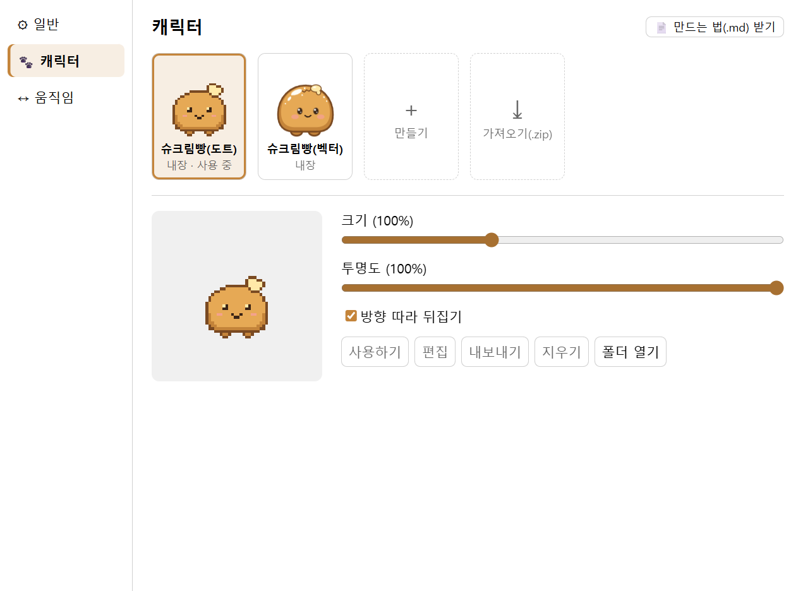
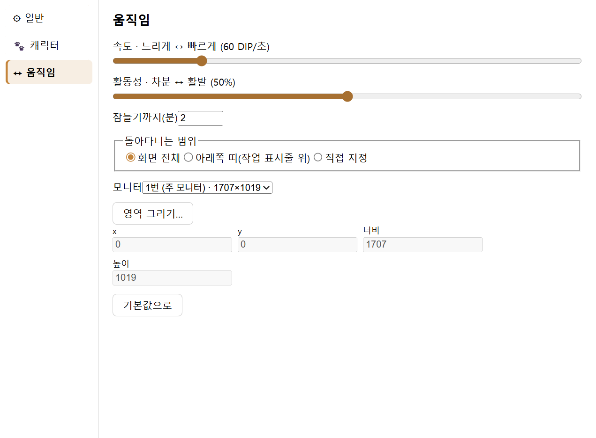

# ClaudeTool

화면 위를 돌아다니는 Windows용 Claude 데스크톱 펫이에요(Windows 10·11, 64비트). 펫을 누르면 Claude를 얼마나 썼는지 보여 주고, 단축키로 질문하면 말풍선으로 답해요.

## 이런 걸 해요

- **화면 위의 펫:** 정한 범위 안을 걷고, 쉬고, 앉고, 오래 쉬면 잠들어요. 늘 다른 창 위에 떠 있지만, 펫과 말풍선이 아닌 곳을 누르면 아래 창이 그대로 눌려서 하던 일을 방해하지 않아요. 펫은 끌어서 옮길 수 있어요.
- **사용량 보기:** 펫을 누르면 Claude를 얼마나 썼는지 한 창에서 보여 줘요. 이 앱에서 쓴 양, 이 PC의 Claude Code 사용량, 구독 한도(5시간·7일), 조직 사용량(조직의 Admin API 키가 있을 때)을 볼 수 있어요.
- **질문하기:** `Ctrl+Alt+K`를 누르고 질문을 쓴 뒤 `Enter`를 누르면 답이 말풍선에 이어서 나타나요. 기본으로는 이 PC에 로그인된 Claude Code(네이티브 설치)가 구독으로 답하고, Anthropic API 키로 바꿔 쓸 수도 있어요.
- **캐릭터:** 기본 캐릭터는 이 앱만의 도트 슈크림빵이에요(32×32칸 도트 그림). 벡터로 그린 슈크림빵 같은 내장 캐릭터도 있어서 설정 창 카드에 “내장”으로 표시돼요. 다른 캐릭터로 바꾸거나, 쉬기·걷기·앉기·잠자기·반응·말하기·끌기 7가지 모습의 그림(GIF, APNG, WebP, PNG, SVG)으로 직접 만들 수 있어요. 만든 캐릭터는 zip 파일로 주고받아요.
- **움직임:** 속도, 활동성, 잠들기까지 시간, 돌아다니는 범위(화면 전체·아래쪽 띠·직접 지정), 모니터를 정해요.
- **메뉴:** 펫을 우클릭하거나 작업 표시줄 알림 영역(트레이)의 도트 슈크림빵 아이콘을 우클릭하면 설정과 기능 메뉴가 떠요.
- **준비 중:** 설치형 플러그인 기능을 준비하고 있어요.

## 화면

## 개인정보와 안전

앱이 무엇을 읽고, 어디에 저장하고, 어디로 보내는지 정리했어요.

**저장하는 곳**

- 데이터는 이 PC의 데이터 폴더(설치 폴더 옆의 `<설치 폴더>-data`)에만 저장해요. 설정(`settings.json`), 내가 만든 캐릭터(`packs`), 사용 기록(`usage`), 로그(`logs`), Claude Code 설정 백업(`backup`) 등이 들어가요. 앱을 업데이트하거나 지워도 이 폴더는 남아요.
- **API 키·Admin 키**는 Windows가 제공하는 보호 기능(DPAPI)으로 암호화해 `secrets.bin`에 저장해요. 이 Windows 계정에서만 풀 수 있어서, 데이터 폴더를 다른 PC나 다른 계정으로 옮기면 키를 다시 넣어야 해요. 이 PC에서 암호화를 쓸 수 없으면 키를 저장하지 않아요.
- **질문과 답의 내용은 파일로 저장하지 않아요.** 이어서 묻기 위해 앱이 켜져 있는 동안만 최근 대화(6번까지, 마지막 답 뒤 10분까지)를 기억해요. 사용 기록에는 모델 이름과 토큰 수 같은 숫자만 남아요.

**읽는 것**

- 사용량을 보여 주려고 Claude Code가 이 PC에 남긴 기록 파일(Claude Code 폴더의 `projects`, 보통 사용자 폴더 아래 `.claude\projects`)을 읽어요. 여기서 모델 이름·시각·토큰 수만 뽑고, 질문과 답의 내용은 가져오지 않아요.
- Claude Code 설정 파일(`settings.json`)은 사용량 창에서 **Claude Code 연결**·**연결 해제**를 누를 때만 읽고 고쳐요. 고치기 전에 바뀔 내용을 보여 주고, **적용**을 눌러야 바꾸며, 원래 파일은 데이터 폴더의 `backup`에 남겨요. 연결하면 Claude Code의 상태 줄(statusLine)에 이 앱의 작은 스크립트가 등록되고, 이 스크립트는 한도 정보만 데이터 폴더에 적어요. 원래 쓰던 상태 줄 명령이 있었다면 그것도 이어서 실행해요.

**보내는 것**

- 앱이 직접 인터넷에 연결하는 곳은 Anthropic API(`api.anthropic.com`) 하나예요. API 키 방식으로 질문할 때와 조직 사용량을 볼 때만 연결해요.
- 구독 방식으로 질문하면 이 PC의 Claude Code를 실행해 답을 받아요. 질문은 Claude Code를 거쳐 Anthropic으로 가요.
- 이때 Claude Code는 **답만 하도록** 실행해요. 파일을 읽거나 명령을 실행하는 도구와 MCP를 모두 끄고, Claude Code 설정 파일·`CLAUDE.md`·메모리를 읽지 않으며, 대화 기록(세션)도 남기지 않아요. 이 PC의 `ANTHROPIC_API_KEY` 같은 환경 변수는 넘기지 않아서 API 요금이 아니라 구독으로 처리돼요.
- 답 속 링크는 누를 때만 기본 브라우저로 열어요(`https` 주소만).

## 소개 페이지

화면과 동작을 그림으로 보여 주는 [소개 페이지](https://blackbuddle.github.io/claude-tool-page/)가 있어요.

## 라이선스와 면책

- **개인 사용자는 무료**로 쓸 수 있어요. 회사·학교·단체의 업무나 영리 목적의 사용, 판매, 재배포는 저작권자의 허락이 필요해요. 이 저장소의 소개 페이지·그림·코드도 같은 라이선스예요. → [LICENSE](LICENSE)
- 소프트웨어는 **있는 그대로 보증 없이** 제공해요. API 키 유출·악성 프로그램·무단 접근 같은 **보안사고**와 손해에 대한 책임의 범위, 그리고 지켜 주시길 권하는 보안 수칙은 [면책조항](DISCLAIMER.md)에 있어요.
- 보안 문제를 발견하면 공개 이슈에 자세히 쓰지 말고 이 저장소의 **Security 탭 → Report a vulnerability**로 알려 주세요.

---

ClaudeTool은 개인 프로젝트이며 Anthropic의 공식 제품이 아니에요. 기본 캐릭터 도트 슈크림빵과 벡터 슈크림빵, 트레이·프로그램 아이콘은 이 프로젝트를 위해 직접 그린 오리지널 그림이에요.
