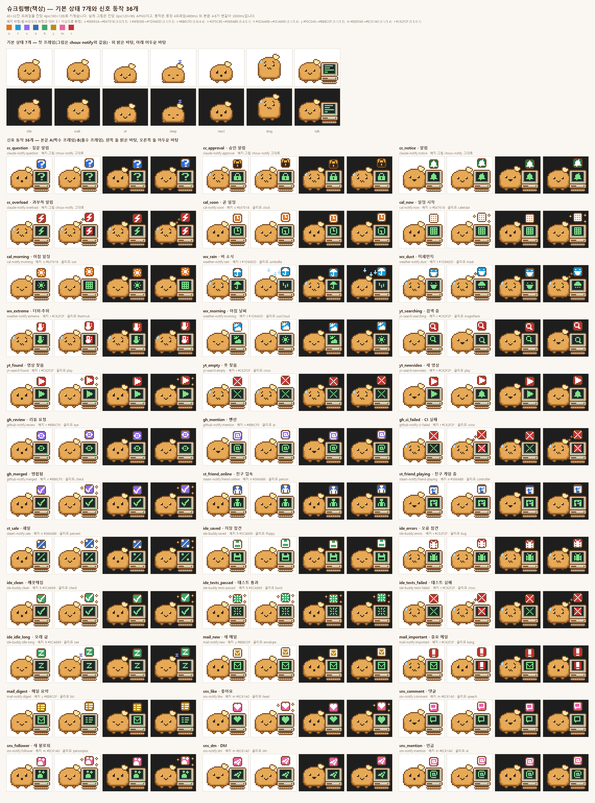

# 캐릭터 choux-desk 안내

`choux-desk`는 플러그인 묶음의 알림마다 다른 몸짓을 보여 주는 캐릭터(슈크림빵 책상판)입니다. 말하는 모습·자는 모습과 알림 동작 36개가 들어 있고, 동작은 플러그인이 보내는 신호에 따라 저절로 나옵니다. 신호와 동작이 짝지어져 있어서 따로 설정할 것은 없습니다.

  

## 가져와서 쓰기

1. [릴리스](https://github.com/BlackBuddle/claude-tool-page/releases/tag/plugins-2026-10)에서 `choux-desk-pack.zip`을 받습니다. 릴리스 노트의 SHA-256 값과 비교해 보세요.
2. 설정 창 › 🐾 캐릭터 › ⤓ 가져오기(.zip)에서 그 파일을 고르고 "사용하기"를 누릅니다.
3. 플러그인을 설치해 두었다면 알림이 올 때 해당 몸짓이 나옵니다. 몸짓은 3초 동안 보이고 그 자리에서 움직입니다.

## 편집기에서 열 때

- 캐릭터 편집기에서 열어 동작을 더 넣으려면 캐릭터 편집기 화면의 "동작 한도" 칸을 37 이상(예: 40, 최대 60)으로 올려 주세요(기본은 12개이고, 이 캐릭터는 동작이 36개라 36으로는 새 동작을 더할 수 없습니다). 열기·저장·사용은 올리지 않아도 됩니다.
- 이 캐릭터의 동작은 모두 "신호가 오면 나오는" 동작입니다. 편집기에서 신호 칸을 지우거나 바꾸면 그 플러그인의 몸짓이 나오지 않습니다.
- 다른 캐릭터를 쓰고 있으면 이 플러그인용 몸짓이 없어서 몸짓만 빠지고, 말풍선과 Windows 알림은 그대로 옵니다.

## 신호와 동작 대응표

신호 이름은 `플러그인 이름:신호`입니다. `claude-notify`의 4개는 Claude Code 알림 플러그인의 것으로, 같은 캐릭터가 함께 씁니다.

| 플러그인 | 신호 | 동작 이름(id) | 언제 나오나 |
|---|---|---|---|
| claude-notify | `question` | 질문 알림(`cc_question`) | Claude Code가 질문을 기다릴 때 |
| claude-notify | `approval` | 승인 알림(`cc_approval`) | 승인을 기다릴 때 |
| claude-notify | `notice` | 알림(`cc_notice`) | 일을 끝냈을 때 같은 알림 |
| claude-notify | `overload` | 과부하 알림(`cc_overload`) | 과부하·한도로 멈췄을 때 |
| cal-notify | `soon` | 곧 일정(`cal_soon`) | 일정이 곧 시작할 때(시계 배지) |
| cal-notify | `now` | 일정 시작(`cal_now`) | 일정이 시작했을 때(달력 배지, 반짝임) |
| cal-notify | `morning` | 아침 일정(`cal_morning`) | 아침 일정 요약(해 배지) |
| weather-notify | `rain` | 비 소식(`wx_rain`) | 비가 올 것 같을 때(우산, 빗방울) |
| weather-notify | `dust` | 미세먼지(`wx_dust`) | 초미세먼지가 나쁠 때(마스크) |
| weather-notify | `extreme` | 더위·추위(`wx_extreme`) | 많이 덥거나 추울 때(온도계, 빨간 화면) |
| weather-notify | `morning` | 아침 날씨(`wx_morning`) | 아침 날씨 요약(해와 구름) |
| yt-search | `searching` | 검색 중(`yt_searching`) | 검색하는 동안(돋보기) |
| yt-search | `found` | 영상 찾음(`yt_found`) | 결과를 찾았을 때(재생, 반짝임) |
| yt-search | `empty` | 못 찾음(`yt_empty`) | 결과가 없을 때(X 표시) |
| yt-search | `newvideo` | 새 영상(`yt_newvideo`) | 구독 채널에 새 영상이 올라왔을 때 |
| github-notify | `review` | 리뷰 요청(`gh_review`) | PR 리뷰 요청이 왔을 때 |
| github-notify | `mention` | 멘션(`gh_mention`) | 멘션됐을 때(@) |
| github-notify | `ci-failed` | CI 실패(`gh_ci_failed`) | CI가 실패했을 때(X 표시, 연기, 빨간 화면) |
| github-notify | `merged` | 병합됨(`gh_merged`) | PR이 닫히거나 병합됐을 때(체크, 반짝임) |
| steam-notify | `friend-online` | 친구 접속(`st_friend_online`) | 친구가 접속했을 때 |
| steam-notify | `friend-playing` | 친구 게임 중(`st_friend_playing`) | 친구가 게임을 시작했을 때 |
| steam-notify | `sale` | 세일(`st_sale`) | 위시리스트 게임이 할인할 때(퍼센트, 반짝임) |
| ide-buddy | `saved` | 저장 참견(`ide_saved`) | 긴 파일·열 번에 한 번 저장·커밋 안 한 변경이 오래 쌓였을 때(디스켓) |
| ide-buddy | `errors` | 오류 참견(`ide_errors`) | 오류가 생겼을 때(벌레) |
| ide-buddy | `clean` | 깨끗해짐(`ide_clean`) | 오류가 모두 사라졌을 때(체크, 반짝임) |
| ide-buddy | `tests-passed` | 테스트 통과(`ide_tests_passed`) | 테스트가 통과했을 때(폭죽) |
| ide-buddy | `tests-failed` | 테스트 실패(`ide_tests_failed`) | 테스트가 실패했을 때(X 표시, 연기, 빨간 화면) |
| ide-buddy | `idle-long` | 오래 쉼(`ide_idle_long`) | 한참 손을 놓았을 때(zZ) |
| mail-notify | `new` | 새 메일(`mail_new`) | 새 메일이 왔을 때(봉투) |
| mail-notify | `important` | 중요 메일(`mail_important`) | 중요 메일이 왔을 때(느낌표, 빨간 화면) |
| mail-notify | `digest` | 메일 요약(`mail_digest`) | 하루 요약(목록) |
| sns-notify | `like` | 좋아요(`sns_like`) | 좋아요(하트, 반짝임) |
| sns-notify | `comment` | 댓글(`sns_comment`) | 댓글(말풍선) |
| sns-notify | `follower` | 새 팔로워(`sns_follower`) | 새 팔로워(사람 모양, 반짝임) |
| sns-notify | `dm` | DM(`sns_dm`) | 메시지 |
| sns-notify | `mention` | 언급(`sns_mention`) | 언급(@) |

동작 id는 `<약칭>_<신호 이름의 하이픈을 밑줄로 바꾼 것>`이고, 약칭은 `cal`·`wx`·`yt`·`gh`·`st`·`ide`·`mail`·`sns`입니다.

## 몸짓이 안 나올 때

| 증상 | 이유와 해결 |
|---|---|
| 말풍선은 오는데 몸짓이 없다 | 쓰는 캐릭터가 `choux-desk`가 아닙니다. 설정 창 › 🐾 캐릭터에서 `choux-desk`를 "사용하기"로 고르세요 |
| 몸짓은 나오는데 말풍선이 없다 | 펫을 숨겨 두었거나 방해 금지 시간입니다. 각 안내서의 "알림이 안 와요" 항목을 보세요 |
| 편집기에서 동작을 더 못 넣는다('동작은 N개까지예요') | 캐릭터 편집기 화면의 "동작 한도" 칸을 37 이상(예: 40, 최대 60)으로 올리세요. 이 캐릭터는 동작이 36개라 한도가 36이면 더 못 넣습니다 |
| 특정 플러그인의 몸짓만 안 나온다 | 그 플러그인이 실행 중인지(카드가 "실행 중"), 그 알림 종류를 꺼 두지 않았는지 보세요 |
